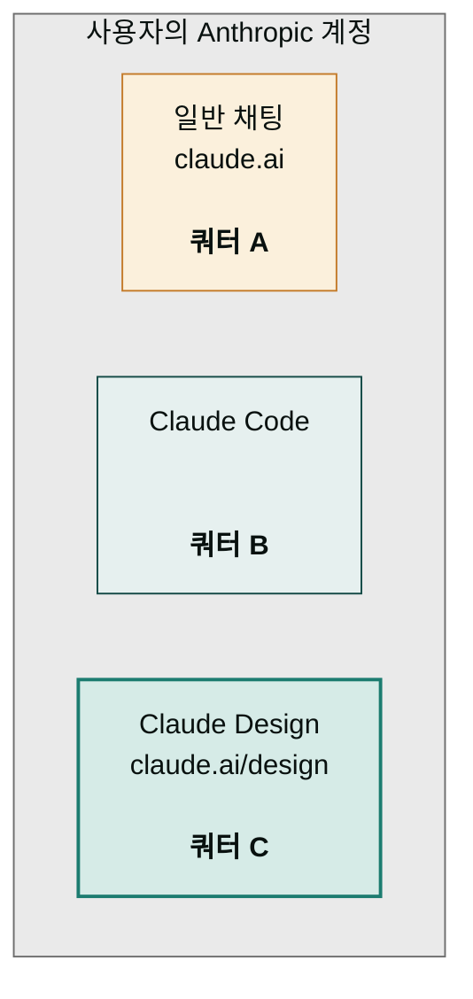
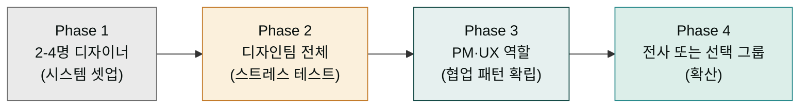

> Claude Design은 **별도 쿼터**를 가진 Research Preview 제품입니다. 일반 채팅·Claude Code 사용량과 분리되어 있어 한쪽이 부족해도 다른 쪽은 영향을 받지 않습니다. 다만 디자인 시스템 생성과 큰 프로젝트는 토큰을 빠르게 소비합니다.

## 플랜별 요약

| 플랜 | Claude Design 접근 | 한도 메커니즘 | Extra usage | Enterprise 크레딧 |
|---|---|---|---|---|
| Free | ✗ | — | — | — |
| Pro | ✓ | 별도 주간 쿼터 | 옵션 활성화 시 가능 | — |
| Max | ✓ | 별도 주간 쿼터 (Pro보다 큼) | 옵션 활성화 시 가능 | — |
| Team | ✓ | 멤버별 + 조직 합산 | 옵션 활성화 시 가능 | — |
| Enterprise | ✓ (기본 OFF) | 조직 단위, 관리자 활성화 필요 | 옵션 활성화 시 가능 | 사용량제 고객: 약 20프롬프트 일회성 (2026-07-17 만료) |


정확한 한도 수치는 Anthropic이 공개하지 않으며 Research Preview 기간 동안 변동될 수 있습니다. 한도 변화는 [공식 도움말](https://support.claude.com/en/articles/14604406-claude-design-admin-guide-for-team-and-enterprise-plans)을 주기적으로 확인하세요.


## 별도 쿼터 메커니즘

Claude Design은 **일반 채팅·Claude Code와 분리된 별도 쿼터**를 사용합니다.



A·B·C는 서로 영향을 주지 않습니다. 일반 채팅 한도를 다 써도 Design은 그대로 가능하고, 그 반대도 같습니다.

## 무엇이 쿼터를 빠르게 소비하나

쿼터를 가장 빠르게 소비하는 것은 디자인 시스템 자체 생성(자산 분석 + UI 키트 추출)입니다. 큰 코드베이스 ingestion과 대용량 PPTX·PDF 업로드·변환도 상당한 토큰을 씁니다. 반면 텍스트 프롬프트·인라인 코멘트·조정 노브 사용은 소비량이 적습니다. 이 때문에 디자인 시스템은 한 번 잘 만들고 Published 상태로 유지하는 것이 가장 경제적입니다.

## Pro · Max — 개인 가입자

개인 디자이너·창업자·PM이 주 대상입니다. `claude.ai/design`에 접근하면 자동으로 활성화되며, 별도 주간 쿼터가 적용됩니다(구체적 수치 비공개). 사용자 보고를 종합하면 1 디자인 시스템 생성 + 2-3 원페이저 + 1 피치덱 + 1 비디오 콘텐츠 정도로 주간 쿼터에 도달하는 경우가 많습니다. 초과 시에는 Extra usage 옵션을 켜면 추가 사용이 가능하며, 다음 주에 리셋됩니다.

## Team — 소규모 조직

5-50명 규모 팀이 주 대상입니다. 조직 멤버는 별도 설정 없이 즉시 사용 가능하며, 멤버별 한도와 조직 합산 한도가 적용됩니다. 관리자는 사용 현황 모니터링(현재 제한적), Extra usage 활성화 결정, 멤버 추가·삭제 기능을 갖습니다.

## Enterprise — 대형 조직

Enterprise는 기본 OFF 상태입니다. 관리자가 명시적으로 활성화해야 멤버가 사용할 수 있습니다.

### 활성화 절차

```
1. Anthropic 콘솔 로그인 (admin 계정)
2. Organization settings 진입
3. Capabilities 섹션으로 이동
4. Anthropic Labs 카테고리 펼침
5. Claude Design 토글 ON
6. (선택) 커스텀 역할로 접근 권한 세분화
```

### RBAC 단계적 롤아웃 — 권장 4단계



각 단계 사이에 1-2주 관찰 기간을 두면 문제를 조기에 발견하고 다음 단계 롤아웃 방식을 조정할 수 있습니다.

### Enterprise 사용량제 크레딧

```
대상: Enterprise usage-based pricing 고객
크레딧: 약 20 프롬프트 일회성 (사용 시작 시점 기준)
만료: 2026-07-17
적용: 자동 — 별도 신청 불필요
```

이 크레딧은 도입 전 평가용으로, 별도 신청 없이 자동으로 적용됩니다. 본격 도입 후에는 통상적인 사용량 정책이 적용됩니다.

### 커스텀 역할 설계 예시

| 역할명 | 권한 | 대상 |
|---|---|---|
| Design System Admin | 시스템 생성·수정·Published 토글 | 디자인 시스템 책임자 1-2명 |
| Design User | 프로젝트 생성·공유, 시스템 사용 (수정 X) | 디자이너·PM·마케터 |
| Reviewer | View-only 권한만 받음, 채팅 불가 | 임원·외부 검토자 |
| No Access | Claude Design 비활성 | 사용 안 하는 부서 |

## Extra usage 옵션

별도 쿼터를 초과해도 작업을 계속하려면 계정 또는 조직 설정의 사용량 섹션에서 **Extra usage**를 활성화합니다. 활성화하면 한도 초과분에 대해 추가 요금이 청구되며 작업이 계속 진행됩니다. Team·Enterprise에서는 관리자가 이를 비활성화할 수 있어 한도 도달 시 작업이 자동으로 중단됩니다. 분기 또는 월 단위로 한도와 실제 사용량을 모니터링하며 Extra usage 활성/비활성을 조정하는 것을 권장합니다.


**Extra usage를 켜둔 채 모니터링 없이 운영하면 예상치 못한 청구가 발생할 수 있습니다.** Team·Enterprise에서는 사용량 알림을 설정하거나 정기 점검 일정을 잡으세요. 사용량 대시보드 자체가 아직 제한적인 점도 고려.


## 한국 결제·운영 환경 메모

| 항목 | 메모 |
|---|---|
| **결제 통화** | USD 기준. 환율 변동에 따른 원화 청구 차이 가능 |
| **카드 결제** | 해외 결제 가능 카드 필요 (대부분 글로벌 신용카드 OK) |
| **세금** | VAT 별도 부과 (사업자 등록 시 사업자 정보 등록 가능) |
| **법인 결제** | Team 이상 플랜에서 법인 카드·송장 결제 옵션 (Sales 문의) |
| **데이터 거주지** | 현재 미지원 — 한국 데이터 거주지 요구가 있으면 사용 제한 |
| **고객지원 언어** | 영문 중심 (지원 티켓·도움말). 한국어 대응은 제한적 |
| **사업자 등록 활용** | Team·Enterprise 가입 시 사업자등록증 제출하면 세금 처리 간소화 |

## 사용량 추적 — 현재 제약

Research Preview 단계이기 때문에 사용량 추적 기능이 전반적으로 미비합니다. 멤버별 사용량 대시보드는 제한적이고, 감사 로그·프로젝트별 토큰 사용량·사용량 알림·API 사용량 조회는 아직 제공되지 않습니다. 분기마다 샘플 프로젝트를 검토해 사용 패턴을 파악하고, 사내 슬랙·노션에 "Claude Design 작업 로그" 채널을 만들어 자율 보고하도록 안내하는 것이 현실적인 대안입니다.

## 도입 결정 — Yes/No 체크리스트

다음 조건에 해당하면 도입을 강력히 추천합니다.

```
✓ 디자이너 0-2명 또는 디자인 백로그가 항상 가득
✓ 매주 비주얼 산출물(피치덱·랜딩·SNS·와이어프레임)이 필요
✓ Claude Code를 이미 쓰고 있음 (핸드오프 효과 극대화)
✓ 기존 디자인 시스템이 있음 (또는 시스템 만들 시간이 있음)
✓ 외부 발송용 자료가 많음 (Canva·PPTX·PDF로 출력)
```

다음 조건이면 도입을 보류·검토하세요.

```
✗ 데이터 거주지 규제가 엄격한 산업(의료·금융·정부)
✗ 디자인 시스템이 매우 정교하고 Figma·Storybook으로 잘 운영 중
✗ 3D·음성·비디오 같은 프론티어 영역 위주 (아직 약함)
✗ 전사 SSO·감사 로그가 엄격하게 요구되는 환경
```

## 다음 단계

- **다음 페이지**: [제한 사항과 로드맵](../limitations/) — Research Preview 위치 정리
- 참고: [협업·공유](../collaboration/) — 권한 모델
- 깊이: [베스트 프랙티스](../best-practices/) — 조직 운영 체크리스트

---

### Sources

- [Claude Design admin guide for Team and Enterprise plans](https://support.claude.com/en/articles/14604406-claude-design-admin-guide-for-team-and-enterprise-plans)
- [Introducing Claude Design by Anthropic Labs](https://www.anthropic.com/news/claude-design-anthropic-labs)
- [Claude Design: Complete Guide for Non-Designers (BuildFastWithAI)](https://www.buildfastwithai.com/blogs/claude-design-anthropic-guide-2026)
- [Using Claude Design for prototypes and UX (Anthropic Tutorial)](https://claude.com/resources/tutorials/using-claude-design-for-prototypes-and-ux)
