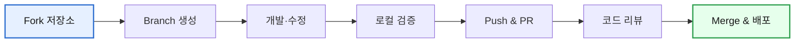

MoAI Cowork Plugins 오픈소스 프로젝트에 기여하는 방법을 안내합니다. 새로운 스킬 개발, 기존 기능 개선, 문서 개선 등 다양한 방식으로 프로젝트에 기여할 수 있습니다.



## 기여 방법

### 1. Fork & Branch

**Fork 생성**:
1. [GitHub 저장소](https://github.com/modu-ai/cowork-plugins) 방문
2. 오른쪽 상단의 "Fork" 버튼 클릭
3. 자신의 계정에 저장소 생성 완료

**Branch 생성**:
```bash
git clone https://github.com/YOUR_USERNAME/cowork-plugins.git
cd cowork-plugins
git checkout -b feature/new-skill-name
```

### 2. 기여 활동 유형

#### 새로운 스킬 개발
- 새로운 플러그인 생성
- 기존 플러그인에 새 스킬 추가
- 특정 비즈니스 문제 해결을 위한 스킬

#### 기존 기능 개선
- 기존 스킬 성능 향상
- 버그 수정
- 사용자 경험 개선

#### 문서 개선
- README.md 업데이트
- 사용 가이드 개선
- API 문서 정리

#### 테스트 및 검증
- 새로운 스킬 테스트
- 에지 케이스 검증
- 품질 검증

### 3. Pull Request 제출

**PR 제출 절차**:
1. 변경 사항 커밋
```bash
git add .
git commit -m "feat: add new skill for data analysis"
```

2. 원본 저장소 동기화
```bash
git remote add upstream https://github.com/modu-ai/cowork-plugins.git
git fetch upstream
git rebase upstream/main
```

3. Push 및 PR 생성
```bash
git push origin feature/new-skill-name
```

4. GitHub에서 Pull Request 생성
- 제목: 명확한 기능 설명
- 내용: 변경 내용 상세 설명
- 관련 이슈 참조

## 저장소 구조

### 전체 구조

```
cowork-plugins/
├── .claude/                     # Claude Code 설정
├── .claude-plugin/             # 마켓플레이스 설정
├── moai-*                      # 플러그인 디렉토리
│   ├── .claude-plugin/        # 플러그인 매니페스트
│   ├── skills/                 # 스킬 파일들
│   ├── README.md               # 플러그인 설명
│   └── CONNECTORS.md           # 연동 가이드 (선택)
├── docs-site/                  # 문서 사이트
├── .gitignore
├── README.md
└── CHANGELOG.md
```

### 플러그인 구조

```
moai-*/
├── .claude-plugin/
│   └── plugin.json            # 플러그인 정보
├── skills/
│   ├── skill-name/            # 스킬 디렉토리
│   │   └── SKILL.md          # 스킬 정의
│   └── README.md              # 스킬 목록
├── README.md                  # 플러그인 설명
└── CONNECTORS.md              # 연동 가이드 (선택)
```

### 스킬 파일 구조

```
moai-*/skills/skill-name/
├── SKILL.md                   # 메인 스킬 파일 (500라인 이하)
├── modules/                   # 심화 모듈
│   ├── patterns.md           # 사용 패턴
│   └── examples.md           # 예시 코드
├── examples.md                # 복사-붙여넣기 준비된 코드
└── reference.md               # 참고 자료
```

## 기여 가이드라인

### 스킬 개발 가이드

새로운 스킬을 개발할 때는 다음 사항을 준수해야 합니다:

- [SKILL.md frontmatter 규격](skill-development/) 준수
- `metadata` 블록 금지 (v1.3.0 정책)
- 트리거 키워드 명시적 기재
- 점진적 공개 구조 적용
- 테스트 케이스 포함

### 코드 스타일

- Go 표준 스타일 준수
- 의미 있는 변수명 사용
- 에러 처리 적절하게 구현
- 주석 포함 (필요한 경우)

### 문서 표준

- 모든 파일을 한국어로 작성
- 명확한 설명과 예시 포함
- 상대 경로 사용 (`../plugins/` 형식)
- Hugo frontmatter 필수 포함

### 버전 관리

- [버저닝 정책](../releases/) 준수
- 모든 18개 지점 동시 업데이트
- CHANGELOG.md 항목 추가
- 커밋 메시지 규격 준수

## 코드 리뷰 프로세스

### 리뷰 절차

1. **자동 검사**: CI/CD 파이프라인 자동 실행
2. **동료 리뷰**: 팀원 코드 리뷰
3. **테스트**: 통합 테스트 실행
4. **배포**: 스테이징 환경 배포
5. **최종 승인**: 프로덕션 배포

### 리뷰 체크리스트

- [ ] 코드 스타일 준수
- [ ] 테스트 커버리지 80% 이상
- [ ] 문서 업데이트
- [ ] 버전 관리 정확
- [ ] 보안 검사 통과

## 테스트 정책

### 단위 테스트

모든 스킬은 반드시 단위 테스트를 포함해야 합니다:

```bash
# 테스트 실행
go test ./moai-*/skills/skill-name/...

# 커버리지 확인
go test -cover ./moai-*/skills/skill-name/...
```

### 통합 테스트

- 스킬 체인 테스트
- 실제 데이터로 테스트
- 에지 케이스 테스트

### 사용자 테스트

- 실제 사용 시나리로 테스트
- 성능 테스트
- 사용성 테스트

## 품질 보증

### TRUST 5 프레임워크

모든 기여는 TRUST 5 품질 기준을 충족해야 합니다:

- **Tested**: 85%+ 테스트 커버리지
- **Readable**: 명확한 코드 구조
- **Unified**: 일관된 스타일
- **Secured**: 보안 검사 통과
- **Trackable**: 버전 관리 완벽

### 스킬 품질 체크리스트

- [ ] SKILL.md frontmatter 규격 준수
- [ ] 트리거 키워드 포함
- [ ] 입력/출력 명확히 정의
- [ ] 예시 코드 포함
- [ ] 오류 처리 구현
- [ ] 테스트 케이스 작성

## 발행 절차

### 1. 코드 검증

```bash
# 코드 스타일 검사
gofmt -l ./moai-*/skills/skill-name/
golint ./moai-*/skills/skill-name/

# 테스트 실행
go test ./moai-*/skills/skill-name/...
```

### 2. 문서 검증

```bash
# 모든 문서 링크 확인
find docs-site/ -name "*.md" -exec grep -l "http" {} \; | xargs grep -o "http[^)]*" | head -20

# 상대 경로 검증
find docs-site/ -name "*.md" -exec grep -l "../plugins/" {} \;
```

### 3. 버전 동기화

```bash
# 버전 확인 (모든 위치가 동일한지)
{ grep -h '"version"' .claude-plugin/marketplace.json moai-*/.claude-plugin/plugin.json \
  | grep -oE '[0-9]+\.[0-9]+\.[0-9]+'; } | sort -u
```

### 4. 최종 검증

```bash
# README 업데이트 확인
grep -n "v$(grep -oE '[0-9]+\.[0-9]+\.[0-9]+' .claude-plugin/marketplace.json)" README.md

# CHANGELOG 업데이트 확인
head -5 CHANGELOG.md | grep -E "^## \[[0-9]+\.[0-9]+\.[0-9]+\]"
```

## 커뮤니티

### 질문 및 토론

- [GitHub Discussions](https://github.com/modu-ai/cowork-plugins/discussions)
- [GitHub Issues](https://github.com/modu-ai/cowork-plugins/issues)
- 이메일: dev@modu.ai

### 기여자 혜택

- 기여자 명단에 포함
- 기여량에 따른 권한 상승
- 새로운 기능 우선 테스트
- 커뮤니티 내 영향력 확대

## 라이선스

이 프로젝트는 MIT 라이선스를 따릅니다. 자세한 내용은 [LICENSE](https://github.com/modu-ai/cowork-plugins/blob/main/LICENSE) 파일을 참조하세요.

### Sources
- GitHub 저장소: [https://github.com/modu-ai/cowork-plugins](https://github.com/modu-ai/cowork-plugins)
- 기여 가이드: [https://github.com/modu-ai/cowork-plugins/blob/main/CONTRIBUTING.md](https://github.com/modu-ai/cowork-plugins/blob/main/CONTRIBUTING.md)
- 라이선스: [https://github.com/modu-ai/cowork-plugins/blob/main/LICENSE](https://github.com/modu-ai/cowork-plugins/blob/main/LICENSE)