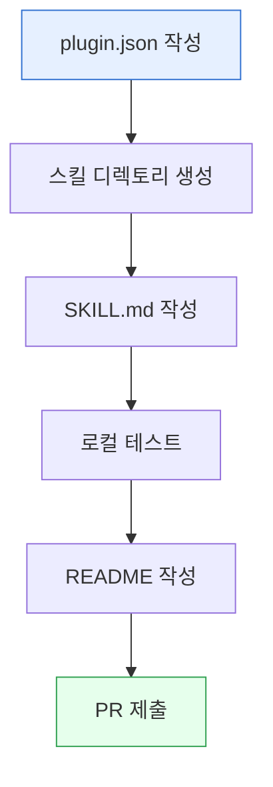

이 가이드는 MoAI Cowork Plugins용 새로운 플러그인을 개발하고 배포하는 전체 과정을 안내합니다. 기존 플러그인 구조를 따라 일관된 품질의 플러그인을 만들 수 있습니다.



## 플러그인 기본 구조

### 표준 디렉토리 구조

```
moai-plugin-name/
├── .claude-plugin/                # 필수: 플러그인 매니페스트
│   └── plugin.json              # 플러그인 정보
├── skills/                      # 스킬 파일들
│   ├── skill-name/             # 스킬 디렉토리
│   │   └── SKILL.md            # 스킬 정의
│   └── README.md               # 스킬 목록
├── README.md                    # 플러그인 설명
├── CONNECTORS.md                # 선택: 연동 가이드
└── .mcp.json                    # 선택: MCP 서버 설정
```

### plugin.json 필수 필드

모든 플러그인은 다음 필수 필드를 포함해야 합니다:

```json
{
  "name": "plugin-name",
  "version": "1.5.1",
  "description": "플러그인의 간결한 설명",
  "author": {
    "name": "작성자 이름",
    "email": "이메일@주소.com"
  },
  "keywords": ["keyword1", "keyword2", "keyword3"],
  "license": "MIT"
}
```

**필드 설명**:
- **name**: 플러그인 고유 이름 (소문자, 하이픈)
- **version**: 현재 버전 (v1.3.0부터 단일 진실 원칙 적용)
- **description**: 플러그인의 주요 기능 설명
- **author**: 작성자 정보
- **keywords**: 플러그인 검색을 위한 키워드
- **license**: 라이선스 종류 (권장: MIT)

## 플러그인 개발 절차

### 1. 플러그인 생성

새 플러그인을 생성합니다:

```bash
# 플러그인 디렉토리 생성
mkdir moai-plugin-name
cd moai-plugin-name

 .claude-plugin 디렉토리 생성
mkdir -p .claude-plugin
```

### 2. plugin.json 작성

기본 플러그인 정보를 작성합니다:

```json
{
  "name": "moai-plugin-name",
  "version": "1.5.1",
  "description": "플러그인의 상세한 설명을 여기에 작성합니다",
  "author": {
    "name": "Your Name",
    "email": "your.email@example.com"
  },
  "keywords": ["business", "analysis", "reports"],
  "license": "MIT"
}
```

### 3. 스킬 디렉토리 생성

```bash
# 스킬 디렉토리 구조 생성
mkdir -p skills/skill-name
```

### 4. 스킬 파일 작성

스킬 디렉토리에 SKILL.md 파일을 작성합니다:

```yaml
---
name: skill-name
description: |
  스킬의 목적과 트리거 조건을 자연스러운 서술로 작성.
  
  다음과 같은 요청 시 반드시 이 스킬을 사용하세요:
  - "요청1"
  - "요청2"
user-invocable: true
---

# 스킬 본문 작성
## 역할

이 스킬은 [특정 도메인]의 전문가입니다.

## 워크플로우

### 1단계: [단계 이름]
- 입력: [필요한 정보]
- 처리: [수행할 작업]
- 출력: [생성될 결과]
```

### 5. README.md 작성

플러그인 루트에 README.md를 작성합니다:

```markdown
# moai-plugin-name

## 개요

이 플러그인은 [도메인] 관련 스킬을 제공합니다.

## 스킬 목록

| 스킬 이름 | 설명 | 유형 |
|----------|------|------|
| [skill-name](./skills/skill-name/) | [설명] | [유형] |

## 설치

```bash
/plugin install moai-plugin-name
```

## 사용 예시

```text
"스킬 사용 예시"
→ 결과물 생성
```

## 기술 스펙

- 지원 언어: 한국어, 영어
- 의존성: 없음
```

### 6. CONNECTORS.md 작성 (선택)

외부 API 연동이 필요한 경우 작성합니다:

```markdown
# CONNECTORS.md

## 외부 API 연동

### API 키 설정

```bash
# 프로젝트 루트에서
echo "API_KEY=your_key_here" >> .moai/credentials.env
```

### 지원 서비스

- 서비스 1: [설명]
- 서비스 2: [설명]

### 연동 방법

1. API 키 발급
2. 환경변수 설정
3. 스킬 사용
```

### 7. .mcp.json 작성 (선택)

MCP 서버를 번들할 경우 작성합니다:

```json
{
  "servers": {
    "server-name": {
      "command": "uvx",
      "args": ["package-name"],
      "env": {
        "API_KEY": "${API_KEY}"
      }
    }
  }
}
```

## 버전 관리

### 단일 진실 원칙 (v1.3.0)

**HARD**: 모든 버전 표기는 **완전히 동일**해야 합니다.

### 동기화 대상 (총 18개 지점)

| 범주 | 경로 | 필드 | 개수 |
|---|---|---|---|
| 마켓플레이스 | `.claude-plugin/marketplace.json` | `metadata.version` | 1 |
| 플러그인 매니페스트 | `<plugin>/.claude-plugin/plugin.json` | `version` | 17 |

### 버전 변경 절차

```bash
# 새 버전 설정
NEW="1.5.1"

# 1. marketplace.json 업데이트
sed -i '' -E 's/"version": *"[0-9]+\.[0-9]+\.[0-9]+"/"version": "'$NEW'"/' .claude-plugin/marketplace.json

# 2. 모든 plugin.json 업데이트
find . -path "*/.claude-plugin/plugin.json" -not -path "*/.git/*" -exec \
  sed -i '' -E 's/"version": *"[0-9]+\.[0-9]+\.[0-9]+"/"version": "'$NEW'"/' {} +

# 3. 버전 확인 (한 줄만 출력되어야 통과)
{ grep -h '"version"' .claude-plugin/marketplace.json moai-*/.claude-plugin/plugin.json \
  | grep -oE '[0-9]+\.[0-9]+\.[0-9]+'; } | sort -u
```

## 배포 절차

### 1. 로컬 테스트

```bash
# 플러그인 구조 검증
find moai-plugin-name/ -name "*.json" -exec jsonlint {} \;

# 스킬 문법 검증
find moai-plugin-name/skills/ -name "SKILL.md" -exec ./scripts/skill-lint.sh {} \;

# 모든 스킬 테스트
find moai-plugin-name/skills/ -name "SKILL.md" -exec ./scripts/skill-test.sh {} \;
```

### 2. CHANGELOG 업데이트

```markdown
## [1.5.1] - 2026-05-01

### Added
- moai-plugin-name: 새로운 플러그인 추가
  - skill-name: [설명]
  - skill-name2: [설명]

### Changed
- 기존 스킬 개선
- 버전 동기화 완료

### Fixed
- [수정 내용]
```

### 3. 커밋 및 태그

```bash
# 변경 사항 커밋
git add .
git commit -m "feat: add moai-plugin-name with new skills"

# 태그 생성
git tag v1.5.1

# 푸시
git push origin main
git push origin v1.5.1
```

### 4. 마켓플레이스 업데이트

```bash
# 마켓플레이스에 플러그인 추가
echo '{
  "plugins": [
    ...,
    {
      "name": "moai-plugin-name",
      "version": "1.5.1",
      "description": "...",
      "author": {...},
      "keywords": [...],
      "license": "MIT"
    }
  ]
}' >> .claude-plugin/marketplace.json
```

## 품질 보증

### 검증 체크리스트

- [ ] plugin.json 필수 필드 완비
- [ ] 버전이 모든 위치에서 동일한지 확인
- [ ] 모든 스킬의 SKILL.md 규격 준수
- [ ] README.md 스킬 테이블과 실제 스킬 수 일치
- [ ] CONNECTORS.md 필요 시 작성
- [ ] .mcp.json 필요 시 작성
- [ ] CHANGELOG.md 업데이트
- [ ] 커밋 메시지 규격 준수

### 자동 검증 스크립트

```bash
#!/bin/bash
# 플러그인 검증 스크립트

PLUGIN_NAME="moai-plugin-name"
PLUGIN_DIR="moai-$PLUGIN_NAME"

# 1. 기본 구조 확인
if [ ! -d "$PLUGIN_DIR" ]; then
    echo "❌ 플러그인 디렉토리가 없습니다: $PLUGIN_DIR"
    exit 1
fi

if [ ! -f "$PLUGIN_DIR/.claude-plugin/plugin.json" ]; then
    echo "❌ plugin.json이 없습니다: $PLUGIN_DIR/.claude-plugin/plugin.json"
    exit 1
fi

# 2. 버전 일관성 확인
MARKETPLACE_VERSION=$(grep -oE '[0-9]+\.[0-9]+\.[0-9]+' .claude-plugin/marketplace.json | head -1)
PLUGIN_VERSION=$(grep -oE '[0-9]+\.[0-9]+\.[0-9]+' "$PLUGIN_DIR/.claude-plugin/plugin.json")

if [ "$MARKETPLACE_VERSION" != "$PLUGIN_VERSION" ]; then
    echo "❌ 버전이 일치하지 않습니다: marketplace=$MARKETPLACE_VERSION, plugin=$PLUGIN_VERSION"
    exit 1
fi

echo "✅ 플러그인 검증 완료"
```

## 플러그인 관리

### 스킬 추가

기존 플러그인에 새 스킬을 추가할 경우:

```bash
# 새 스킬 디렉토리 생성
mkdir moai-plugin-name/skills/new-skill

# SKILL.md 작성
cat > moai-plugin-name/skills/new-skill/SKILL.md << 'EOF'
---
name: new-skill
description: |
  새 스킬 설명
user-invocable: true
---

## 역할
이 스킬은...
EOF

# README.md 업데이트
echo "| [new-skill](./skills/new-skill/) | 설명 | user-invocable |" >> moai-plugin-name/README.md
```

### 버전 업데이트

기존 플러그인의 버전을 업데이트할 경우:

```bash
# 버전 변경 (18개 지점 전부)
NEW="1.5.2"
sed -i '' -E 's/"version": *"[0-9]+\.[0-9]+\.[0-9]+"/"version": "'$NEW'"/' .claude-plugin/marketplace.json
find . -path "*/.claude-plugin/plugin.json" -exec sed -i '' -E 's/"version": *"[0-9]+\.[0-9]+\.[0-9]+"/"version": "'$NEW'"/' {} +

# CHANGELOG 업데이트
echo "### Changed" >> CHANGELOG.md
echo "- 버전 업데이트: v$NEW" >> CHANGELOG.md
```

## 문제 해결

### 자주 발생하는 문제

**Q: 버전이 여러 위치에서 다릅니다**

A: 반드시 18개 지점의 버전을 동시에 업데이트하세요:

```bash
# 버전 확인 (한 줄만 출력되어야 정상)
{ grep -h '"version"' .claude-plugin/marketplace.json moai-*/.claude-plugin/plugin.json \
  | grep -oE '[0-9]+\.[0-9]+\.[0-9]+'; } | sort -u
```

**Q: 플러그인이 마켓플레이스에 나타나지 않습니다**

A: 플러그인 이름이 `moai-`로 시작하는지 확인하세요:

```bash
# 올바른 형식
moai-plugin-name

# 잘못된 형식
plugin-name
```

**Q: 스킬이 호출되지 않습니다**

A: SKILL.md의 user-invocable 필드가 true로 설정되어 있는지 확인하세요.

### 디버깅

```bash
# 플러그인 로드 상태 확인
/plugin info moai-plugin-name

# 스킬 목록 확인
/plugin list moai-plugin-name

# 스킬 테스트
moai-test run skill:new-skill
```

## 성능 최적화

### 스킬 로딩 최적화

- 500라인 이하의 SKILL.md 유지
- modules/ 디렉토리로 분리
- 불필요한 의존성 제거

### 메모리 관리

- 불필요한 전역 변수 사용 금지
- 메모리 누수 방지
- 캐시 적절하게 사용

## 보안 고려사항

### API 키 관리

- 절대 하드코딕 금지
- 환경변수로만 관리
- .gitignore에 .moai/credentials.env 추가

### 입력 검증

- 사용자 입력 검증 필수
- SQL 인젝션 방지
- XSS 방지

### 의존성 보안

- 외부 라이브러리 버전 관리
- 정기적인 보안 업데이트
- 취약점 스캔

## 관련 자료

### 참고 자료

- [스킬 개발 가이드](../skill-development/)
- [버전 관리 정책](../../releases/)
- [품질 가이드](../../getting-started/quick-start/)
- [마켓플레이스 문서](https://claude.com/marketplace)

### 템플릿

새 플러그인을 시작할 때 템플릿을 사용할 수 있습니다:

```bash
# 플러그인 템플릿 복사
cp -r templates/plugin-template moai-new-plugin
```

### Sources
- GitHub 저장소: [https://github.com/modu-ai/cowork-plugins](https://github.com/modu-ai/cowork-plugins)
- 마켓플레이스 문서: [https://claude.com/marketplace](https://claude.com/marketplace)
- 플러그인 개발 가이드: [https://github.com/modu-ai/cowork-plugins/blob/main/CONTRIBUTING.md](https://github.com/modu-ai/cowork-plugins/blob/main/CONTRIBUTING.md)