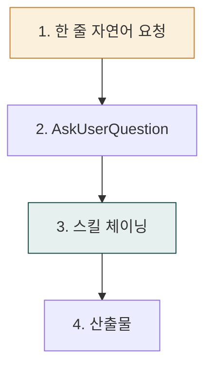
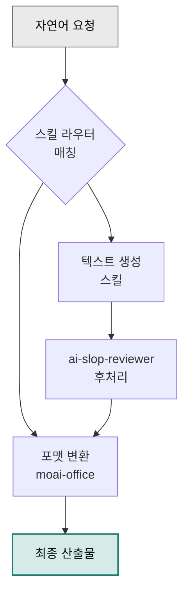

# Cowork 쿡북

> Claude Cowork와 moai 플러그인을 **실제 업무에 어떻게 엮는지** 시나리오 묶음으로 정리한 쿡북입니다.

## 사용 방식

복잡한 업무를 매번 긴 프롬프트로 작성할 필요는 없습니다. 사용자가 짧은 한 줄로 요청하면 시스템이 AskUserQuestion으로 필요한 맥락을 물어보고, 스킬 체이닝이 나머지 과정을 자동으로 처리해 최종 산출물을 내놓습니다.

➡️ **[사용 패턴 가이드 (4가지 표준 패턴)](../cowork/patterns/)** — 단일 프롬프트 · 멀티턴 대화 · 배치 처리 · 스케줄 자동화

## 어디서 시작하나요?

자신의 상황에 맞는 진입점을 고르세요. 역할이 이미 명확하다면 **[실전 트랙](./tracks/)** (문서·콘텐츠·광고·이커머스·HR·운영·법무·재무·데이터·프로덕트 10개 트랙 + 부록)에서 바로 시작할 수 있습니다. 구체적인 시나리오가 궁금하다면 아래 쿡북 목록을 훑어보세요. 개념을 먼저 잡고 싶다면 **[스킬 체이닝 가이드](./skill-chaining/)** 를 읽는 것이 효율적입니다.

## 공통 포맷 (모든 쿡북 항목)

각 예제는 일관된 구성을 따릅니다. 한 줄 자연어 요청(✅ 권장 패턴)으로 시작해 AskUserQuestion이 필요한 맥락을 수집하고, mermaid 다이어그램으로 자동 스킬 순서를 시각화합니다. 이어서 최종 산출물 미리보기가 나오고, 한 줄 요청만 바꿔 다른 결과를 얻는 변형 시나리오와 실패 케이스·우회법까지 한데 담았습니다. 한 예제를 끝까지 읽으면 나머지 예제도 같은 구조로 읽힙니다.

## 먼저 읽으면 좋은 글

- [스킬 체이닝 가이드](./skill-chaining/) — 쿡북 전반에서 공통으로 쓰는 체인 패턴 입문
- [플러그인 빠른 시작](../plugins/quick-start/) — 마켓플레이스 등록부터 첫 호출까지

## 예제 목록

- [스킬 체이닝 가이드](./skill-chaining/) — 체인 설계 기초
- [베스트 프랙티스](./best-practices/) — 실패 패턴 10선, 프롬프트 점검표
- [자동화 레시피](./automation-recipes/) — 바로 쓰는 20개 체인 모음
- [블로그 파이프라인](./blog-pipeline/) — 초안→검수→썸네일
- [주간 보고서 자동화](./report-automation/) — 상태 집계→XLSX→DOCX
- [마케팅 트랙](./track-marketing/) — 브랜딩·SEO·캠페인 8주
- [문서 트랙](./track-documents/) — Office 산출물 자동화 8주
- [데이터 트랙](./track-data/) — 분석·공공데이터 8주
- [사업계획서 자동화](./business-plan/) — 전략→산업분석→PPT
- [IR 덱 제작](./ir-deck/) — 투자자 관점 슬라이드
- [계약서 검토 리포트](./contract-review/) — NDA 트리아지·리스크 점검
- [트러블슈팅](./troubleshooting/) — 체인 실패 진단·재시도

## 공통 원칙

쿡북 전반에 걸쳐 네 가지 원칙이 일관되게 적용됩니다.

보고서·블로그·이메일·자소서·계약서 수정안처럼 텍스트 중심 산출물은 **반드시 `ai-slop-reviewer`로 마무리**합니다. 재무제표 엑셀·차트 HTML·스크립트 코드처럼 숫자·차트·코드가 본체인 산출물은 AI 어투를 검출할 대상이 없으므로 `ai-slop-reviewer`를 생략해도 됩니다.

포맷 변환은 항상 `moai-office`에 위임합니다. 내용 생성 스킬은 초안까지만 맡고, 실제 파일은 `docx-generator` / `xlsx-creator` / `pptx-designer` / `hwpx-writer`가 담당합니다.

Windows를 사용한다면 파일명을 짧게 유지하세요. MAX_PATH(260자) 제한 때문에 `보고서.docx`처럼 짧은 한글 이름을 권장합니다.

---

### Sources
- [modu-ai/cowork-plugins](https://github.com/modu-ai/cowork-plugins)
- [docs.claude.com — Cowork](https://docs.claude.com)
