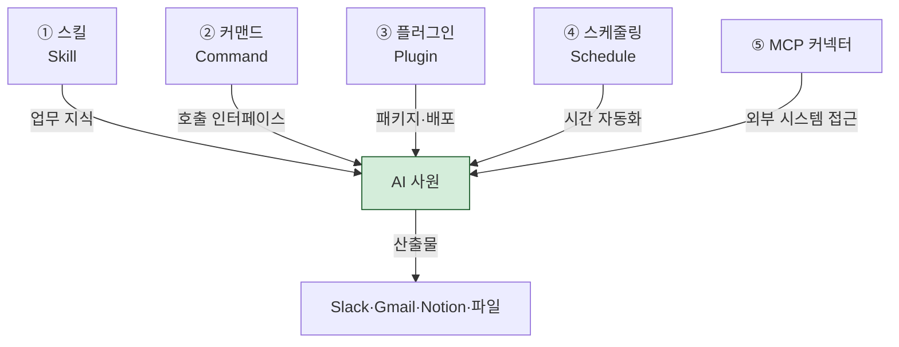

# AI 사원 설계 — 5개 부품으로 "부서 하나"를 만든다

> "AI 사원"이라는 표현은 마케팅 용어가 아닙니다. Cowork에서는 5개 부품을 조립해 **사람 직원에 대응하는 단위**를 실제로 만들 수 있습니다. CTR-AX 강의에서 제시한 설계 모델을 정리합니다.

## 구성 5요소



| 부품 | 비유 | Cowork 구현 |
|---|---|---|
| ① 스킬 | 직원의 "머릿속 매뉴얼" | `SKILL.md` + resources |
| ② 커맨드 | 직원을 부르는 "호출 벨" | `/명령어` 슬래시 또는 자연어 트리거 |
| ③ 플러그인 | 부서 패키지 (여러 직원 묶음) | `.plugin` 번들 (`cowork-plugins`) |
| ④ 스케줄링 | 직원의 "출퇴근표·업무 주기" | `/schedule` 등록 |
| ⑤ MCP 커넥터 | 직원의 "사내 시스템 접근 권한" | Slack·Gmail·Notion MCP |

## 설계 절차 — Job Design 5단계

1. **역할 정의 (Role)** — 직원의 한 줄 직무 기술서를 씁니다. 어떤 부서의, 무슨 일을 하는, 누구의 보조인지.
2. **업무 분해 (Responsibilities)** — 일을 반복 가능한 태스크로 분해합니다. "매일 뉴스 요약" / "주간 KPI 집계" / "긴급 메일 알림" 같은 단위.
3. **인터페이스 결정 (Interface)** — 각 업무를 어떻게 호출할지 정합니다. 슬래시 명령·자연어·예약·이벤트 기반 중 선택.
4. **권한·연동 매핑 (Access)** — 각 업무가 어떤 외부 시스템을 읽고 쓰는지 MCP 커넥터 목록으로 정리.
5. **산출물 채널 (Delivery)** — 결과물을 어디로 내보낼지 결정합니다. Slack·Gmail·Notion·로컬 파일 중 선택.

## 설계 사례 — "재무 대리 AI"

### 1. 역할 정의

> 재무팀 김대리의 반복 업무를 맡는 AI. 환율·미결·월마감 현황을 매일 아침 자동 보고하고, 출장 중 긴급 조회에 응답한다.

### 2. 업무 분해

| 태스크 ID | 업무 | 반복 주기 |
|---|---|---|
| T1 | 환율 3종 조회 (USD·JPY·EUR) | 매일 08:50 |
| T2 | 미결 메일 분류 (결제·인보이스·정산) | 매일 08:50 |
| T3 | 월마감 긴급 조회 | 수시 (Dispatch) |
| T4 | 주간 현금흐름 요약 | 매주 월 09:00 |

### 3. 인터페이스 결정

| 태스크 | 호출 방법 |
|---|---|
| T1·T2 | `/schedule` 예약 (매일 08:50 실행) |
| T3 | 자연어 Dispatch ("월마감 긴급 확인해줘") |
| T4 | `/schedule` 예약 (매주 월 09:00) + `/finance weekly` 수동 호출 |

### 4. 권한·연동 매핑

| 태스크 | 읽기 | 쓰기 |
|---|---|---|
| T1 | WebFetch (naver.com/finance) | — |
| T2 | Gmail MCP (받은편지함) | Slack MCP (`#finance-daily`) |
| T3 | 로컬 파일 (`D:/ERP/monthly/`) | — |
| T4 | 로컬 파일 (`D:/Finance/weekly/`) | 로컬 파일 (PPT), Notion MCP |

### 5. 산출물 채널

- **일일** — Slack `#finance-daily` 자동 게시
- **월마감 긴급** — Dispatch 호출자 모바일 알림
- **주간** — `90_Output/weekly-finance-YYYY-MM-DD.pptx` + Notion 페이지

## 구현 — 플러그인 번들로 묶기

개인용 스킬은 프로젝트 폴더에 SKILL.md로 두는 것만으로 충분합니다. 하지만 **같은 AI 사원을 여러 PC·팀원과 공유**하려면 플러그인으로 번들해야 합니다.

### 폴더 구조

```text
finance-assistant/
├── .claude-plugin/
│   └── plugin.json
├── skills/
│   ├── daily-briefing/
│   │   └── SKILL.md
│   ├── monthly-close/
│   │   └── SKILL.md
│   └── weekly-cashflow/
│       └── SKILL.md
└── CONNECTORS.md
```

### `plugin.json` 최소 스펙

```json
{
  "name": "finance-assistant",
  "version": "0.1.0",
  "description": "재무 대리 AI — 환율·미결·월마감·현금흐름 자동화",
  "skills": [
    "skills/daily-briefing",
    "skills/monthly-close",
    "skills/weekly-cashflow"
  ]
}
```

### `SKILL.md` 프런트매터 필수 항목

```yaml
---
name: daily-briefing
description: >
  매일 아침 환율 3종과 미결 메일 분류 후 Slack 발송.
  사용자가 "환율 브리핑" "일일 재무 브리핑" "/finance daily"
  등을 말하면 이 스킬이 발동한다.
---
```

`description` 안의 트리거 키워드가 핵심입니다. Cowork의 auto-skill 매칭은 **description 텍스트**만 보고 판단합니다.

## 커맨드 — 명시 호출 인터페이스

자연어 매칭이 애매한 경우 `/명령어` 슬래시로 명시 호출합니다.

### 커맨드 정의 예시

```text
# .claude/commands/finance-daily.md
자연어: /finance daily
설명: 오늘의 환율·미결·월마감 요약

실행 흐름:
1. skills/daily-briefing 스킬 호출
2. 결과를 Slack #finance-daily 채널 전송
3. 완료 후 "일일 재무 브리핑 완료" 응답
```

## 스케줄링 — 반복 자동화

플러그인 안에 직접 스케줄을 박아두지 말고, **사용자 PC별 등록을 권장**합니다. PC마다 시간대·휴일이 다르므로.

```text
(사용자가 처음 설치한 날 한 번 실행)
/schedule

매주 월요일 09:00에 finance-assistant 플러그인의
weekly-cashflow 스킬을 실행해줘.
결과는 90_Output 폴더에 PPT로 저장하고
Notion "주간 현금흐름" 페이지에도 동기화해줘.
```

## MCP 커넥터 — 권한 최소 원칙

| 태스크 | 필요 권한 | 과도한 권한 (금지) |
|---|---|---|
| 환율 조회 | WebFetch | 로컬 파일 쓰기 |
| 미결 메일 분류 | Gmail 읽기, Slack 쓰기 | Gmail 삭제 |
| 월마감 조회 | 로컬 파일 읽기 (`D:/ERP/monthly/`) | Gmail 발송 |
| 현금흐름 요약 | 로컬 파일 읽기·쓰기 | 은행 시스템 자동 이체 |


**금융 계좌 자동 이체·주식 거래·송금은 절대 AI 사원에게 맡기지 마세요.** Cowork는 원칙적으로 금융 실행 액션을 거부합니다.


## 실무 팁

### 역할당 하나의 플러그인

"재무 대리 AI" 플러그인 하나에 태스크 4개. 역할이 늘어나면 새 플러그인으로 분리하세요. 하나의 플러그인에 스킬 10개 이상 들어가면 description 매칭이 흐트러집니다.

### Description이 80%를 결정한다

Cowork는 SKILL.md의 description 텍스트만 보고 이 스킬이 발동할지를 결정합니다. 트리거 키워드 3~5개를 description 본문에 자연스럽게 녹이세요.

### 스킬은 짧게, 리소스는 파일로

SKILL.md 본문은 200줄 이내로 유지합니다. 긴 템플릿·체크리스트·샘플 데이터는 `skills/<name>/resources/`에 분리하고 SKILL.md에서 상대 경로로 참조하세요.

### 출퇴근표는 사용자 PC에 등록

스케줄을 플러그인에 하드코딩하지 말고, 사용자가 설치 후 `/schedule`로 직접 등록하도록 가이드하세요. PC 타임존·휴일·근무 패턴이 달라질 수 있습니다.

## 다음 읽을거리

- [AI 사원 실습 1 — 재무](../ai-employee-lab-1/)
- [AI 사원 실습 2 — 품질·SCM](../ai-employee-lab-2/)
- [스킬 체이닝 가이드](../skill-chaining/)
- [자동화 레시피](../automation-recipes/)

---

### Sources
- CTR-AX S5 · Skill 라이브 제작, S6 · Schedule + Dispatch
- [Claude Docs — Skills](https://docs.claude.com/en/docs/claude-cowork/skills)
- [modu-ai/cowork-plugins v1.5.0 — 17 플러그인 73 스킬 카탈로그](https://github.com/modu-ai/cowork-plugins)
