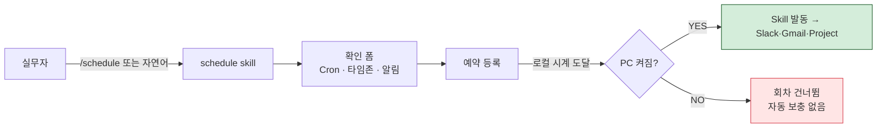
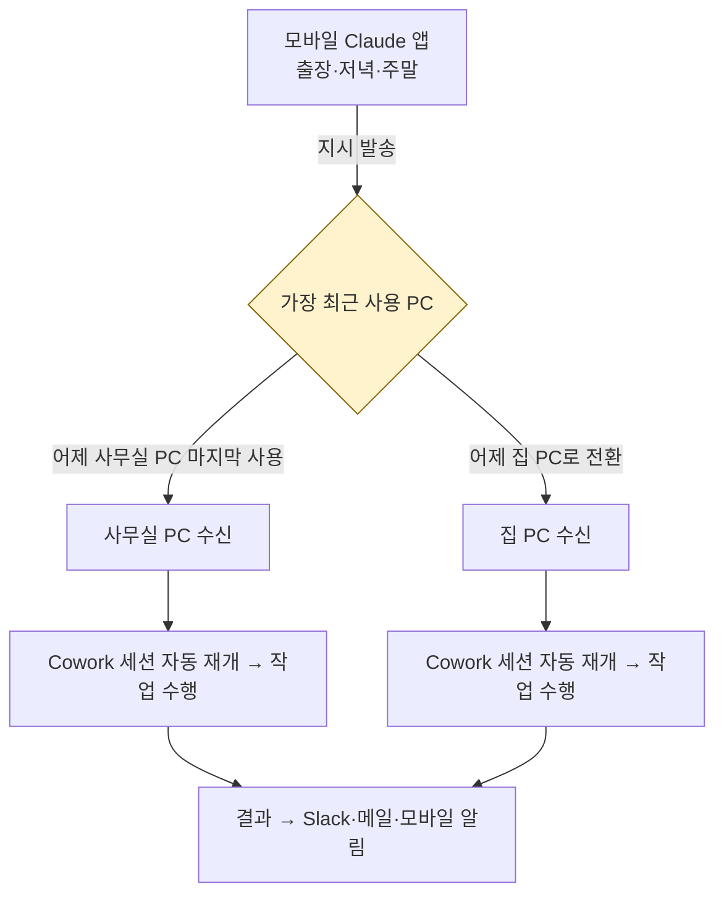

> Schedule은 **시간의 자동화**, Dispatch는 **공간의 확장**입니다. 둘을 결합하면 "내가 자리에 없어도 내 AI 직원은 계속 일하는" 상태가 만들어집니다.

CTR-AX 현장에서 검증된 레시피를 본부별로 정리합니다.

## 기본 원리



### Schedule 핵심 팩트

- **호출 방법** — `/schedule` 슬래시 명령 또는 자연어 ("매일 아침 8시에 X 실행해줘")
- **시간 기준** — 로컬 PC 시계 (UTC 아님). 서머타임 구간 주의
- **실행 조건** — PC 켜짐 + Cowork 실행 중. 꺼진 PC는 회차 스킵
- **외부 MCP 쓰기** — 최초 1회 명시적 승인 필요

## Dispatch — 모바일에서 PC로 지시 쏘기



### 현장 규칙 3가지

1. **작업받을 PC를 마지막으로 사용한 상태로 두고 나가기** — Dispatch는 "마지막으로 사용한 PC"로 라우팅되므로, 출근할 때 사무실 PC로 일하고 퇴근할 때 집 PC를 켜지 말아야 사무실 PC가 야간 지시를 받습니다.
2. **집 PC를 잠깐 열면 라우팅이 집 PC로 넘어감** — 저녁에 집 PC로 메일만 확인해도 라우팅이 바뀝니다. 중요한 야간 배치가 있으면 집 PC를 아예 켜지 마세요.
3. **출장 전 사무실 PC 대기 상태 확인** — 절전 모드·자동 종료 스케줄·Windows Update 재부팅을 모두 해제해야 합니다.


**제약** — Pro·Max·Team·Enterprise 플랜, PC 켜짐, 네트워크 연결 필수. **원격 부팅(WOL)은 지원하지 않습니다.**


## 본부별 레시피

### 재무

| 유형 | 시점 | 내용 |
|---|---|---|
| Schedule | 매일 08:50 | 환율 (KRW/USD·JPY·EUR) 조회 + 미결 메일 분류 → Slack `#finance-daily` |
| Dispatch | 출장 중 | 월마감 긴급 확인 — "이번 달 미결 전표 현황 확인해서 경영진 보고 초안 써줘" |

### 품질

| 유형 | 시점 | 내용 |
|---|---|---|
| Schedule | 매일 07:00 | 전일 불량 대시보드 → HTML 리포트 → 공장장 Gmail |
| Dispatch | 해외 공장 방문 중 | "해외공장 이번 주 불량 이슈 Top 3 정리하고 원인 분석해줘" |

### SCM

| 유형 | 시점 | 내용 |
|---|---|---|
| Schedule | 매주 월 08:00 | 벤더 리스크 스캔 (뉴스·주가·공시) → Notion |
| Dispatch | 항공 이동 중 | 발주 승인 초안 — "A벤더 5월 발주 품목 확인하고 결재 초안 써줘" |

### 해외영업

| 유형 | 시점 | 내용 |
|---|---|---|
| Schedule | 매일 06:00 | 현지 (미국·유럽·동남아) 업계 뉴스 요약 |
| Dispatch | 국내 출장 중 | 법인 이슈 브리프 — "베트남 법인 지난주 이슈 Top 5 정리해줘" |

## 실전 등록 예시

### 재무 — 매일 아침 환율·미결 메일


> /schedule

매일 08:50에 다음을 실행해줘:
1. 네이버 금융에서 KRW/USD, KRW/JPY, KRW/EUR 환율 조회
2. Gmail에서 어제 이후 안 읽은 이메일 중 "결제·인보이스·정산" 키워드 포함 메일 분류
3. Slack #finance-daily 채널에 환율 + 미결 메일 목록 전송
4. 전날 대비 환율 변동이 ±1% 이상이면 "경고" 표시


### 품질 — 불량 대시보드


> /schedule

매일 07:00에 다음을 실행해줘:
1. D:/QMS/daily_inspection.xlsx에서 어제자 불량 데이터 추출
2. 생산라인별 불량률 집계, 임계치(2%) 초과 라인 강조
3. HTML 리포트를 90_Output/YYYY-MM-DD-quality.html로 저장
4. 공장장(factory@company.com) Gmail로 HTML 첨부 발송


### 해외영업 — 조기 뉴스 브리핑


> /schedule

매일 06:00에 다음을 실행해줘:
1. WebSearch로 "반도체 산업 어제자 주요 뉴스" 검색 (미국·유럽 소스 우선)
2. 주요 기사 5개 선별하여 한국어로 3줄 요약
3. 요약을 Notion "일일 해외 브리핑" 페이지에 오늘 날짜로 추가
4. 카카오톡 나에게 보내기로 Notion URL 푸시


## Dispatch 활용 패턴

Dispatch는 모바일 Claude 앱에서 이렇게 생깁니다.

### 패턴 A — 즉시 실행

```text
(모바일 앱에서)
사무실 PC에서 지금 다음 작업을 실행해줘:
D:/Sales/Q1_report.xlsx를 분석해서 임원 요약 PPT 5장을 만들어
90_Output/IR/Q1-summary.pptx로 저장. 완료되면 카톡으로 알려줘.
```

### 패턴 B — 조건부 실행

```text
(모바일 앱에서)
집 PC에 지시 — 오후 7시 이후 퇴근 알림이 뜨면
내일 아침 회의 자료를 취합해서 이메일 초안을 준비해둬.
실제 발송은 내일 아침 내가 확인한 뒤 수동으로 하겠다.
```

### 패턴 C — 지연 실행


> (모바일 앱에서)
사무실 PC에서 오늘 밤 10시에 실행:
Downloads 폴더의 어제 이후 파일을 Project_YYYY-MM 폴더로 분류하고
30일 이상 안 쓴 파일은 Archive로 이동해줘.


## 운영 체크리스트

### 도입 전

```
[ ] Cowork 이용 플랜 확인 (Pro·Max·Team·Enterprise)
[ ] 각 PC에 Claude Desktop 설치 + 로그인
[ ] 모바일 Claude 앱 설치 + 동일 계정 로그인
[ ] 절전·자동종료·Windows Update 재부팅 스케줄 해제
```

### 도입 직후

```
[ ] Schedule 첫 회차를 "수동" 빈도로 등록하여 동작 확인
[ ] Dispatch 테스트 — 모바일에서 "테스트" 지시 → PC 수신 확인
[ ] 결과 채널 (Slack·Gmail·카톡) 알림 동작 확인
[ ] 외부 MCP 쓰기 승인 (최초 1회)
```

### 운영 중

```
[ ] 매주 월요일 Schedule 실행 로그 점검
[ ] PC 재부팅·세션 종료 후 Cowork 자동 실행 여부 확인
[ ] 서머타임 전환일 직후 일정 수동 점검
[ ] 보안 — 외부 MCP 토큰 만료 시점 기록
```

## 한계와 대안

| 한계 | 대안 |
|---|---|
| 원격 부팅 불가 | PC를 상시 가동 또는 BIOS WOL + 네트워크 장비 연동 (자체 구성) |
| PC 꺼짐 시 회차 스킵 | 중요 일정은 사내 서버 + Cowork Team 플랜 고려 |
| 모바일에서 직접 실행 불가 | Dispatch는 "지시 전송"만 담당 — PC가 실제 실행 |
| 서머타임 자동 조정 없음 | 전환 주간에 한해 수동 시간 조정 |

## 다음 읽을거리

- [AI 사원 설계](../ai-employee-design/)
- [예약 작업 기본](../../cowork/schedule/)
- [스킬 체이닝 가이드](../skill-chaining/)
- [최종 프로젝트](../final-project/)

---

### Sources
- CTR-AX S6 · Schedule + Dispatch + 과제 계약
- [Claude Docs — Scheduled Tasks](https://docs.claude.com/en/docs/claude-cowork/scheduled-tasks)
- [modu-ai/cowork-plugins v1.5.0](https://github.com/modu-ai/cowork-plugins)
