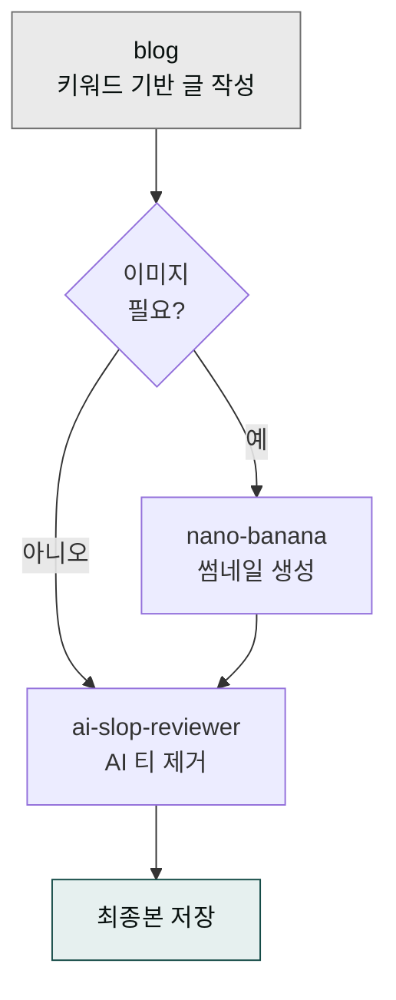

> **목표** — 키워드 한 줄에서 시작해 네이버·티스토리·브런치에 바로 올릴 수 있는 2500자 블로그 글까지, 한 번의 지시로 완성합니다.



## 대상 독자

키워드 하나에서 발행 가능한 완성 글까지 직접 쓰는 데 드는 시간을 줄이고 싶은 블로그·콘텐츠 마케터, 1인 미디어 운영자, 기업 블로그 담당자를 위한 레시피입니다.

## 사전 준비

- 플러그인: `moai-content`, `moai-core:ai-slop-reviewer`
- (선택) 이미지 — `moai-media`의 `nano-banana` (한국어 타이포 SOTA) 또는 `image-gen`
- 입력: **타깃 키워드**, **플랫폼**(네이버·티스토리·브런치 등), **대상 독자**

## 스킬 체인

```
blog → (이미지가 필요하면 nano-banana) → ai-slop-reviewer
```

`blog` 스킬이 C-Rank/D.I.A./GEO 알고리즘을 고려해 글을 작성하고, 마지막에 `ai-slop-reviewer`를 거쳐 AI 특유의 기계적 어투를 걷어냅니다. 썸네일이 필요한 경우에는 `nano-banana`를 중간에 끼웁니다.

## 단계별 실행

### 1. 플러그인이 설치되어 있는지 확인


> /plugin installed


목록에 `moai-content`와 `moai-core:ai-slop-reviewer`가 보여야 합니다. 없다면:


> /plugin install moai-content
/plugin install moai


### 2. 단일 프롬프트로 파이프라인 지시


> 네이버 블로그에 올릴 포스팅 써줘.
> - 키워드: "노션 프로젝트 관리 템플릿"
> - 대상: 30대 직장인, 노션 입문
> - 분량: 2500자 내외
> - C-Rank 친화, 도입-본론 3단-결론 구조
>
> 다 쓰고 나서 ai-slop-reviewer로 마지막에 다듬어줘.


### 3. 중간 점검

Claude가 초안을 보여주면 두 가지를 확인하세요. 첫째, 키워드가 본문 H2 두 곳 이상에 자연스럽게 등장하는가입니다. 둘째, 첫 문단이 질문형 또는 공감형으로 시작하는가인데, 이는 네이버 C-Rank 체류시간에 영향을 줍니다. 어색한 부분이 있다면 "도입 첫 2문단만 다시" 식으로 부분 재요청하면 됩니다.

### 4. (옵션) 썸네일 이미지 추가


> 방금 글 제목으로 카드뉴스 썸네일 한 장 만들어줘.
nano-banana로 한글 타이포 들어가게. 3:4 비율.


### 5. 최종본 저장


> 완성본을 my-blog-post.md 로 저장해줘.


## 자주 겪는 이슈


**이슈 1 — 네이버에 붙였더니 줄바꿈이 뭉침.**
네이버 에디터는 `\n\n` 두 줄 공백을 한 문단 사이로 인식합니다. Markdown 그대로 복사하면 괜찮지만 한 줄 공백은 합쳐질 수 있습니다.



**이슈 2 — 브런치 업로드 시 이미지가 너무 큼.**
`nano-banana` 기본 출력이 1536px 인 경우가 있으므로 "브런치용 1024px 로 리사이즈" 한 번 더 지시하세요.



**이슈 3 — AI 어투가 남음.**
`ai-slop-reviewer`가 생략된 경우가 많습니다. 최종본을 보고 나서 "이 글 ai-slop-reviewer로 한 번 더 돌려줘"라고 명시하세요.


## 응용 변형

같은 키워드로 네이버·티스토리·링크드인 3버전을 동시에 뽑으려면 플랫폼별로 세 번 호출한 뒤 마지막에 `ai-slop-reviewer`를 한 번만 더 돌리면 됩니다(**일괄 발행**). 시리즈 글을 연속으로 발행할 계획이라면 `content-calendar` 스킬(`moai-content`)로 월간 계획을 먼저 세운 뒤 매주 이 파이프라인을 실행하세요(**시리즈 글**).

---

### Sources
- [modu-ai/cowork-plugins › moai-content](https://github.com/modu-ai/cowork-plugins)
- [네이버 검색 공식 블로그 — C-Rank](https://blog.naver.com/naver_search)
