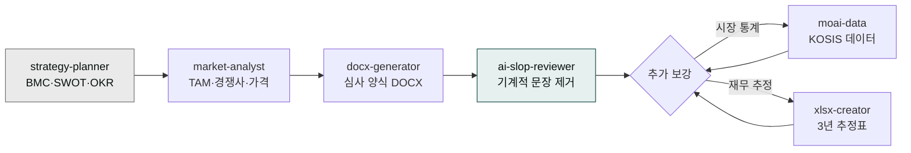

> **목표** — 아이템 아이디어에서 시작해 심사위원이 받을 수 있는 수준의 DOCX 사업계획서까지, 1~2시간 이내로 완성합니다.



## 대상 독자

예비창업패키지·TIPS 등 정부 지원사업에 제출할 사업계획서를 준비하는 창업가·중소기업 기획자.

## 사전 준비

- 플러그인: `moai-business`, `moai-office`, `moai-core:ai-slop-reviewer`
- (선택) `moai-data` — 시장 규모·통계 인용이 필요한 경우
- 입력: **아이템 한 줄 요약**, **타깃 고객**, **매출 모델**, **제출 양식**(자유 / 예비창업패키지 / TIPS 등)

## 스킬 체인

```
strategy-planner → market-analyst → docx-generator → ai-slop-reviewer
```

- `strategy-planner` — BMC·SWOT·OKR로 뼈대 작성
- `market-analyst` — TAM/SAM/SOM·경쟁사·가격 전략
- `docx-generator` — 심사 양식에 맞는 DOCX 변환
- `ai-slop-reviewer` — 기계적 문장 제거

## 단계별 실행

### 1. 아이템을 한 문단으로 정리

```
한 문단 아이템 설명:
(예) "50대 이상 1인 가구를 위한 반찬 정기구독 서비스. 주 2회 냉장 배송,
월 9만원부터. 영양사 1:1 식단 상담 포함."

타깃: 서울·경기 50대 1인 여성, 도보 15분 내 편의점 없는 지역
매출 모델: 월정액 + 영양 상담 유료 옵션
제출 양식: 예비창업패키지 2026 상반기
```

### 2. 뼈대 생성

```
위 아이템으로 BMC·SWOT·4P·경쟁사 맵을 짜줘.
strategy-planner 와 market-analyst 를 순서대로 써.
```

### 3. 심사 양식에 맞춰 DOCX로


> 방금 뼈대를 2026 예비창업패키지 양식에 맞게 DOCX로 만들어줘.
  - 표지, 목차, 문제 인식, 실현가능성, 성장전략, 팀 구성, 재무계획
  - 표·그림 포함
  - 폰트는 맑은고딕, 본문 10pt

docx-generator 스킬로 실제 파일 만들어줘.


### 4. AI 슬롭 검수

```
방금 만든 사업계획서 본문 섹션별로 ai-slop-reviewer 돌려줘.
특히 "패러다임", "본 사업은", "선도적" 같은 표현 잡아줘.
```

### 5. (선택) 시장 통계 보강


> 1인 가구 통계가 필요해. moai-data 의 public-data 로 KOSIS에서
최근 5년 서울 1인 가구 추이 가져와서 5장 "시장 분석" 에 표와 그래프로 추가해줘.


### 6. 재무 추정표 별도 엑셀


> 3년 매출·비용 추정 엑셀 만들어줘. xlsx-creator 로.
  - 가정: 월 500명 출발, 월 10% 성장, CAC 4만원, LTV 36만원
  - 손익계산서·월별 현금흐름·BEP 시트 포함


## 자주 겪는 이슈


**이슈 1 — 심사 양식 페이지 수 제한 초과.**
예비창업패키지는 본문 30장 내외. 초과하면 `docx-generator` 호출 시 "30장 이내로 압축" 명시.



**이슈 2 — 재무 추정이 비현실적.**
`strategy-planner`는 낙관적 가정을 쓰는 경향이 있습니다. 월 성장률 10%를 넘는 가정은 심사에서 감점 요인이므로 직접 조정하세요.



**이슈 3 — 팀 구성원 이력이 빈칸.**
팀원 이력서를 PDF로 업로드한 뒤 "팀 구성원 경력 요약을 docx 에 삽입" 지시하세요.


## 응용 변형

- **정부 지원사업 매칭** — `kr-grant-writer` 스킬로 내 아이템에 맞는 공고를 먼저 찾고 그 양식에 맞춰 진행합니다.
- **피칭 덱 변환** — 완성된 DOCX를 `investor-relations + pptx-designer`로 IR 덱으로 변환 → [IR 덱 제작](../ir-deck/) 참고.

---

### Sources
- [modu-ai/cowork-plugins › moai-business](https://github.com/modu-ai/cowork-plugins)
- [창업진흥원 — 예비창업패키지](https://www.k-startup.go.kr)
