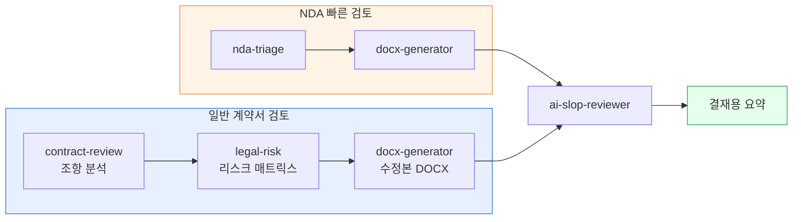

> **목표** — 상대측이 보낸 계약서·NDA를 **리스크 항목별로 표 정리** → 수정본 DOCX → 1페이지 결재용 요약까지 자동으로 만듭니다.




**법률 자문의 최종 결정은 반드시 변호사가 해야 합니다.** 이 파이프라인은 초안·1차 스크리닝·협상 포인트 정리용입니다. [Cowork 안전 사용](../../cowork/safety/) 참고.


## 대상 독자

계약서·NDA 1차 리뷰가 자주 필요한 사업개발·법무 담당자, 스타트업 대표.

## 사전 준비

- 플러그인: `moai-legal`, `moai-office`, `moai-core:ai-slop-reviewer`
- (선택) `korean-law` MCP — 조문·판례 레퍼런스 필요 시
- 입력: 계약서 원문 (PDF / DOCX / HWPX), **계약 유형**, **내 포지션**(을·발주·라이선시 등)

## 스킬 체인

```
contract-review → legal-risk → docx-generator → ai-slop-reviewer
```

(NDA 빠른 검토만 필요하면: `nda-triage → docx-generator → ai-slop-reviewer`)

## 단계별 실행

### 1. 원문 업로드


> 첨부 계약서(서비스계약서-v2.pdf) 검토해줘.
내 포지션: 을(수탁자)
관심사: 손해배상 상한, 지재권 귀속, 해지 조항


### 2. 10대 리스크 체크 표


> contract-review 로 조항별로 분석해서 다음 표 만들어줘:
| 조항 번호 | 조항 요약 | 리스크 | 우리측 대응 |


### 3. 영향도 매트릭스

```
legal-risk 로 각 리스크 항목의 발생가능성 × 영향도를 2x2 매트릭스로.
상위 3개 리스크는 협상 포인트로 분리.
```

### 4. 수정본 DOCX


> 상위 3개 조항에 대한 대체 조항 문구를 docx 로 만들어줘.
  - 원문 인용 + 우리 수정안 + 근거 (조문·판례)
  - 추적 변경처럼 보이게 표로


### 5. 1페이지 결재용 요약


> 방금 검토를 경영진 결재용으로 1페이지 요약해줘.
핵심 리스크 3개 + 권장 액션 + 승인 필요 사항.
ai-slop-reviewer 로 끝에 다듬어줘.


## 자주 겪는 이슈


**이슈 1 — HWPX 원본이 깨짐.**
한글 파일은 `hwpx-writer`로 변환한 뒤 `contract-review`에 입력합니다. 표·각주가 있는 계약서는 특히 중요합니다.



**이슈 2 — 조항 번호가 틀리게 인용된다.**
스캔 PDF는 OCR 오류가 많습니다. 번호 인용은 최종 검토자가 반드시 크로스체크하세요.



**이슈 3 — 판례 레퍼런스가 허구.**
`legal-risk`가 가상 판례를 만드는 경우가 있습니다. 국가법령정보센터에서 실제 존재하는지 확인하거나 `korean-law` MCP를 연결하세요.


## 응용 변형

- **대량 표준계약서 심사** — 같은 포맷 계약서가 월 수십 건이라면 슬래시 명령으로 묶어 `/contract-review` 하나로 실행합니다.
- **이력 관리** — 수정본마다 `xlsx-creator`로 차수별 변경점 표를 누적합니다.

---

### Sources
- [modu-ai/cowork-plugins › moai-legal](https://github.com/modu-ai/cowork-plugins)
- [국가법령정보센터](https://law.go.kr)
