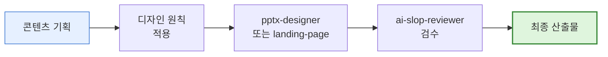

cowork-plugins의 디자인 계열 스킬을 사용할 때 참고할 수 있는 원칙 모음입니다.

```mermaid
flowchart LR
    A["콘텐츠 기획"] --> B["디자인 원칙<br/>적용"]
    B --> C["pptx-designer<br/>또는 landing-page"]
    C --> D["ai-slop-reviewer<br/>검수"]
    D --> E["최종 산출물"]

    style A fill:#e6f0ff,stroke:#3070d0
    style E fill:#dff5dd,stroke:#3a8a3a,stroke-width:2px
```

## 가이드

- [프레젠테이션 디자인 원칙](./presentation/) — `moai-office:pptx-designer`로 만든 슬라이드를 더 좋게 만드는 룰
