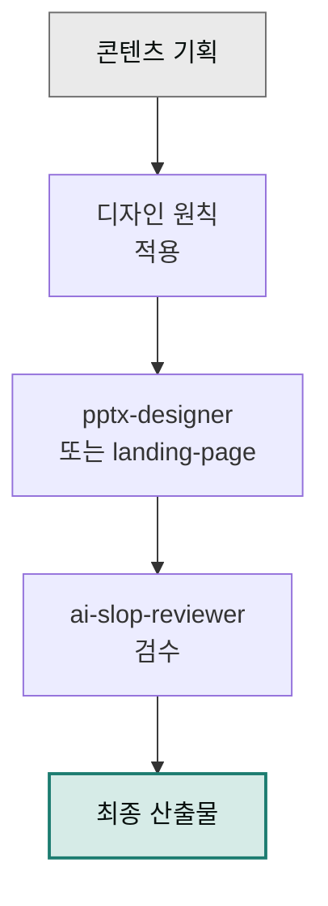

cowork-plugins의 디자인 계열 스킬로 슬라이드나 랜딩 페이지를 만들 때, 결과물의 완성도를 높이는 원칙 모음입니다. 스킬이 자동으로 생성한 산출물을 더 잘 다듬고 싶을 때 참고하세요.

## 가이드

- [프레젠테이션 디자인 원칙](./presentation/) — `moai-office:pptx-designer`로 만든 슬라이드를 더 좋게 만드는 룰
