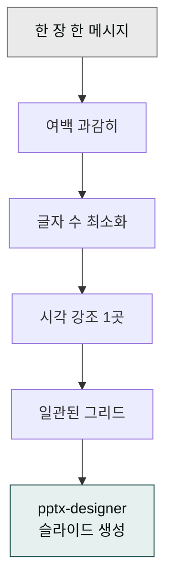

> "디자인이 좋다"는 칭찬은 보통 "정보가 잘 정리되어 있다"는 뜻입니다. 슬라이드를 화려하게 만드는 게 아니라, 한 장에 한 가지 메시지가 명확하게 보이도록 다듬는 것이 핵심입니다.



## 사용 스킬

- **`moai-office:pptx-designer`** — 발표용 PPT 슬라이드 디자인. Pretendard + 명조 기반 한국형 디자인, 한글 깨짐 없음.

## 5가지 핵심 원칙

### 1. 한 장에 한 메시지

청중이 슬라이드를 보면서 한 문장으로 요약할 수 있어야 합니다. 그 한 문장이 슬라이드 제목이어야 합니다.

- 나쁨: "Q2 실적" (요약 불가)
- 좋음: "Q2 매출, 전년 동기 대비 47% 성장" (한 문장 요약 = 제목)

### 2. 시각 위계 = 폰트 위계

3단계 위계만 씁니다.

| 역할 | 폰트·크기 | 예시 |
|---|---|---|
| 제목 | Pretendard Bold 28~36pt | "Q2 매출, 전년 동기 대비 47% 성장" |
| 본문 강조 | Pretendard SemiBold 18~22pt | 핵심 숫자, 키워드 |
| 본문 | Pretendard Regular 14~18pt | 설명, 캡션 |

### 3. 색은 3개 + 회색

브랜드 컬러 1개(메인) + 강조 1개 + 중성 회색. 4번째 색이 들어가면 청중이 헤맵니다.

### 4. 표·차트는 정렬·여백·축

표는 숫자 정렬 + 행간 1.5배 + 헤더만 강조. 차트는 축 라벨이 가독성의 절반입니다.

### 5. 마지막 한 장은 행동

"문의: ...", "다음 단계: ..." 같은 명시적 콜투액션 슬라이드로 마무리.

## 워크플로우 예시 — IR 덱 디자인

```
> "이 사업계획서를 IR 덱 PPT로 만들어줘. 우리 브랜드 메인 컬러는 #2C5FBC, 폰트는 Pretendard. 12장 분량, 한 장에 한 메시지. 차트가 들어가는 슬라이드는 표 대신 막대·도넛 차트로. 발표 시간 10분 기준."
```

`pptx-designer` 스킬이 슬라이드 마스터를 자동 적용해 한국형 폰트로 출력합니다. PPTX 파일을 받은 뒤 PowerPoint·Keynote에서 미세 조정.

## 한국 발표 환경 특이점

- **회사 PC 폰트 부재** — Pretendard·Noto Sans KR을 발표 PC에 설치하지 않으면 글꼴이 깨집니다. PPT를 PDF로도 함께 내보내 백업.
- **빔 프로젝터 색상** — 화면에서 잘 보이는 빨간색이 빔에서는 죽습니다. 진한 색·고대비 컬러를 권장.
- **한글·영문 혼용** — 한글은 Pretendard, 영문은 같은 패밀리(Pretendard Variable)로 통일.

## 자주 겪는 실수

- **글머리 기호 7~10개 / 슬라이드** — 청중이 못 따라옵니다. 3~4개로 줄이세요.
- **애니메이션 과용** — 페이드인 1개면 충분. 회전·바운스는 빼세요.
- **마지막 슬라이드 "감사합니다"만** — 행동을 유도하는 한 줄 + 연락처를 넣으세요.

## 다음 단계

- [트랙 — 문서 작성](../../tracks/track-documents/)
- [투자 유치 가이드](../../guides/funding/)

---

### Sources

- moai-office 플러그인 [`pptx-designer`](https://github.com/modu-ai/cowork-plugins/blob/main/moai-office/skills/pptx-designer/SKILL.md)
- [Pretendard 폰트](https://github.com/orioncactus/pretendard)
