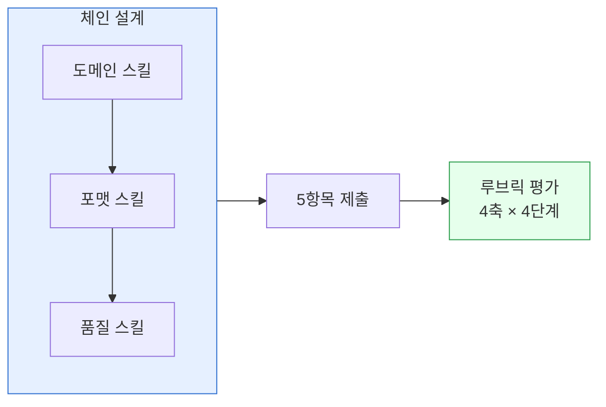

> 8주 코스의 마지막 단계입니다. 자기 업무 한 가지를 골라 3-스킬 체인으로 자동화하고, 산출물·프롬프트·회고를 한 문서로 정리합니다.


**v0.2 스켈레톤**: 제출 템플릿과 루브릭의 뼈대만 우선 배치했습니다. 예시 제출물과 모범 답안은 이후 체인 F에서 추가합니다.


## 학습 목표

- 본인 업무에서 **반복 가능한** 1건을 후보로 고를 수 있다
- 도메인 → 포맷 → 품질 3단계 체인을 스스로 설계할 수 있다
- 산출물 품질을 루브릭으로 자기 평가할 수 있다

## 선수 지식

- [스킬 체이닝 가이드](../skill-chaining/)
- [트러블슈팅](../troubleshooting/)
- 쿡북 실습 2편 이상 완료 (`blog-pipeline` 또는 `report-automation` 권장)

## 과제 정의


**과제**: 본인이 주 1회 이상 반복하는 업무 1건을 골라 **3-스킬 체인**으로 자동화하고, 5항목 제출 템플릿을 채우기.


**적합한 업무 예시**

- 주간 보고서 작성 · 고객 문의 1차 답변 초안 · 회의록 요약 · 신제품 상세페이지 초안 · 계약서 1차 리뷰

**부적합한 예시 (지금 단계에선 피할 것)**

- 정답이 하나뿐인 기계적 입력 (엑셀 수식으로 해결 가능)
- 인간 판단이 핵심인 고위험 의사결정 (최종 승인·인사 평가)

## 제출 템플릿 (5항목)

1. **업무 개요** — 업무 이름 · 주기(주 1회 등) · 현재 소요 시간 · 현재 담당자 · 산출물 형태
2. **체인 설계** — 도메인 → 포맷 → 품질 순서로 스킬 3개를 선정하고 각 스킬이 수행하는 역할을 한 줄씩. 예) `strategy-planner → docx-generator → ai-slop-reviewer`
3. **프롬프트** — 복붙 가능한 실제 프롬프트 원문. 맥락·독자·분량·톤을 모두 명시할 것.
4. **산출물** — 생성된 파일 링크 또는 스크린샷 + 파일 크기·포맷.
5. **회고**
   - 잘된 점 1개
   - 실패 원인 1개 (해결했다면 해결법 포함)
   - 다음 개선점 1개

## 루브릭 (4축 × 4단계)

| 축 | 1점 | 2점 | 3점 | 4점 |
|---|---|---|---|---|
| 체인 구성 | 체인 미구성 | 2개 스킬만 사용 | 3개 스킬 정석 순서 | 3개 + 상황별 분기 |
| 프롬프트 구체성 | 한 문장 | 맥락만 | 맥락+독자+분량 | 맥락+독자+분량+톤+제약 |
| 산출물 품질 | 열리지 않음 | 열리나 오류 다수 | ai-slop 통과 | 도메인 전문가 검토 통과 |
| 회고 반영 | 회고 부재 | 잘된 점만 | 잘된 점+실패 원인 | 4항목 모두 + 재발 방지 |

**합격선**: 총 12점 (각 축 3점) 이상.

## 제출·공유


제출 문서는 본인 저장소나 사내 위키에 올리고, 동료 1명에게 리뷰를 받으세요. 원한다면 [modu-ai/cowork-plugins Discussions](https://github.com/modu-ai/cowork-plugins/discussions)에 공유해 피드백을 받을 수 있습니다.


## 자가 점검


- Q. 선택한 업무가 주 1회 이상 반복되는가? (쉬움·이해)
- Q. 체인 3단계가 각각 도메인·포맷·품질에 해당하는가? (중간·적용)
- Q. 루브릭 4축 중 가장 약한 축은 무엇이며 다음에 어떻게 보강할 것인가? (어려움·평가)


## 다음 단계

- [Team·Enterprise 관리](../../cowork/enterprise/) — 사내 표준으로 제안하는 절차
- [안전하게 사용하기](../../cowork/safety/) — 도입 시 체크할 경계

---

### Sources

- [modu-ai/cowork-plugins Discussions](https://github.com/modu-ai/cowork-plugins/discussions)
- [Claude Cowork 공식 블로그](https://claude.com/blog/cowork-research-preview)
