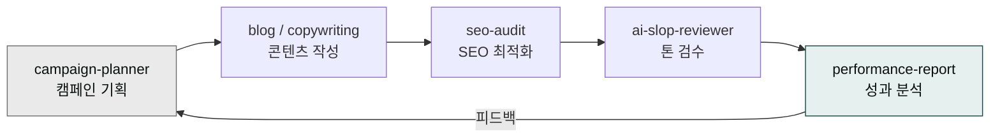

> 콘텐츠 마케팅은 한 번의 히트가 아니라 *지속 가능한 발행 리듬*에서 효과가 나옵니다. cowork-plugins는 기획·작성·검수·게시 전 단계를 자동화해 그 리듬을 만들 수 있게 합니다.



## 사용 스킬

| 단계 | 스킬 | 용도 |
|---|---|---|
| 캠페인 기획 | `moai-marketing:campaign-planner` | 그로스해킹·인플루언서·A/B 테스트 |
| 블로그 작성 | `moai-content:blog` | 네이버·티스토리·브런치·WordPress·Ghost |
| 카피 작성 | `moai-content:copywriting` | 헤드라인·CTA·슬로건 |
| SEO 최적화 | `moai-marketing:seo-audit` | 네이버·구글·AI 검색 통합 |
| 성과 분석 | `moai-marketing:performance-report` | GA4·네이버 광고·메타·카카오모먼트 |
| AI 슬롭 검수 | `moai-core:ai-slop-reviewer` | 발행 전 자연어 톤 검수 |

## 콘텐츠 운영 4단계

### 1. 페르소나·여정 정의

```
> "우리 타겟 고객 페르소나 3개 만들어줘. 각각 페인 포인트·정보 수집 채널·구매 결정 트리거. 첨부 파일 고객 인터뷰 데이터 참고."
```

`campaign-planner` 스킬이 고객 여정 맵까지 한 번에 그립니다.

### 2. 채널 믹스

| 채널 | 역할 | 발행 빈도 |
|---|---|---|
| 블로그 | 검색 진입 + 권위 | 주 2회 |
| 뉴스레터 | 충성 고객 유지 | 주 1회 |
| SNS (인스타·LinkedIn) | 인지도 + 인게이지먼트 | 주 3~5회 |
| 영상 (유튜브·릴스) | 신규 도달 | 월 2회 |

### 3. 콘텐츠 캘린더

```
> "다음 달 콘텐츠 캘린더 짜줘. 월~금 발행, 채널별 키워드 + 톤 + CTA 명시. 시즌 이슈(추석·단풍)도 반영."
```

### 4. 성과 분석

```
> "지난달 마케팅 성과 보고서 만들어줘. GA4·네이버 광고·메타 통합. 채널별 ROAS·전환율·LTV/CAC, 인사이트 5개."
```

## 워크플로우 예시 — 블로그 1편 발행

```
> "노션 활용법 블로그 1편 써줘. 30대 직장인 대상, 2500자, SEO 키워드 '노션 템플릿'. 네이버 블로그 발행 형식. AI 슬롭 검수까지 마쳐서."
```

체인:
1. `campaign-planner` (앵글 기획)
2. `blog` (본문 작성)
3. `seo-audit` (SEO 점검)
4. `ai-slop-reviewer` (검수)

## 한국 콘텐츠 마케팅 특이점

- **네이버 검색 비중** — 한국 B2C는 네이버 검색이 50% 이상. 네이버 블로그·카페 + 인플루언서 조합 필수.
- **카톡 채널** — 뉴스레터보다 카톡 채널 친구 1명이 더 비싼 자산일 수 있음.
- **애드밴티지 광고** — 메타·구글뿐 아니라 네이버 GFA·카카오모먼트도 검토 필수.

## 자주 겪는 실수

- **양 우선, 질 부족** — 주 5편 발행하다 3개월에 멈추는 것보다 주 2편을 12개월 유지하는 게 효과적.
- **KPI를 트래픽으로만** — 트래픽 → 리드 → 매출 깔때기 전체로 측정.
- **단일 채널 의존** — 한 채널이 알고리즘 변경으로 죽을 때 전부 무너집니다. 3개 이상 채널 분산.

## 다음 단계

- [SNS 최적화 가이드](../social-media/)
- [이메일 마케팅 템플릿](../../templates/email/)
- [트랙 — 마케팅](../../tracks/track-marketing/)

---

### Sources

- moai-marketing 플러그인 [`campaign-planner`](https://github.com/modu-ai/cowork-plugins/blob/main/moai-marketing/skills/campaign-planner/SKILL.md), [`seo-audit`](https://github.com/modu-ai/cowork-plugins/blob/main/moai-marketing/skills/seo-audit/SKILL.md), [`performance-report`](https://github.com/modu-ai/cowork-plugins/blob/main/moai-marketing/skills/performance-report/SKILL.md)
- moai-content 플러그인 [`blog`](https://github.com/modu-ai/cowork-plugins/blob/main/moai-content/skills/blog/SKILL.md)
