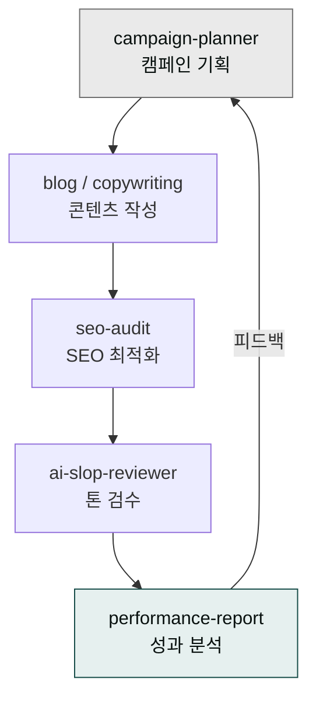

> 콘텐츠 마케팅은 한 번의 히트가 아니라 *지속 가능한 발행 리듬*에서 효과가 나옵니다. cowork-plugins는 기획·작성·검수·게시 전 단계를 자동화해 그 리듬을 만들 수 있게 합니다.

```mermaid
flowchart TD
    A["campaign-planner<br/>캠페인 기획"] --> B["blog / copywriting<br/>콘텐츠 작성"]
    B --> C["seo-audit<br/>SEO 최적화"]
    C --> D["ai-slop-reviewer<br/>톤 검수"]
    D --> E["performance-report<br/>성과 분석"]
    E -- "피드백" --> A

    style A fill:#eaeaea,stroke:#6e6e6e,color:#09110f
    style E fill:#e6f0ef,stroke:#144a46,color:#09110f
```

## 사용 스킬

콘텐츠 마케팅 전 단계는 여섯 개 스킬이 릴레이로 이어받습니다. 캠페인 전략부터 발행 직전 검수까지 각 스킬의 역할은 아래 표를 참고하세요.

| 단계 | 스킬 | 용도 |
|---|---|---|
| 캠페인 기획 | `moai-marketing:campaign-planner` | 그로스해킹·인플루언서·A/B 테스트 |
| 블로그 작성 | `moai-content:blog` | 네이버·티스토리·브런치·WordPress·Ghost |
| 카피 작성 | `moai-content:copywriting` | 헤드라인·CTA·슬로건 |
| SEO 최적화 | `moai-marketing:seo-audit` | 네이버·구글·AI 검색 통합 |
| 성과 분석 | `moai-marketing:performance-report` | GA4·네이버 광고·메타·카카오모먼트 |
| AI 슬롭 검수 | `moai-core:ai-slop-reviewer` | 발행 전 자연어 톤 검수 |

## 콘텐츠 운영 4단계

### 1. 페르소나·여정 정의

누가 읽는지 모르면 무엇을 써야 할지도 모릅니다. 먼저 타겟 고객의 페인 포인트와 정보 수집 경로를 정의하면, 이후 키워드 선정부터 채널 배분까지 모든 콘텐츠 결정이 훨씬 빨라집니다.


> 우리 타겟 고객 페르소나 3개 만들어줘. 각각 페인 포인트·정보 수집 채널·구매 결정 트리거.
> 첨부 파일 고객 인터뷰 데이터 참고.


`campaign-planner` 스킬이 고객 여정 맵까지 한 번에 그립니다.

### 2. 채널 믹스

| 채널 | 역할 | 발행 빈도 |
|---|---|---|
| 블로그 | 검색 진입 + 권위 | 주 2회 |
| 뉴스레터 | 충성 고객 유지 | 주 1회 |
| SNS (인스타·LinkedIn) | 인지도 + 인게이지먼트 | 주 3-5회 |
| 영상 (유튜브·릴스) | 신규 도달 | 월 2회 |

### 3. 콘텐츠 캘린더

발행 리듬은 한 번 정하면 월 단위로 미리 확정해 두는 것이 좋습니다. 캘린더가 있으면 "오늘 뭘 쓰지?"라는 고민이 사라지고, 팀 내 담당자 배분도 명확해집니다.


> 다음 달 콘텐츠 캘린더 짜줘. 월~금 발행, 채널별 키워드 + 톤 + CTA 명시.
> 시즌 이슈(추석·단풍)도 반영.


### 4. 성과 분석


> 지난달 마케팅 성과 보고서 만들어줘. GA4·네이버 광고·메타 통합.
> 채널별 ROAS·전환율·LTV/CAC, 인사이트 5개.


## 워크플로우 예시 — 블로그 1편 발행

한 편의 블로그 글을 처음부터 끝까지 완성하는 데는 보통 기획·작성·SEO 점검·검수 네 단계가 필요합니다. 단계마다 도구를 바꿔 가며 작업하면 흐름이 끊기고 시간이 배로 걸립니다. cowork-plugins는 이 흐름을 단일 프롬프트로 연결합니다.


> 노션 활용법 블로그 1편 써줘. 30대 직장인 대상, 2500자, SEO 키워드 '노션 템플릿'.
> 네이버 블로그 발행 형식. AI 슬롭 검수까지 마쳐서.


체인:
1. `campaign-planner` (앵글 기획)
2. `blog` (본문 작성)
3. `seo-audit` (SEO 점검)
4. `ai-slop-reviewer` (검수)

## 한국 콘텐츠 마케팅 특이점

한국 시장에서 콘텐츠를 운영할 때는 글로벌 방식과 다른 세 가지 포인트를 반드시 고려해야 합니다. 첫째, 한국 B2C에서는 네이버 검색이 전체 유입의 50% 이상을 차지하기 때문에 네이버 블로그·카페와 인플루언서 조합은 선택이 아닌 필수입니다. 둘째, 뉴스레터보다 카카오 채널 친구 한 명이 더 비싼 자산이 되는 경우도 많으므로, 카카오 채널 구독자 확보를 별도 KPI로 관리하는 것이 좋습니다. 셋째, 광고 채널 역시 메타·구글에 머물지 말고 네이버 GFA와 카카오모먼트를 반드시 함께 검토하세요.

## 자주 겪는 실수

콘텐츠 마케팅에서 가장 흔한 함정은 양을 우선하다 지쳐 멈추는 것입니다. 주 5편을 3개월 발행하는 것보다 주 2편을 12개월 유지하는 편이 검색 노출과 신뢰 모두에서 효과적입니다. KPI도 트래픽 하나만 보지 말고 트래픽 → 리드 → 매출 깔때기 전체를 측정해야 실제 기여도를 알 수 있습니다. 마지막으로 단일 채널에 의존하는 구조는 알고리즘 변경 한 번으로 전부 무너질 수 있으니 3개 이상 채널에 분산하세요.

## 다음 단계

- [SNS 최적화 가이드](../social-media/)
- [이메일 마케팅 템플릿](../../templates/email/)
- [트랙 — 마케팅](../../tracks/track-marketing/)

---

### Sources

- moai-marketing 플러그인 [`campaign-planner`](https://github.com/modu-ai/cowork-plugins/blob/main/moai-marketing/skills/campaign-planner/SKILL.md), [`seo-audit`](https://github.com/modu-ai/cowork-plugins/blob/main/moai-marketing/skills/seo-audit/SKILL.md), [`performance-report`](https://github.com/modu-ai/cowork-plugins/blob/main/moai-marketing/skills/performance-report/SKILL.md)
- moai-content 플러그인 [`blog`](https://github.com/modu-ai/cowork-plugins/blob/main/moai-content/skills/blog/SKILL.md)
