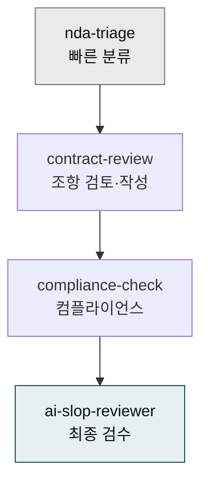

> 계약서는 한 번 잘못 보내면 회수가 어렵습니다. cowork-plugins의 `moai-legal` 스킬을 활용해 초안 작성·위험 조항 식별·표준 조항 적용까지 안전하게 진행합니다.

## 사용 스킬

| 단계 | 스킬 | 용도 |
|---|---|---|
| 빠른 NDA 검토 | `moai-legal:nda-triage` | 받은 NDA를 5분 내 위험도 분류 |
| 본격 검토·작성 | `moai-legal:contract-review` | 위험 조항 분석 + 수정 권고 |
| 컴플라이언스 체크 | `moai-legal:compliance-check` | 개인정보·전자상거래법 적합성 |
| AI 슬롭 검수 | `moai-core:ai-slop-reviewer` | 외부 발송 전 마지막 검수 |

## 한국 실무 체크포인트

계약서를 완성하기 전에 한국 법무 실무에서 가장 자주 빠뜨리는 네 가지를 반드시 확인하세요. 먼저 준거법·관할 조항입니다. 한국 기업끼리 계약할 때는 한국법 적용과 서울중앙지방법원 관할이 기본값입니다. 개인정보가 포함된다면 처리 내용을 계약 본문에 녹이지 말고 별도 동의서로 분리하는 것이 원칙입니다. 코로나·자연재해·정부 명령 같은 예외 상황에 대비한 불가항력 조항도 빠지기 쉬우므로 명시해 두세요. 마지막으로 분쟁이 생겼을 때의 해결 순서, 즉 협의 → 조정 → 중재(KCAB) → 소송 단계를 계약서에 명시해 두면 나중에 불필요한 분쟁 확대를 막을 수 있습니다.

## 워크플로우 예시 — NDA 검토 30초 체인

이메일로 NDA가 도착했을 때, 어디가 위험한지 직접 읽으며 파악하면 시간이 많이 걸립니다. `nda-triage`에 먼저 던지면 위험 조항만 추려주고, `contract-review`가 수정 권고까지 이어받습니다.


> 이 NDA 검토해줘. 위험 조항만 표로 뽑아주고, 우리 측에 불리한 부분만 빨갛게 표시해서 DOCX로 저장해줘.


`nda-triage` → `contract-review` → `docx-generator` 체인이 자동으로 흘러갑니다.

## 표준 조항 라이브러리 만들기

계약서를 반복적으로 작성하다 보면 보안 책임 한도·데이터 반환·파기 절차·손해배상 상한 같은 조항을 매번 새로 쓰는 비효율이 생깁니다. 이 표현들을 한 번 정리해 회사 표준으로 고정해 두면, 이후 검토마다 일관된 문구를 자동으로 적용할 수 있습니다.


> 이 NDA에서 '데이터 파기' 조항 표현을 우리 회사 표준으로 만들어 메모리에 저장해줘.
> 다음부터는 자동으로 이 표현 사용해줘.


[프로젝트 메모리](../../../cowork/projects-memory/)의 `feedback` 종류로 저장되어, 같은 프로젝트의 다음 NDA 검토에서 자동 적용됩니다.

## 자주 겪는 실수

AI가 만든 계약서 초안은 반드시 변호사 또는 사내 법무팀 검토를 거친 뒤 외부에 보내야 합니다. AI는 초안 도구이지 법적 판단 도구가 아닙니다 ([안전하게 사용하기](../../../cowork/safety/)). 계약서가 포함된 PDF를 입력할 때는 인적사항·계좌번호 같은 민감 정보를 미리 마스킹하는 것도 잊지 마세요. 또 상대방이 보낸 "표준 양식"이라는 말을 너무 믿지 마세요. 상대방의 표준 양식은 대부분 그 측에 유리하게 설계된 양식이므로, 자동으로 우리 측에 가장 불리한 버전일 가능성이 높습니다.

## 다음 단계

- [법률 리스크 관리](../legal-risk/) — 계약 외 법적 리스크 전반
- [컴플라이언스 체크리스트](../../templates/compliance/) — GDPR·PIPA·ISMS 체크
- [트랙 — 법률](../../tracks/track-legal/)

---

### Sources

- moai-legal 플러그인 [`contract-review`](https://github.com/modu-ai/cowork-plugins/blob/main/moai-legal/skills/contract-review/SKILL.md), [`nda-triage`](https://github.com/modu-ai/cowork-plugins/blob/main/moai-legal/skills/nda-triage/SKILL.md)
- [한국 표준약관 (공정거래위원회)](https://www.ftc.go.kr)
