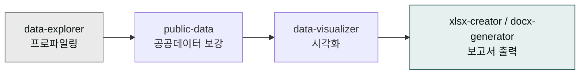

> "이 데이터로 뭘 할 수 있을까?"라는 질문은 EDA(탐색적 데이터 분석)으로 답합니다. cowork-plugins의 `data-explorer`가 5분 안에 첫 인사이트를 돌려줍니다.



## 사용 스킬

| 단계 | 스킬 | 용도 |
|---|---|---|
| 데이터 로드 + 프로파일링 | `moai-data:data-explorer` | 컬럼 요약, 결측·이상값, 상관관계 |
| 통계·공공데이터 보강 | `moai-data:public-data` | KOSIS·data.go.kr |
| 시각화 | `moai-data:data-visualizer` | 차트·대시보드 |
| 결과 출력 | `moai-office:xlsx-creator` / `moai-office:docx-generator` | 엑셀·워드 보고서 |

## EDA 5단계

### 1. 구조 파악

```
> "이 CSV 분석해줘. 컬럼별 타입·결측 비율·고유값 수를 표로 정리하고, 데이터 스키마를 한 줄로 설명해줘."
```

### 2. 분포·이상값

```
> "각 숫자 컬럼의 분포를 살펴봐. 평균·중앙값·표준편차, 박스플롯으로 이상값 후보 알려줘."
```

### 3. 상관관계

```
> "수치 컬럼끼리 상관관계 매트릭스 만들어줘. 0.7 이상 또는 -0.7 이하인 쌍만 별도 표로."
```

### 4. 가설 테스트

```
> "고객 등급별로 평균 결제액에 차이가 있는지 ANOVA로 확인해줘. p-value와 사후 비교 결과 포함."
```

### 5. 보고서

```
> "이 분석 결과를 한 페이지 워드 보고서로 정리해줘. 발견사항 5개 + 권고 액션 3개."
```

## 한국 공공데이터와 결합

내부 데이터만으로 부족할 때:

```
> "우리 매출 추이를 같은 기간 KOSIS의 소매판매지수와 비교해줘. 차이가 큰 분기를 표시하고 원인 후보를 정리."
```

`public-data` 스킬이 KOSIS·data.go.kr API를 자동 호출합니다.

## 데이터 품질 체크 5가지

분석 전 반드시 확인:

| 체크 | 신호 |
|---|---|
| **결측** | 컬럼별 NULL 비율 > 5%면 보고 |
| **중복** | 행 단위 중복 시 원인 추적 |
| **타입 일관성** | "1,000원" 같은 문자열 숫자 컬럼 변환 |
| **이상값** | IQR 외부 또는 Z-score > 3 |
| **시간 정합성** | 날짜 컬럼 미래·과거 극단 |

## 자주 겪는 실수

- **첫 발견을 결론으로 발표** — EDA는 가설 만드는 단계입니다. 결론은 가설 검증 후.
- **이상값을 일괄 제거** — 어떤 이상값은 비즈니스 인사이트의 핵심입니다. 항상 이유를 확인.
- **상관관계를 인과로 해석** — 강한 상관이 있어도 인과는 따로 검증해야 합니다.

## 다음 단계

- [시각화 최적화 원칙](../data-visualization/)
- [엑셀 고급 기법](../../templates/excel/)
- [트랙 — 데이터](../../tracks/track-data/)

---

### Sources

- moai-data 플러그인 [`data-explorer`](https://github.com/modu-ai/cowork-plugins/blob/main/moai-data/skills/data-explorer/SKILL.md), [`public-data`](https://github.com/modu-ai/cowork-plugins/blob/main/moai-data/skills/public-data/SKILL.md)
- [KOSIS 통계청](https://kosis.kr) · [공공데이터포털](https://www.data.go.kr)
