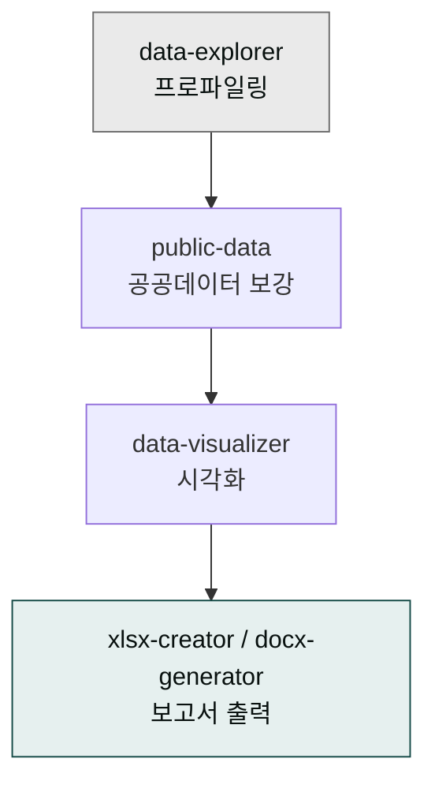

> "이 데이터로 뭘 할 수 있을까?"라는 질문은 EDA(탐색적 데이터 분석)으로 답합니다. cowork-plugins의 `data-explorer`가 5분 안에 첫 인사이트를 돌려줍니다.

```mermaid
flowchart TD
    A["data-explorer<br/>프로파일링"] --> B["public-data<br/>공공데이터 보강"]
    B --> C["data-visualizer<br/>시각화"]
    C --> D["xlsx-creator / docx-generator<br/>보고서 출력"]

    style A fill:#eaeaea,stroke:#6e6e6e,color:#09110f
    style D fill:#e6f0ef,stroke:#144a46,color:#09110f
```

## 사용 스킬

| 단계 | 스킬 | 용도 |
|---|---|---|
| 데이터 로드 + 프로파일링 | `moai-data:data-explorer` | 컬럼 요약, 결측·이상값, 상관관계 |
| 통계·공공데이터 보강 | `moai-data:public-data` | KOSIS·data.go.kr |
| 시각화 | `moai-data:data-visualizer` | 차트·대시보드 |
| 결과 출력 | `moai-office:xlsx-creator` / `moai-office:docx-generator` | 엑셀·워드 보고서 |

## EDA 5단계

### 1. 구조 파악

데이터를 받으면 분석하기 전에 먼저 "어떤 컬럼이 있고, 얼마나 비어 있는가"를 확인해야 합니다.


> 이 CSV 분석해줘. 컬럼별 타입·결측 비율·고유값 수를 표로 정리하고,
> 데이터 스키마를 한 줄로 설명해줘.


### 2. 분포·이상값

구조를 파악했다면 각 수치 컬럼이 어떤 범위에 퍼져 있는지, 눈에 띄는 극단값이 없는지 살핍니다.


> 각 숫자 컬럼의 분포를 살펴봐. 평균·중앙값·표준편차, 박스플롯으로 이상값 후보 알려줘.


### 3. 상관관계

컬럼 간 관계를 파악하면 어떤 변수가 결과에 영향을 줄 가능성이 높은지 가설을 세울 수 있습니다.


> 수치 컬럼끼리 상관관계 매트릭스 만들어줘. 0.7 이상 또는 -0.7 이하인 쌍만 별도 표로.


### 4. 가설 테스트

가설이 생겼다면 통계적으로 검증합니다. 느낌이 아니라 수치로 확인하는 단계입니다.


> 고객 등급별로 평균 결제액에 차이가 있는지 ANOVA로 확인해줘. p-value와 사후 비교 결과 포함.


### 5. 보고서

분석 결과를 혼자 보는 데 그치지 말고, 의사결정자가 읽을 수 있는 형태로 정리합니다.


> 이 분석 결과를 한 페이지 워드 보고서로 정리해줘. 발견사항 5개 + 권고 액션 3개.


## 한국 공공데이터와 결합

내부 데이터만 보면 "우리 매출이 줄었다"는 사실은 알지만 "시장 전체가 줄었는지, 우리만 줄었는지"는 알 수 없습니다. KOSIS·data.go.kr의 공공데이터와 결합하면 맥락이 생깁니다.


> 우리 매출 추이를 같은 기간 KOSIS의 소매판매지수와 비교해줘.
> 차이가 큰 분기를 표시하고 원인 후보를 정리.


`public-data` 스킬이 KOSIS·data.go.kr API를 자동 호출합니다.

## 데이터 품질 체크 5가지

잘못된 데이터로 분석하면 잘못된 결론이 나옵니다. EDA를 시작하기 전에 아래 다섯 가지를 먼저 점검하세요.

| 체크 | 신호 |
|---|---|
| **결측** | 컬럼별 NULL 비율 > 5%면 보고 |
| **중복** | 행 단위 중복 시 원인 추적 |
| **타입 일관성** | "1,000원" 같은 문자열 숫자 컬럼 변환 |
| **이상값** | IQR 외부 또는 Z-score > 3 |
| **시간 정합성** | 날짜 컬럼 미래·과거 극단 |

## 자주 겪는 실수

EDA에서 첫 번째로 눈에 띄는 발견을 바로 결론으로 발표하고 싶은 충동이 생깁니다. 그러나 EDA는 가설을 만드는 단계이지 결론을 내리는 단계가 아닙니다. 결론은 반드시 가설 검증 이후에 냅니다. 이상값도 마찬가지입니다. 일괄 제거하기보다 왜 이 값이 나왔는지 먼저 파악하세요. 어떤 이상값은 비즈니스 인사이트의 핵심이 되기도 합니다. 마지막으로 강한 상관관계를 발견했을 때 인과로 바로 해석하지 마세요. 인과는 별도 검증이 필요합니다.

## 다음 단계

- [시각화 최적화 원칙](../data-visualization/)
- [엑셀 고급 기법](../../templates/excel/)
- [트랙 — 데이터](../../tracks/track-data/)

---

### Sources

- moai-data 플러그인 [`data-explorer`](https://github.com/modu-ai/cowork-plugins/blob/main/moai-data/skills/data-explorer/SKILL.md), [`public-data`](https://github.com/modu-ai/cowork-plugins/blob/main/moai-data/skills/public-data/SKILL.md)
- [KOSIS 통계청](https://kosis.kr) · [공공데이터포털](https://www.data.go.kr)
