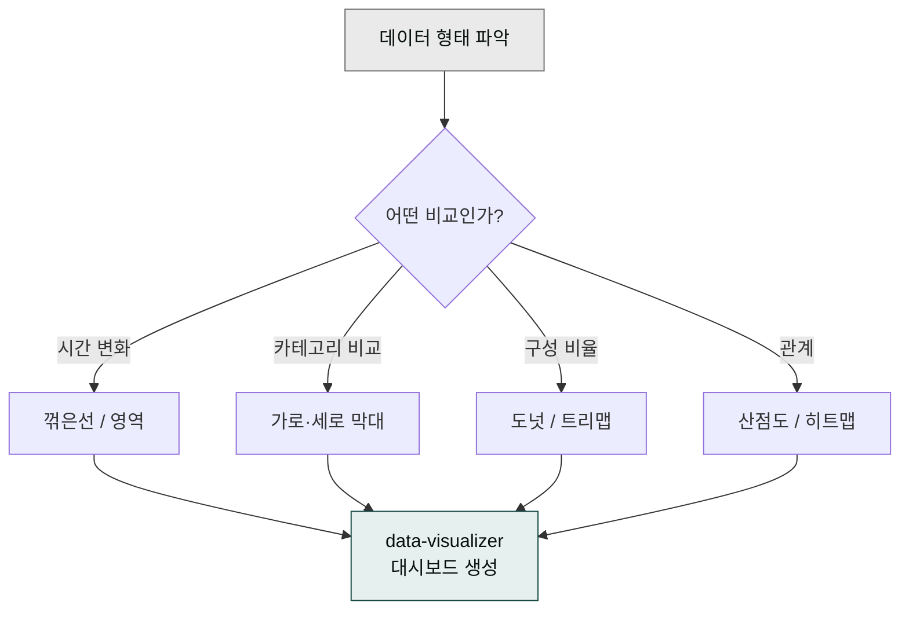

> 좋은 차트는 보는 사람이 0.5초 안에 메시지를 읽고, 나머지 시간은 디테일을 확인하는 데 쓰는 차트입니다. 화려한 색·3D·과한 레이블은 그 0.5초를 빼앗습니다.

## 사용 스킬

- **`moai-data:data-visualizer`** — shadcn/ui 기반 데이터 시각화·차트·대시보드 생성. HTML 대시보드 출력 전 소크라테스식 인터뷰로 메시지 명확화.

## 차트 선택 룰

"어떤 차트를 써야 하지?"라는 질문의 답은 데이터의 형태가 결정합니다. 메시지를 먼저 정하고, 그 메시지를 가장 빨리 전달하는 형태를 고르세요.

| 데이터 형태 | 첫 번째 선택 | 두 번째 선택 |
|---|---|---|
| 시간에 따른 변화 | 꺾은선 | 영역 |
| 카테고리 비교 | 가로 막대 | 세로 막대 |
| 부분-전체 (3개 이하) | 도넛 | 100% 누적 막대 |
| 부분-전체 (4개 이상) | 100% 누적 막대 | 트리맵 |
| 분포 | 히스토그램 / 박스플롯 | 바이올린 |
| 상관관계 | 산점도 | 히트맵 |
| 지리 데이터 | 지도 (Choropleth) | 거품 지도 |

피해야 할 차트: **3D 파이**, **누적 영역(3개 이상)**, **레이더(3개 이상 축)**.

## 색 사용 5가지 룰

1. **카테고리 색**: 7개 이내. 그 이상이면 회색 + 강조 색 1개로.
2. **순서 색**: 단일 그라데이션(연→진).
3. **발산 색**: 0을 중심으로 양쪽 다른 색(빨강 ↔ 파랑).
4. **하이라이트**: 메시지의 핵심 1개만 강조 색.
5. **색맹 안전**: 빨강·녹색만으로 정보 전달 금지. 모양·라벨로 보강.

## 대시보드 구성 — F자 패턴

사람의 시선은 좌상단 → 우 → 좌 → 우 (F자)로 이동합니다. 가장 중요한 KPI를 좌상단에:

| 위치 | 콘텐츠 |
|---|---|
| 좌상단 | 핵심 KPI 1개 (큰 숫자 + 변화율) |
| 우상단 | 보조 KPI 2-3개 |
| 중간 | 시간 추이 차트 |
| 하단 | 카테고리·세그먼트 분해 |

## 워크플로우 예시 — 주간 KPI 대시보드


> 주간 KPI 대시보드 만들어줘. 좌상단에 이번 주 매출·전주 대비.
> 우상단에 신규 고객 수, NPS, Churn. 중간에 4주 매출 추이, 하단에 카테고리별 매출.
> shadcn/ui 기반 HTML로.


`data-visualizer`가 인터뷰로 메시지를 정련한 뒤 HTML 대시보드를 생성합니다.

## 한국 시각화 함정

한국어 데이터를 시각화할 때 자주 놓치는 세 가지가 있습니다. 축 라벨에 단위를 빠뜨리는 경우가 가장 흔한데, ₩백만·₩만처럼 명시해야 숫자가 맥락 없이 떠 보이지 않습니다. 연도 표기도 "2026年" 같은 한자 혼용 없이 "2026년"으로 통일하세요. 한글 폰트 깨짐은 Pretendard·Noto Sans KR을 시스템에 설치하거나, 공유 문서라면 PDF로 출력해 폰트를 임베드하는 방식으로 해결합니다.

## 자주 겪는 실수

막대 차트를 0이 아닌 임의의 값에서 시작하면 변화가 실제보다 훨씬 크게 보입니다. 항상 0에서 시작하거나, 축 절단 사실을 명시하세요. 한 페이지에 차트를 6개 이상 넣으면 보는 사람은 어디를 봐야 할지 몰라 핵심을 놓칩니다. 4개 이내로 줄이고 나머지는 표로 처리하는 것이 더 효과적입니다. 레전드를 차트에서 멀리 떨어진 곳에 두면 눈이 계속 오가야 해서 읽기 힘들어집니다. 차트 바로 옆 또는 데이터 포인트에 직접 라벨링하세요.

## 다음 단계

- [데이터 분석 가이드](../data-analysis/)
- [엑셀 고급 기법](../../templates/excel/)
- [트랙 — 데이터](../../tracks/track-data/)

---

### Sources

- moai-data 플러그인 [`data-visualizer`](https://github.com/modu-ai/cowork-plugins/blob/main/moai-data/skills/data-visualizer/SKILL.md)
- [shadcn/ui charts](https://ui.shadcn.com/charts) · [Color Brewer](https://colorbrewer2.org)
