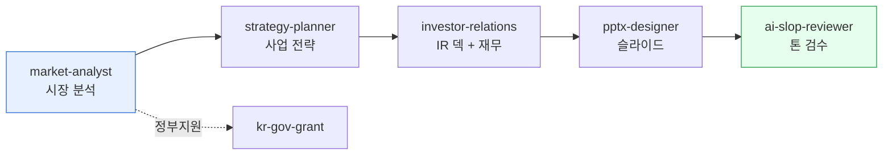

> 투자자가 보는 것은 "얼마나 큰 시장에서 얼마나 잘 팔 자신이 있는가"의 두 줄 답변입니다. 그 답변을 IR 덱·재무 모델·실적 데이터로 뒷받침하는 일련의 산출물을 cowork-plugins로 작성합니다.



## 사용 스킬

| 단계 | 스킬 | 용도 |
|---|---|---|
| 시장 분석 | `moai-business:market-analyst` | TAM/SAM/SOM, 경쟁사 매핑 |
| IR 덱 작성 | `moai-business:investor-relations` | 시리즈 A/B 피칭 덱 + 재무 모델 |
| 사업 전략 | `moai-business:strategy-planner` | BMC, OKR, 5년 로드맵 |
| 정부지원사업 | `moai-business:kr-gov-grant` | K-Startup, 창업도약, 기보·신보 |
| 발표 자료화 | `moai-office:pptx-designer` | 한국형 IR 슬라이드 디자인 |
| AI 슬롭 검수 | `moai-core:ai-slop-reviewer` | 발송 전 자연어 톤 검수 |

## 시리즈별 핵심 메시지

투자 라운드별로 투자자가 가장 듣고 싶어 하는 한 줄이 다릅니다.

| 라운드 | 핵심 한 줄 | 필요 자료 |
|---|---|---|
| **Pre-seed** | "이 문제가 진짜 문제이고, 우리는 풀 수 있다" | 문제 정의 + 팀 + MVP |
| **Seed** | "초기 고객이 사랑한다" | NPS·리텐션·UV/MAU·매출 첫 데이터 |
| **Series A** | "PMF 도달, 그로스 엔진 가동 중" | LTV/CAC·코호트·매출 성장 곡선 |
| **Series B** | "유닛 이코노믹스 검증, 시장 점유율 확장" | EBITDA 경로·해외 진출 계획 |

## 워크플로우 예시 — 시리즈 A IR 덱 1주 만에 완성

```
> "우리 회사 시리즈 A IR 덱 만들어줘. 회사 정보는 첨부 파일 회사 소개서 참고. 12장 분량으로 — 문제·솔루션·시장(TAM/SAM/SOM)·경쟁우위·트랙션·비즈니스 모델·고객·로드맵·팀·재무·요청 라운드·연락처 순서. 발표 자료 PPT로 저장해줘."
```

체인:
1. `market-analyst`
2. `investor-relations`
3. `pptx-designer`
4. `ai-slop-reviewer`

## 재무 모델 — 3년 P&L

투자자에게 보내는 재무 모델은 **간단할수록 신뢰가 갑니다**. 5개 시트면 충분합니다:

1. Assumptions (단가·MAU·전환율·인건비)
2. P&L (매출·매출원가·OpEx·EBITDA·순이익)
3. Cash flow (월별 현금 흐름)
4. Cohort (고객 코호트별 매출)
5. Funding need (자금 소요 + 사용 계획)

```
> "시리즈 A 투자 받기 위한 3년 P&L 모델 만들어줘. 월별로 36개월. assumptions 시트에 단가·MAU·CAC·인건비·임대료를 분리. P&L·cash-flow·cohort·funding need 5개 시트로 xlsx 저장."
```

## 정부지원사업 병행

VC 투자와 별도로 정부지원사업은 비희석 자금으로 매년 검토할 가치가 있습니다:

```
> "지금 시점에서 우리 회사가 받을 수 있는 정부지원사업 정리해줘. K-Startup, 창업도약패키지, 기보·신보 보증, 콘텐츠진흥원 등 — 마감일이 가까운 순으로 표로."
```

`kr-gov-grant` 스킬이 K-Startup·BIZINFO·나라장터·창업진흥원을 통합 검색해 마감 임박 순으로 정리합니다.

## 자주 겪는 실수

- **TAM을 너무 넓게 잡음** — "전 세계 ERP 시장"이 아니라 "한국 중견 SaaS ERP 도입 가능 기업"으로 SAM을 좁히세요.
- **트랙션이 vanity metrics** — 다운로드·가입자 수보다 매출·리텐션·NPS가 우선합니다.
- **재무 모델에 100개 행** — 5개 시트로 단순화. 가정(assumption)을 물어볼 때 답변할 수 있는 깊이가 한계입니다.

## 다음 단계

- [트랙 — 문서 작성](../../tracks/track-documents/) — IR 덱 + 사업계획서 워크플로우
- [프레젠테이션 디자인 원칙](../../design/presentation/)
- [재무 모델링 템플릿](../../templates/financial/)

---

### Sources

- moai-business 플러그인 [`investor-relations`](https://github.com/modu-ai/cowork-plugins/blob/main/moai-business/skills/investor-relations/SKILL.md), [`kr-gov-grant`](https://github.com/modu-ai/cowork-plugins/blob/main/moai-business/skills/kr-gov-grant/SKILL.md), [`market-analyst`](https://github.com/modu-ai/cowork-plugins/blob/main/moai-business/skills/market-analyst/SKILL.md)
- [K-Startup 창업지원포털](https://www.k-startup.go.kr) · [BIZINFO](https://www.bizinfo.go.kr)
