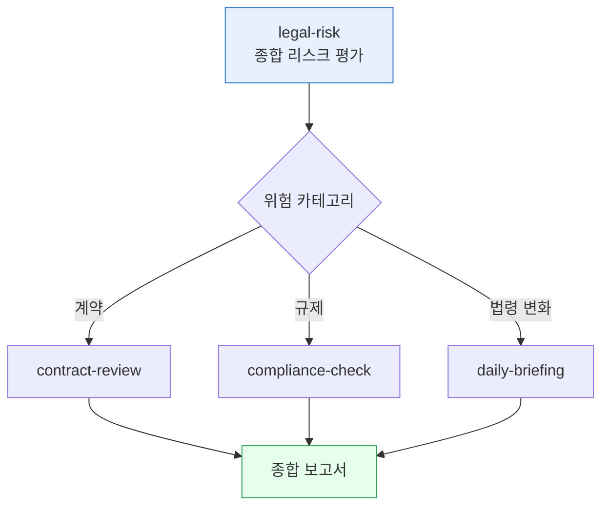

> 법적 리스크는 사고가 나기 전에는 보이지 않다가, 한 번 터지면 매출의 몇 분의 일이 날아갑니다. 정기적으로 점검 가능한 형태로 만들어 두는 것이 핵심입니다.



## 사용 스킬

- **`moai-legal:legal-risk`** — 기업 법적 리스크 평가, 특허 침해 위험 분석, 개인정보 위반 리스크 체크, IP 포트폴리오 분석, 2026년 법령 변화 영향 분석
- 보조: `moai-legal:compliance-check` (규제 준수), `moai-legal:contract-review` (계약 리스크), `moai-business:daily-briefing` (법령 변화 모니터링)

## 4가지 리스크 카테고리

대부분의 한국 기업이 다뤄야 할 법적 리스크는 다음 4가지로 분류됩니다.

| 카테고리 | 예시 | 점검 주기 |
|---|---|---|
| **계약 리스크** | 공급계약 미이행, 위약금 청구 | 분기 |
| **컴플라이언스** | 개인정보보호법, 공정거래법, 전자상거래법 | 월 |
| **IP 리스크** | 특허·상표 침해, 영업비밀 유출 | 분기 |
| **고용·노무** | 부당해고, 임금 미지급 클레임 | 월 |

## 워크플로우 예시 — 분기 리스크 리뷰

분기 첫 주에 정례 점검:

```
> "지난 분기 우리 회사 법적 리스크 평가해줘. 계약·컴플라이언스·IP·노무 4개 카테고리로 나눠서, 각 카테고리당 상위 3개 리스크와 완화 방안을 표로 정리해줘."
```

`legal-risk` 스킬이 4분면 매트릭스로 결과를 돌려줍니다. 위험도(저·중·고) × 발생 가능성(저·중·고) 9칸에 리스크가 매핑됩니다.

## IP 포트폴리오 점검

특허·상표·저작권을 분기 1회 정리해 두면 침해 분쟁 발생 시 대응 속도가 크게 빨라집니다.

```
> "우리 회사 보유 특허·상표 목록 정리해줘. 각각 만료일·갱신일·해외 등록 여부를 체크하고, 갱신 임박한 항목 따로 표시해줘."
```

## 2026년 한국 주요 법령 변화

`legal-risk` 스킬이 추적하는 주요 변화 영역:

- 개인정보보호법 시행령 개정 (CCTV·자동화 의사결정)
- AI 기본법 시행 (생성형 AI 라벨링 의무)
- 공정거래법 — 플랫폼 사업자 추가 규제
- 노동법 — 주 4.5일제 시범, 외국인 고용 절차

분기 1회 `daily-briefing`으로 변화를 받고, 영향이 큰 항목만 `legal-risk`로 깊이 분석합니다.

## 자주 겪는 실수

- **리스크 점검을 사고 발생 후에만** — 정례화하지 않으면 의미가 없습니다. 캘린더에 분기별 일정을 박아두세요.
- **점검 결과를 보고서로만 끝내고 액션 아이템 미할당** — 리스크 항목당 담당자·기한을 명시합니다.
- **법령 변화를 모르고 운영** — `daily-briefing`을 [예약 작업](../../../cowork/schedule/)으로 등록해 매일 아침 받으세요.

## 다음 단계

- [계약서 작성 가이드](../contract-drafting/) — 계약 단계의 리스크 차단
- [컴플라이언스 체크리스트](../../templates/compliance/)
- [트랙 — 법률](../../tracks/track-legal/)

---

### Sources

- moai-legal 플러그인 [`legal-risk`](https://github.com/modu-ai/cowork-plugins/blob/main/moai-legal/skills/legal-risk/SKILL.md)
- [개인정보보호위원회](https://www.pipc.go.kr) · [공정거래위원회](https://www.ftc.go.kr) · [특허청](https://www.kipo.go.kr)
