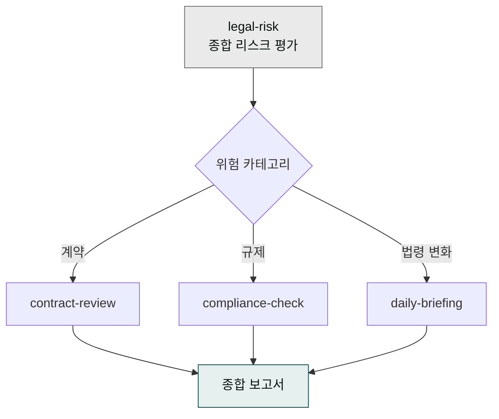

> 법적 리스크는 사고가 나기 전에는 보이지 않다가, 한 번 터지면 매출의 몇 분의 일이 날아갑니다. 정기적으로 점검 가능한 형태로 만들어 두는 것이 핵심입니다.

```mermaid
flowchart TD
    A["legal-risk<br/>종합 리스크 평가"] --> B{"위험 카테고리"}
    B -- "계약" --> C["contract-review"]
    B -- "규제" --> D["compliance-check"]
    B -- "법령 변화" --> E["daily-briefing"]
    C & D & E --> F["종합 보고서"]

    style A fill:#eaeaea,stroke:#6e6e6e,color:#09110f
    style F fill:#e6f0ef,stroke:#144a46,color:#09110f
```

## 사용 스킬

리스크 관리의 중심은 `moai-legal:legal-risk` 스킬입니다. 기업 법적 리스크 평가부터 특허 침해 위험 분석, 개인정보 위반 리스크 체크, IP 포트폴리오 분석, 2026년 법령 변화 영향 분석까지 한 스킬이 담당합니다. 규제 준수가 필요할 때는 `moai-legal:compliance-check`, 계약에서 비롯된 리스크는 `moai-legal:contract-review`, 법령 변화 모니터링은 `moai-business:daily-briefing`이 보조합니다.

## 4가지 리스크 카테고리

대부분의 한국 기업이 다뤄야 할 법적 리스크는 다음 4가지로 분류됩니다.

| 카테고리 | 예시 | 점검 주기 |
|---|---|---|
| **계약 리스크** | 공급계약 미이행, 위약금 청구 | 분기 |
| **컴플라이언스** | 개인정보보호법, 공정거래법, 전자상거래법 | 월 |
| **IP 리스크** | 특허·상표 침해, 영업비밀 유출 | 분기 |
| **고용·노무** | 부당해고, 임금 미지급 클레임 | 월 |

## 워크플로우 예시 — 분기 리스크 리뷰

분기 첫 주를 정례 점검 주간으로 정해 두고, 아래 프롬프트로 4개 카테고리를 한 번에 점검하세요.


> 지난 분기 우리 회사 법적 리스크 평가해줘. 계약·컴플라이언스·IP·노무 4개 카테고리로 나눠서,
> 각 카테고리당 상위 3개 리스크와 완화 방안을 표로 정리해줘.


`legal-risk` 스킬이 4분면 매트릭스로 결과를 돌려줍니다. 위험도(저·중·고) × 발생 가능성(저·중·고) 9칸에 리스크가 매핑됩니다.

## IP 포트폴리오 점검

특허·상표·저작권을 분기 1회 정리해 두면 침해 분쟁 발생 시 대응 속도가 크게 빨라집니다.


> 우리 회사 보유 특허·상표 목록 정리해줘. 각각 만료일·갱신일·해외 등록 여부를 체크하고,
> 갱신 임박한 항목 따로 표시해줘.


## 2026년 한국 주요 법령 변화

2026년에는 기업 운영에 직접 영향을 주는 법령 변화가 여럿 시행됩니다. `legal-risk` 스킬이 아래 영역을 추적합니다.

- 개인정보보호법 시행령 개정 (CCTV·자동화 의사결정)
- AI 기본법 시행 (생성형 AI 라벨링 의무)
- 공정거래법 — 플랫폼 사업자 추가 규제
- 노동법 — 주 4.5일제 시범, 외국인 고용 절차

분기 1회 `daily-briefing`으로 변화를 받고, 영향이 큰 항목만 `legal-risk`로 깊이 분석합니다.

## 자주 겪는 실수

리스크 점검을 사고가 생긴 다음에야 시작하는 경우가 많습니다. 정례화하지 않으면 의미가 없으니, 캘린더에 분기별 점검 일정을 미리 고정해 두세요. 점검 결과를 보고서 파일로만 남기는 것도 문제입니다. 리스크 항목마다 담당자와 처리 기한을 명시해야 실제로 조치가 이루어집니다. 법령은 조용히 바뀌기 때문에 모르는 사이에 위반 상태가 되기도 합니다. `daily-briefing`을 [예약 작업](../../../cowork/schedule/)으로 등록해 매일 아침 변화를 받아보세요.

## 다음 단계

- [계약서 작성 가이드](../contract-drafting/) — 계약 단계의 리스크 차단
- [컴플라이언스 체크리스트](../../templates/compliance/)
- [트랙 — 법률](../../tracks/track-legal/)

---

### Sources

- moai-legal 플러그인 [`legal-risk`](https://github.com/modu-ai/cowork-plugins/blob/main/moai-legal/skills/legal-risk/SKILL.md)
- [개인정보보호위원회](https://www.pipc.go.kr) · [공정거래위원회](https://www.ftc.go.kr) · [특허청](https://www.kipo.go.kr)
