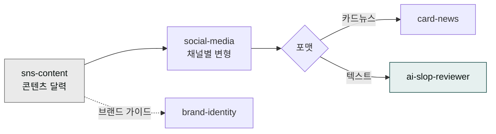

> 채널마다 사람이 다르고, 사람이 다르면 톤·길이·해시태그도 달라야 합니다. cowork-plugins의 SNS 스킬은 7개 채널의 알고리즘·관습을 미리 알고 있어 동일 메시지를 채널별로 자동 변형합니다.



## 사용 스킬

| 스킬 | 커버 채널 |
|---|---|
| `moai-content:social-media` | 인스타·스레드·X·LinkedIn·유튜브 쇼츠·카카오·네이버 7개 |
| `moai-content:card-news` | 인스타 카드뉴스·캐러셀 |
| `moai-marketing:sns-content` | 콘텐츠 달력·브랜드 보이스 가이드 |
| `moai-marketing:brand-identity` | 톤앤매너·비주얼 가이드라인 |

## 채널별 권장 패턴

| 채널 | 톤 | 길이 | 해시태그 | 최적 시간(KST) |
|---|---|---|---|---|
| 인스타 | 감성·시각 | 짧음 | 5~10개 | 19~21시 |
| LinkedIn | 전문·인사이트 | 중간(3~5문단) | 3~5개 | 평일 8~10시 |
| X (구 트위터) | 짧고 즉답 | 280자 + 스레드 | 1~2개 | 출근 시간 + 점심 |
| 카카오 채널 | 친근·정보 | 중간 | 0~1개 | 평일 12~13시 |
| 네이버 블로그 | SEO 친화 | 길게(2000자+) | 키워드 자연 삽입 | 오전 |
| 스레드(Threads) | 인스타 + X 사이 | 짧음 | 적게 | 인스타와 동일 |
| 유튜브 쇼츠 | 첫 3초 후킹 | 15~60초 | 자막 + 1~3 해시 | 18~22시 |

## 워크플로우 예시 — 한 메시지, 5개 채널 동시 발행

```
> "이번 주 신제품 출시 메시지를 인스타·LinkedIn·X·카카오·네이버 5개 채널로 변형해줘. 각 채널 톤·해시태그·길이에 맞춰. 인스타는 카드뉴스 5장 슬라이드도 함께."
```

체인:
1. `sns-content` (메시지 코어)
2. `social-media` (채널 변형)
3. `card-news` (카드 디자인)
4. `ai-slop-reviewer` (검수)

## 콘텐츠 달력

월간 달력으로 발행 리듬 고정:

```
> "다음 달 SNS 콘텐츠 달력 만들어줘. 인스타 주 5회, LinkedIn 주 3회, X 주 7회. 시즌 이슈(추석·할로윈) 반영, 채널별 톤 가이드 포함."
```

## 한국 SNS 특이점

- **네이버 블로그 = SEO** — SNS이지만 검색 노출 비중이 큰 *반(半) 검색 채널*. 키워드 최적화 필수.
- **카카오 채널 친구 = CRM** — 친구는 자산. 마케팅 동의 별도 받기 ([컴플라이언스 체크리스트](../../templates/compliance/)).
- **인스타 릴스 vs 쇼츠** — 같은 영상 9:16이라도 알고리즘이 다름. 쇼츠는 첫 3초, 릴스는 시각 톤.
- **LinkedIn 한국** — 영문 + 한글 동시 작성 시 영문 우선이 도달 유리.

## 자주 겪는 실수

- **모든 채널에 같은 콘텐츠** — 자동 변형도 안 하고 인스타 글을 그대로 LinkedIn에 올리면 양쪽 다 어색.
- **해시태그 30개** — 인스타는 5~10개가 가장 효과적. 30개는 스팸 신호.
- **알고리즘 변경 무시** — 분기 1회 채널별 알고리즘 트렌드 점검 ([SEO 감사](../content-marketing/)).

## 다음 단계

- [콘텐츠 마케팅 전략](../content-marketing/)
- [이메일 마케팅 템플릿](../../templates/email/)
- [트랙 — 마케팅](../../tracks/track-marketing/)

---

### Sources

- moai-content 플러그인 [`social-media`](https://github.com/modu-ai/cowork-plugins/blob/main/moai-content/skills/social-media/SKILL.md), [`card-news`](https://github.com/modu-ai/cowork-plugins/blob/main/moai-content/skills/card-news/SKILL.md)
- moai-marketing 플러그인 [`sns-content`](https://github.com/modu-ai/cowork-plugins/blob/main/moai-marketing/skills/sns-content/SKILL.md)
