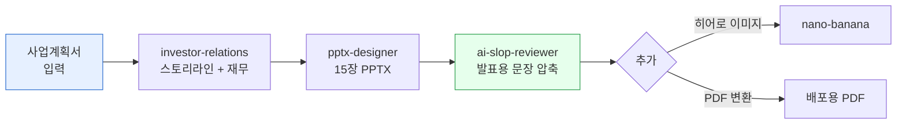

> **목표** — 사업계획서 내용을 받아 투자자 앞에서 15분 안에 끝낼 수 있는 **15장 PPT 피칭 덱**을 만듭니다.



## 대상 독자

Seed·Series A·B 투자 유치를 준비하는 스타트업 창업가.

## 사전 준비

- 플러그인: `moai-business`, `moai-office`, `moai-core:ai-slop-reviewer`
- (선택) `moai-media` — 히어로 이미지·아이콘 커스텀
- 입력: 사업계획서(DOCX 또는 텍스트), **시리즈 단계**(Seed / Series A / B), **목표 조달액**, **밸류에이션 가정**

## 스킬 체인

```
investor-relations → pptx-designer → ai-slop-reviewer
```

- `investor-relations` — 재무 모델·밸류에이션·스토리라인
- `pptx-designer` — Pretendard + 명조 한국형 PPT 코드
- `ai-slop-reviewer` — 발표용 문장 다듬기(짧고 자연스럽게)

## 15장 표준 구조

| # | 슬라이드 | 핵심 |
|---|---|---|
| 1 | 커버 | 서비스명 + 한 줄 카피 |
| 2 | 문제 | 고객 Pain 3가지 |
| 3 | 솔루션 | 우리 제품이 어떻게 해결하는가 |
| 4 | 데모 | 스크린샷·영상 캡처 |
| 5 | 시장 | TAM/SAM/SOM |
| 6 | 비즈니스 모델 | 단가·CAC·LTV |
| 7 | 경쟁 | 2×2 포지셔닝 |
| 8 | 성장 지표 | MRR·MoM·리텐션 |
| 9 | Go-to-Market | 채널·캠페인 |
| 10 | 로드맵 | 12~18개월 마일스톤 |
| 11 | 팀 | 대표·핵심 인력 |
| 12 | 재무 추정 | 3년 매출·손익 |
| 13 | 이번 라운드 | 조달액·밸류·용도 |
| 14 | Exit·비전 | 5년 뒤 모습 |
| 15 | Thank You | 연락처 |

## 단계별 실행

### 1. 사업계획서 업로드 또는 붙여넣기

```
첨부한 사업계획서(business-plan.docx)로 IR 덱 만들려고 해.
시리즈: Seed
목표 조달액: 10억원
프리머니 밸류: 60억원 가정
```

### 2. 스토리라인 먼저 확정

```
investor-relations 로 위 자료를 기반으로 15장 스토리라인과
각 장 핵심 메시지(1문장)만 먼저 뽑아줘. 슬라이드 제작은 다음 단계.
```

스토리라인이 약한 장은 **여기서 미리 수정**합니다. (슬라이드부터 만들면 피드백 비용이 커집니다.)

### 3. PPT 생성


> 확정된 스토리라인으로 pptx-designer 스킬을 사용해서 ir-deck.pptx 를 만들어줘.
  - 16:9, 한글 Pretendard, 본문 18pt
  - 커버는 풀블리드 이미지
  - 5·12장은 차트 포함 (recharts 스타일)


### 4. 문장 다듬기

```
발표용이니 문장을 짧게 줄여줘. ai-slop-reviewer 로 각 슬라이드
불릿 3개씩, 한 줄 12자 이내로 압축.
```

### 5. (옵션) 히어로 이미지


> 1번 커버용 히어로 이미지 만들어줘. Ideogram 으로 서비스명 타이포 포함,
16:9, 브랜드 컬러 #2F5BFF 톤.


### 6. PDF 내보내기

```
완성된 pptx를 PDF로 내보내줘. 투자자 공유용.
```

## 자주 겪는 이슈


**이슈 1 — 문장이 여전히 길다.**
`pptx-designer`가 DOCX 원문을 그대로 복사하는 경우가 있습니다. 반드시 **압축 지시**를 한 번 더 하세요.



**이슈 2 — 폰트가 기본 Calibri 로 나온다.**
Pretendard가 시스템에 없으면 Calibri로 폴백됩니다. 배포 전 "Pretendard 임베드" 또는 PDF로 전환하세요.



**이슈 3 — 재무 차트가 어색하다.**
`pptx-designer`가 그리는 기본 차트보다 **엑셀에서 그린 차트를 캡처해 이미지로 삽입**하는 편이 더 예쁩니다. 필요하면 `xlsx-creator`로 추정표를 먼저 만드세요.


## 응용 변형

- **투자자별 맞춤** — 심사역이 특정 산업 포커스라면 2·5·7장을 해당 산업 용어로 다시 쓰세요.
- **원페이저** — 15장 요약본을 `docx-generator`로 A4 한 장 티저로 먼저 뿌리면 미팅 약속이 잘 잡힙니다.

---

### Sources
- [modu-ai/cowork-plugins › moai-business](https://github.com/modu-ai/cowork-plugins)
- [Sequoia Capital — Pitch Deck Template](https://www.sequoiacap.com/article/writing-a-business-plan/)
