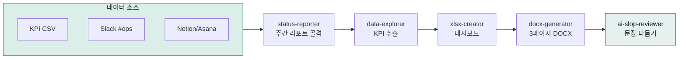

> **목표** — 매주 금요일 오후 5시에 자동으로 시작해 **KPI 대시보드 + 이슈 요약 + 다음 주 액션**까지 담긴 3페이지 DOCX를 팀 공유 폴더에 저장합니다.



## 대상 독자

운영팀·기획팀의 정기 보고를 담당하는 실무자.

## 사전 준비

- 플러그인: `moai-operations`, `moai-data`, `moai-office`, `moai-core:ai-slop-reviewer`
- MCP 커넥터: Slack(이슈 수집) + Notion/Asana(할 일) — [커넥터·MCP](../../cowork/connectors-mcp/) 참고
- (선택) GA4·광고 채널 데이터
- `schedule` 스킬 — 스케줄링

## 스킬 체인

```
status-reporter → data-explorer → xlsx-creator → docx-generator → ai-slop-reviewer
```

- `status-reporter` — 주간 리포트 골격, OKR 진행률
- `data-explorer` — 로우 데이터(CSV·Slack·Notion)에서 KPI 추출
- `xlsx-creator` — KPI 대시보드 시트
- `docx-generator` — 최종 3페이지 보고서
- `ai-slop-reviewer` — 임원이 바로 읽을 수 있게 문장 다듬기

## 단계별 실행

### 1. 입력 소스 고정

매주 같은 곳에서 데이터가 오도록 경로를 약속합니다.

- **KPI 로우 데이터** — `/Claude Work 온라인 문서/weekly/kpi-YYYYMMDD.csv`
- **이슈 로그** — Slack `#ops-weekly` 채널 최근 7일
- **할 일 현황** — Notion 「팀 업무」 DB 또는 Asana 프로젝트

### 2. 수동 실행으로 검증


> 이번 주 주간 보고서 만들어줘.
  - KPI 데이터: /weekly/kpi-20260417.csv
  - 이슈: Slack #ops-weekly 이번 주
  - 할 일: Notion 팀 업무 DB 이번 주

체인: status-reporter → data-explorer → xlsx-creator → docx-generator → ai-slop-reviewer
출력: /weekly/주간보고-20260417.docx


### 3. 스케줄로 등록


> /schedule create
이름: 주간 보고서
주기: 매주 금요일 17:00
프롬프트: (2번의 프롬프트를 그대로, 날짜만 {{date}} 로 치환)


### 4. 첫 2주는 수동 검수

스케줄이 자동 생성한 보고서를 **2주 연속 눈으로 확인**합니다. 데이터 소스 키가 바뀌면 여기서 잡힙니다.

### 5. 팀장 피드백 반영

팀장이 "이 섹션 더", "이 차트 빼" 같은 요청을 하면 프롬프트에 한 줄씩 추가합니다. 5~6회 반복하면 더 이상 손볼 게 없는 템플릿이 됩니다.

## 자주 겪는 이슈


**이슈 1 — 데이터가 없는 주에 에러.**
연휴·서버 이슈로 CSV가 비면 `data-explorer`가 멈춥니다. 프롬프트에 "CSV가 비면 지난 주 데이터 인용" 분기 지시를 추가하세요.



**이슈 2 — Slack 장기 검색 토큰 부족.**
MCP 기본 검색은 14일. 그 이상은 `slack_search_public` 사용권을 확인하세요.



**이슈 3 — 숫자 형식이 제각각.**
매출·유저수 등 단위를 `xlsx-creator` 프롬프트에 "원 → 백만원, 명 → 천명"같이 고정하세요.


## 응용 변형

- **월간 보고서** — 같은 파이프라인을 "4주치 CSV" 입력으로 돌려 월간판 생성.
- **대시보드 HTML** — `data-visualizer`로 사내 공유용 단일 HTML 대시보드 추가 발행 → 이메일 링크.
- **마크다운 → HTML 변환 (v2.2.0 신규)** — `moai-content:html-report` 스킬로 마크다운 보고서를 단일 파일 HTML로 변환. 외부 의존성 0, 12-25KB 초경량 산출물.

### 마크다운 보고서 → HTML 변환 (v2.2.0)


> 이번 주 주간 현황 보고서 HTML로 변환해줘.
  - 모드: status
  - 입력: /weekly/주간보고-20260510.md

체인: (기존 보고서 생성) → html-report mode=status
출력: /weekly/주간보고-20260510.html


**html-report 스킬 특징**:
- **6개 보고서 모드**: status, incident, plan, explainer, financial, pr
- **인라인 SVG + vanilla JS**: 외부 의존성 0, 12-25KB 초경량
- **한글 폰트 6종**: Pretendard(기본), Noto Serif KR, Noto Sans KR, 조선일보명조, KoPubWorld 명조, JetBrains Mono
- **인쇄 친화**: `@media print` 자동 적용, 페이지 나누기 최적화

**권장 체인**:
```
{텍스트 생성 스킬} → ai-slop-reviewer → humanize-korean → html-report mode=<X>
```

**관련 링크**:
- [SKILL.md](https://github.com/modu-ai/cowork-plugins/blob/v2.2.0/moai-content/skills/html-report/SKILL.md)
- [Thariq Shihipar "The Unreasonable Effectiveness of HTML"](https://thariq.substack.com/p/the-unreasonable-effectiveness-of)

---

### Sources
- [modu-ai/cowork-plugins › moai-operations](https://github.com/modu-ai/cowork-plugins)
- [docs.claude.com — Scheduled Tasks](https://docs.claude.com)
