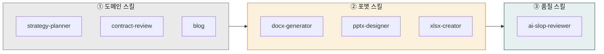

> Cowork에서 가장 중요한 실무 기술. 단일 스킬보다 2-4개를 엮은 체인이 결과 품질을 10배 좌우합니다.

## 왜 체인인가

스킬 하나는 한 분야에 특화되어 있어 폭이 좁습니다. 예를 들어 `strategy-planner`는 전략 초안을 잘 쓰지만 DOCX로 저장하지 못하고, `docx-generator`는 파일을 잘 만들지만 전략 내용을 기획하지 못합니다. 게다가 생성된 글에는 대부분 AI 특유의 기계적 어투가 남아 있습니다. 세 스킬을 순서대로 엮으면 각자의 장점만 결합한 완성된 파이프라인이 됩니다.

```
strategy-planner → docx-generator → ai-slop-reviewer
```

## 체인 설계 3원칙



1. **도메인 → 포맷 → 품질**

   항상 도메인 스킬이 먼저, 포맷 변환이 중간, 품질 검수가 마지막입니다.

   ```
   (도메인: moai-business / moai-legal / moai-content 등)
      → (포맷: moai-office 의 docx/xlsx/pptx/hwpx)
        → (품질: ai-slop-reviewer)
   ```

2. **숫자·차트·코드는 품질 스킬 생략**

   재무제표, 데이터 차트, 스크립트 코드는 AI 어투를 검출할 게 없으므로 `ai-slop-reviewer`를 생략합니다.

3. **같은 체인을 슬래시 명령으로 저장**

   자주 쓰는 체인은 슬래시 명령으로 만들면 한 번의 지시로 실행됩니다. 예: `/weekly-report`는 `status-reporter → xlsx-creator → docx-generator → ai-slop-reviewer`를 한 번에.

## 자주 쓰는 체인 12종

각 체인의 출처 플러그인을 함께 표기했습니다. 설치 시 참고하세요.

| 용도 | 체인 | 사용 플러그인 |
|---|---|---|
| 블로그 글 | 1. `blog`<br>2. `ai-slop-reviewer` | moai-content, moai-core |
| 보도자료 | 1. `ctr-pr-team`<br>2. `docx-generator`<br>3. `ai-slop-reviewer` | moai-marketing, moai-office, moai-core |
| 사업계획서 | 1. `strategy-planner`<br>2. `docx-generator`<br>3. `ai-slop-reviewer` | moai-business, moai-office, moai-core |
| IR 덱 | 1. `investor-relations`<br>2. `pptx-designer`<br>3. `ai-slop-reviewer` | moai-business, moai-office, moai-core |
| 월말 결산 | 1. `close-management`<br>2. `xlsx-creator`<br>3. `docx-generator` | moai-finance, moai-office |
| NDA 검토 | 1. `nda-triage`<br>2. `docx-generator(수정본)`<br>3. `ai-slop-reviewer` | moai-legal, moai-office, moai-core |
| 계약서 리뷰 | 1. `contract-review`<br>2. `legal-risk`<br>3. `docx-generator` | moai-legal, moai-office |
| 주간 보고서 | 1. `status-reporter`<br>2. `xlsx-creator`<br>3. `docx-generator`<br>4. `ai-slop-reviewer` | moai-operations, moai-office, moai-core |
| 카드뉴스 | 1. `card-news`<br>2. `nano-banana(이미지)`<br>3. `pptx-designer` | moai-content, moai-media, moai-office |
| 쇼츠 영상 | 1. `social-media(스크립트)`<br>2. `audio-gen(TTS)`<br>3. `video-gen(영상)` | moai-content, moai-media |
| 연구 논문 | 1. `paper-search`<br>2. `paper-writer`<br>3. `docx-generator`<br>4. `ai-slop-reviewer` | moai-research, moai-office, moai-core |
| 면접 준비 | 1. `job-analyzer`<br>2. `interview-coach`<br>3. `interview-coach(모의)` | moai-career |

## 체인을 깨뜨리는 흔한 실수


**실수 1 — `ai-slop-reviewer`를 맨 앞에 둔다.**
검수할 원문이 없으므로 의미가 없습니다. 마지막에 오는 스킬입니다.



**실수 2 — 포맷 스킬을 여러 번 호출한다.**
docx 생성 후 다시 docx로 변환하면 포맷이 깨집니다. 한 번만 통과시키세요.



**실수 3 — 도메인 스킬 2개를 같은 프롬프트에 섞는다.**
`strategy-planner`와 `market-analyst`를 동시에 요청하면 한쪽이 약해집니다. 필요하면 두 번 나눠 호출한 뒤 `docx-generator`에서 합치세요.


## 디버깅 체크리스트

결과물이 기대에 미치지 못할 때는 증상별로 접근하면 빠릅니다. 결과가 너무 짧다면 도메인 스킬에 독자·목적·분량 같은 구체적 맥락을 추가해 재실행하세요. AI 티가 난다면 `ai-slop-reviewer`가 실행됐는지 확인하고, 생략됐다면 마지막 산출물에 수동으로 호출합니다. 포맷이 이상하다면 `docx-generator` 로그에서 빠진 섹션을 확인한 뒤 원문을 보강하세요. Windows에서 파일이 열리지 않는다면 파일명과 폴더 경로가 합산 260자를 넘지 않는지 점검합니다.

## 다음 단계

- [블로그 파이프라인](../blog-pipeline/)
- [사업계획서 자동화](../business-plan/)

---

### Sources
- [modu-ai/cowork-plugins](https://github.com/modu-ai/cowork-plugins)
- [docs.claude.com — Skills](https://docs.claude.com/en/docs/agents/skills)
