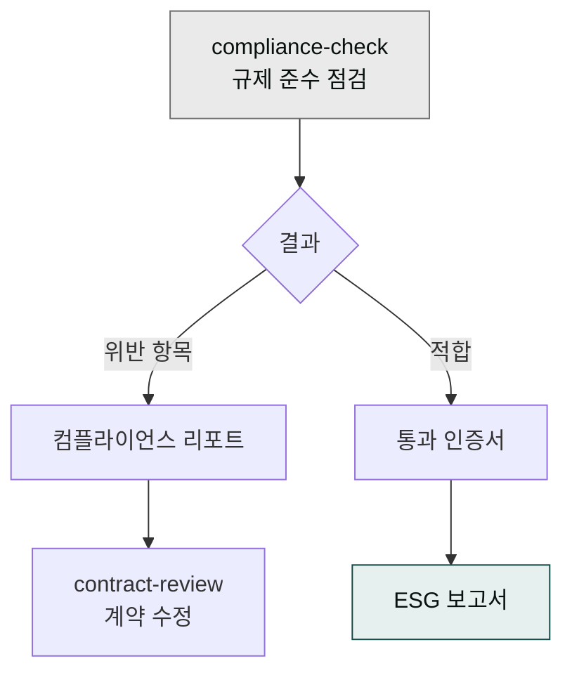

> 컴플라이언스는 분기 1회 점검으로 충분하지만, 그 1회을 빠뜨리면 행정처분이 날아옵니다. 표준 체크리스트를 두고 `moai-legal:compliance-check` 스킬로 자동화하세요.



## 사용 스킬

- **`moai-legal:compliance-check`** — 규제 준수 점검, 내부 감사, ESG 보고, 인허가 서류 지원

## 한국 기업이 가장 자주 빠뜨리는 4개 영역

### 1. 개인정보보호법 (PIPA)

- [ ] 개인정보처리방침이 웹사이트 푸터에 게시되어 있는가
- [ ] 개인정보보호책임자(CPO)가 지정되고 연락처가 공개되어 있는가
- [ ] 만 14세 미만 가입 시 법정대리인 동의 절차가 있는가
- [ ] 외부 위탁(CRM, 클라우드)에 대한 위탁 사실이 공개되어 있는가
- [ ] 영향평가가 필요한 처리(50만 명 이상 등)에 대해 평가가 완료되었는가
- [ ] 자동화된 의사결정 — 사용자에게 설명 요구권 안내

### 2. 전자상거래법

- [ ] 사이트 푸터에 사업자등록번호·통신판매업 신고번호·대표자명·주소·연락처
- [ ] 청약철회 절차·기한·환불 방법 명시
- [ ] 표시·광고에 거짓·과장 표현 없는지 (예: "최저가", "100% 효과")
- [ ] 결제 수단별 수수료가 정확히 표시
- [ ] 미성년자 결제 동의 절차

### 3. 정보통신망법 + 마케팅 동의

- [ ] 광고성 정보 수신 동의를 별도로 받음 (필수 동의에 끼워넣기 금지)
- [ ] 야간(21시~익일 8시) 광고 발송 시 별도 동의 확인
- [ ] 수신거부(unsubscribe) 링크가 모든 마케팅 메일에 있음
- [ ] 발송자명·연락처·수신거부 방법이 명확히 표시

### 4. ISMS·ISO 27001 (정보보안)

- [ ] 임직원 보안 교육 연 1회 이상 시행 기록
- [ ] 접근 권한 관리 — 퇴사자 계정 즉시 회수
- [ ] 백업·복구 정책 문서화 + 분기별 복구 테스트
- [ ] 외부 위탁사 보안 점검 (DPA + 점검 결과 보관)

## 워크플로우 예시 — 분기 컴플라이언스 점검

```
> "우리 회사 분기 컴플라이언스 점검해줘. 위 4개 영역 체크리스트를 기준으로 미흡 항목 표로 정리하고, 각 항목당 담당자가 다음에 할 액션을 한 줄로 써줘."
```

`compliance-check` 스킬이 체크리스트 기반 점검 보고서를 DOCX로 생성합니다.

## ESG 보고서

상장 준비 중이거나 대기업 협력사라면 ESG 보고서가 정기 의무입니다:

```
> "2026년 ESG 보고서 초안 작성해줘. GRI Standards 기준으로, 환경·사회·지배구조 3개 섹션. 우리 회사 1년치 데이터는 첨부 파일에 있어."
```

## 자주 겪는 실수

- **체크리스트만 보고 점검을 안 함** — 분기 첫째 주를 점검 주간으로 캘린더에 고정하세요.
- **점검 결과를 PDF로만 보관** — 미흡 항목은 [트랙 — 법률](../../tracks/track-legal/)의 액션 아이템 생성 패턴으로 즉시 티켓화하세요.
- **개인정보처리방침을 한 번 만들고 방치** — 처리 항목·위탁사·보유기간이 바뀔 때마다 갱신해야 합니다.

## 다음 단계

- [법률 리스크 관리](../../guides/legal-risk/)
- [계약서 작성 가이드](../../guides/contract-drafting/)
- [트랙 — 법률](../../tracks/track-legal/)

---

### Sources

- moai-legal 플러그인 [`compliance-check`](https://github.com/modu-ai/cowork-plugins/blob/main/moai-legal/skills/compliance-check/SKILL.md)
- [개인정보보호위원회 — 개인정보처리방침 작성지침](https://www.pipc.go.kr) · [한국인터넷진흥원 — ISMS-P 인증](https://isms.kisa.or.kr)
