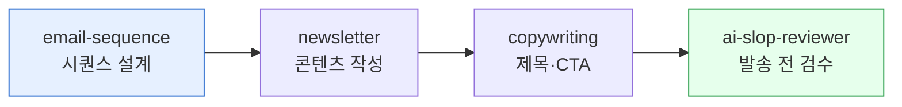

> 이메일은 "죽었다"는 말을 10년째 듣고 있지만, 매출 ROAS 기준으로는 가장 안정적인 채널입니다. cowork-plugins는 한국 정보통신망법을 준수하면서 시퀀스를 자동 설계합니다.



## 사용 스킬

| 스킬 | 용도 |
|---|---|
| `moai-content:newsletter` | 위클리 뉴스레터 기획·작성·구독자 분석 |
| `moai-marketing:email-sequence` | 정보통신망법 준수 자동화 시퀀스 |
| `moai-content:copywriting` | 제목·CTA 카피 |
| `moai-core:ai-slop-reviewer` | 발송 전 검수 |

## 4가지 표준 시퀀스

### 1. Welcome — 신규 구독 후 7일

| 일차 | 메시지 | 목적 |
|---|---|---|
| 0 | 환영 + 자기소개 | 기대 형성 |
| 2 | 핵심 가치 1개 | "왜 구독했는지" 재확인 |
| 5 | 베스트 콘텐츠 모음 | 백카탈로그 노출 |
| 7 | 첫 CTA (체험·다운로드) | 전환 |

### 2. Drip — 14일 교육형

신규 고객을 제품 사용에 익숙하게 만드는 일일 짧은 메일:

| 일차 | 주제 |
|---|---|
| 1 | 빠른 시작 |
| 3 | 자주 묻는 5가지 |
| 5 | 고급 기능 1 |
| 8 | 고객 사례 |
| 11 | 고급 기능 2 |
| 14 | 한 달 회고 + 업그레이드 |

### 3. Re-engagement — 30일 미접속

| 일차 | 메시지 | 톤 |
|---|---|---|
| 0 | "보고 싶었어요" + 신규 콘텐츠 | 친근 |
| 7 | "이게 도움이 될까요?" + 가이드 | 도움 |
| 14 | 마지막 — 구독 해제 옵션 명시 | 정중 |

### 4. Win-back — 이탈 고객 복귀

| 일차 | 제안 |
|---|---|
| 0 | 사용 안 한 이유 한 줄 설문 |
| 3 | 제품 변화 요약 |
| 7 | 한정 할인 (선택) |

## 워크플로우 예시 — Welcome 시퀀스 30분에 만들기

```
> "신규 가입자 Welcome 7일 시퀀스 만들어줘. 우리 제품은 노션 템플릿 SaaS, 타겟은 30대 직장인. 제목·본문·CTA·발송 시점 포함. 정보통신망법 준수 — 광고 표시·수신거부 링크 필수."
```

체인:
1. `email-sequence` (뼈대)
2. `copywriting` (제목·CTA)
3. `ai-slop-reviewer` (검수)

## 정보통신망법 준수 체크

[HARD] 한국에서 영리 목적 이메일은 다음을 반드시 포함:

- 제목 첫머리에 `[광고]` 또는 본문 상단 광고 표시
- 발송자 정보 (회사명·연락처·주소)
- 수신거부(unsubscribe) 한 번 클릭으로
- 야간(21시~익일 8시) 발송은 별도 동의

`email-sequence` 스킬은 이 4가지를 자동으로 본문에 삽입합니다.

## 성과 지표

| 지표 | 양호 | 점검 시작 |
|---|---|---|
| 오픈율 | 25%+ | 20% 미만 — 제목 문제 |
| 클릭률 | 3%+ | 1% 미만 — CTA 문제 |
| 수신거부율 | 0.2% 미만 | 0.5% 초과 — 빈도·관련성 |
| 반송률 | 2% 미만 | 5% 초과 — 리스트 위생 |

## 자주 겪는 실수

- **법적 표시 누락** — 정보통신망법 위반은 과태료 대상.
- **수신거부 클릭 후 재구독 동의 안 받음** — 재구독은 새로운 동의가 필요.
- **개인화 없음** — 이름·구독 일자·관심사 1개라도 개인화하면 오픈율 +5~10%p.
- **HTML만 발송** — 일부 이메일 클라이언트는 텍스트 fallback 필요.

## 다음 단계

- [콘텐츠 마케팅 전략](../../guides/content-marketing/)
- [SNS 최적화 가이드](../../guides/social-media/)
- [트랙 — 마케팅](../../tracks/track-marketing/)

---

### Sources

- moai-content 플러그인 [`newsletter`](https://github.com/modu-ai/cowork-plugins/blob/main/moai-content/skills/newsletter/SKILL.md)
- moai-marketing 플러그인 [`email-sequence`](https://github.com/modu-ai/cowork-plugins/blob/main/moai-marketing/skills/email-sequence/SKILL.md)
- [방송통신위원회 — 정보통신망법 광고성 정보 발송 가이드](https://www.kcc.go.kr)
