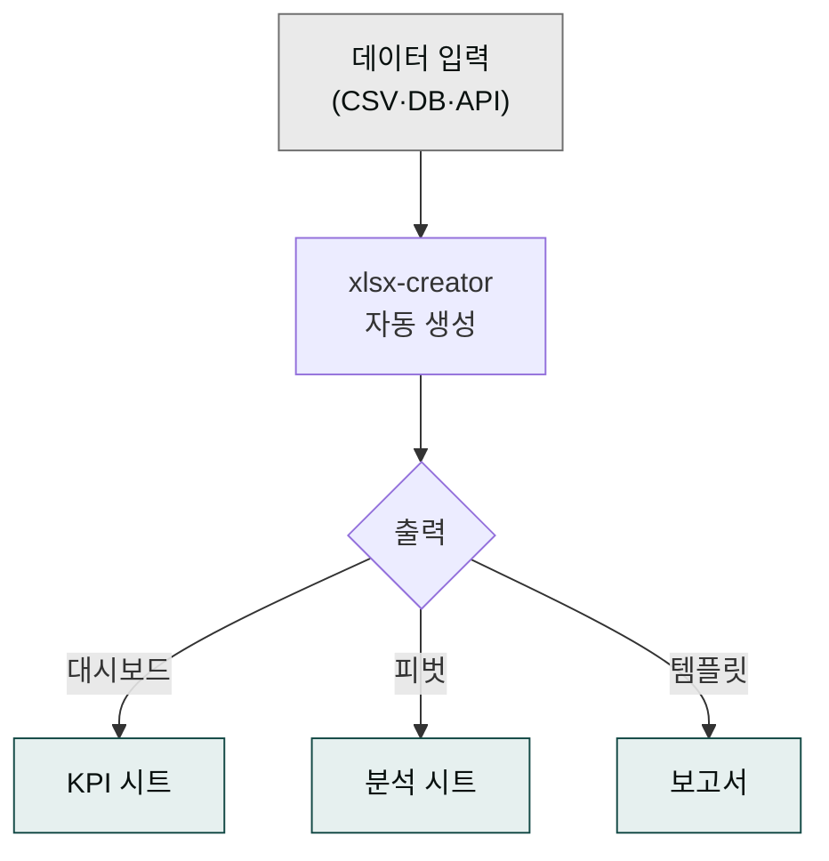

> 엑셀의 90%는 SUM·VLOOKUP만으로 풀리지만, 나머지 10%가 사람의 시간을 다 잡아먹습니다. 그 10%를 cowork-plugins로 자동화합니다.

## 사용 스킬

`moai-office:xlsx-creator` 스킬은 openpyxl 기반으로 엑셀 파일을 코드로 생성합니다. 데이터 표·차트·수식·서식 적용은 물론 시트 보호까지 한 번의 프롬프트로 처리할 수 있습니다.

## 자동화하기 쉬운 5가지 작업

### 1. KPI 대시보드

매출·고객수·NPS·LTV/CAC 같은 KPI를 한 시트에 정리하고, 매주·매월 자동 갱신:


> 이번 주 KPI 대시보드 엑셀로 만들어줘. 시트 1: 요약(전주 대비 변화),
> 시트 2: 매출·고객수·NPS 차트. 데이터는 첨부 CSV에 있음.


### 2. 간트 차트

프로젝트 일정을 셀 단위 그리드로 시각화:


> Q3 프로젝트 간트 차트 엑셀로. 30개 태스크, 시작일·종료일·담당자·진척률 컬럼.
> 일정은 행, 날짜는 열, 진행 중인 셀은 녹색으로.


### 3. 매출 분석표

월별 매출 + 카테고리·채널·지역별 분해:


> 2026년 매출 분석표. 행: 월, 열: 카테고리·채널, 값: 매출액.
> 합계 행/열 추가, 변화율 색상 표시.


### 4. 피벗 + 슬라이서 시뮬레이션

cowork는 동적 피벗 슬라이서를 직접 만들지는 못하지만, 시나리오별 결과 시트를 미리 생성해 같은 효과를 냅니다:


> 이 매출 데이터로 채널별·지역별 피벗 결과 시트 4개 미리 만들어줘.
> 각 시트 상단에 시나리오 이름과 핵심 합계.


### 5. 표·서식 일괄 적용

엑셀 양식 표준이 있을 때:


> 이 데이터를 우리 회사 표준 양식으로 정리해줘 — 헤더는 #2C5FBC 배경 흰 글씨,
> 짝수 행 회색 줄무늬, 합계 행은 굵게.


## Power Query 대체 — 데이터 전처리

`xlsx-creator`는 Power Query를 직접 호출하지 않지만, 동일한 결과를 코드로 만들어냅니다. 여러 시트나 파일을 하나로 합치거나(UNION), 컬럼을 분할·결합하거나, 결측·이상값을 처리하거나, 피벗·언피벗 변환이 필요할 때 모두 사용할 수 있습니다. 더 복잡한 변환이 필요하다면 [데이터 분석 가이드](../../guides/data-analysis/)의 `data-explorer` 스킬과 조합하세요.

## LAMBDA·동적 배열 함수

엑셀 365의 LAMBDA는 cowork에서 셀에 직접 작성 가능:


> 이 표 J 컬럼에 LAMBDA로 '이름 + 등급' 결합해줘.
> 등급은 H열 숫자에 따라 A/B/C/D 자동 분류 (90+ A, 80+ B, 70+ C, 그 외 D).


## 자주 겪는 실수

수식이 깨질까 봐 값으로만 복사해 두는 습관이 있다면, `xlsx-creator`를 사용할 때는 수식 그대로 써도 원본 셀 참조가 보존된다는 점을 기억하세요. 차트를 지나치게 화려하게 만드는 것도 피해야 합니다. 막대·꺾은선·도넛 세 종류만으로 대부분의 보고서가 해결되고, 그 이상은 오히려 읽기 어렵게 만듭니다. 머지 셀은 보기에는 깔끔하지만 정렬과 필터를 깨뜨리기 때문에 가능하면 사용하지 않는 것이 좋습니다.

## 다음 단계

- [데이터 분석 가이드](../../guides/data-analysis/)
- [재무 모델링 템플릿](../financial/)
- [트랙 — 데이터](../../tracks/track-data/)

---

### Sources

- moai-office 플러그인 [`xlsx-creator`](https://github.com/modu-ai/cowork-plugins/blob/main/moai-office/skills/xlsx-creator/SKILL.md)
- [openpyxl 공식 문서](https://openpyxl.readthedocs.io)
