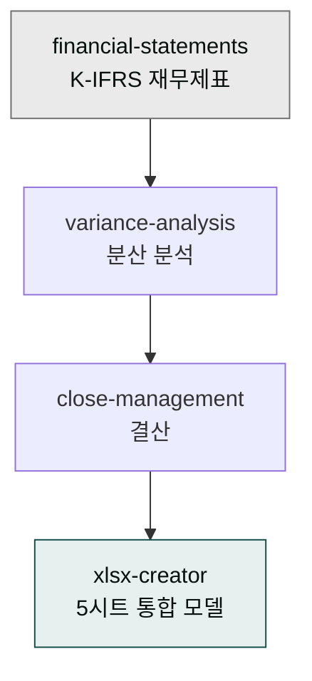

> 투자 검토에서 통하는 재무 모델은 *복잡함이 아니라 검증 가능함*에서 신뢰를 얻습니다. 5개 시트, 가정과 결과의 명확한 분리, 가정을 바꾸면 결과가 자동으로 따라가는 구조 — 이 셋이면 충분합니다.

## 사용 스킬

| 스킬 | 역할 |
|---|---|
| `moai-finance:financial-statements` | K-IFRS 기준 재무상태표·손익계산서·현금흐름표 |
| `moai-finance:variance-analysis` | 예산 대비 실적 분산 분석 |
| `moai-finance:close-management` | 결산·급여 정산 |
| `moai-office:xlsx-creator` | 5개 시트 통합 모델 출력 |

## 5개 시트 표준 구조

### Sheet 1 — Assumptions

모든 가정 단가·증가율·전환율을 한 시트에 모읍니다. 다른 시트는 이 시트만 참조.

| 항목 | 단위 | 값 | 비고 |
|---|---|---|---|
| 평균 단가 (ARPU) | KRW | 50,000 | 월별 |
| 신규 고객 증가율 | % | 15 | 월별 MoM |
| Churn | % | 5 | 월별 |
| CAC | KRW | 80,000 | 마케팅·세일즈 합계 |
| 평균 인건비 | KRW | 5,500,000 | 월 1인당 |

### Sheet 2 — P&L (월별 36개월)

매출 → COGS → 매출총이익 → OpEx → EBITDA → 순이익 순으로 흐릅니다. 모든 셀은 Sheet 1의 가정값만 참조하므로, Assumptions 시트 하나만 수정하면 P&L 전체가 자동으로 바뀝니다.

### Sheet 3 — Cash flow

영업·투자·재무 활동 세 가지로 분류합니다. 누적 현금잔고가 음수로 빠지지 않는지 월별로 확인하는 것이 핵심입니다.

### Sheet 4 — Cohort

월별 가입 코호트의 누적 매출과 리텐션을 추적합니다. LTV 계산의 직접 근거가 되는 시트입니다.

### Sheet 5 — Funding need

자금 소요와 사용 계획을 라운드별(Pre-seed · Seed · Series A)로 누적해 표시합니다. 투자자가 "이 돈으로 뭘 할 건가"를 확인하는 시트입니다.

## 워크플로우 예시 — 36개월 모델 자동 생성


> 시리즈 A 투자 검토용 재무 모델 만들어줘. 36개월, 5개 시트(Assumptions/P&L/Cash/Cohort/Funding).
> 가정은 다음과 같음 — ARPU 50,000원, 신규 MoM 15%, Churn 5%, CAC 80,000원.
> xlsx 한 파일로 저장.


체인:
1. `financial-statements`
2. `xlsx-creator`

## 가정 변경 테스트

투자자가 "Churn 7%로 가정하면?" 같은 질문을 던졌을 때 5초 안에 답할 수 있어야 합니다.


> 방금 만든 모델의 Assumptions 시트에서 Churn을 7%로 바꿔 결과 비교해줘.
> 기존(5%) vs 변경(7%) 상태에서 24개월 매출과 EBITDA를 표로 정리.


## K-IFRS 결산 보고

시리즈 A 이후에는 외부 감사와 정기 결산 보고가 의무화됩니다. K-IFRS 기준 재무제표가 필요해지는 시점에 아래 프롬프트로 시작할 수 있습니다.


> 2026년 K-IFRS 기준 재무제표 만들어줘. 손익계산서·재무상태표·현금흐름표 풀 세트.
> 1년치 거래 데이터는 첨부 엑셀에.


## 자주 겪는 실수

Assumptions 시트 없이 P&L에 숫자를 직접 입력하면, 투자자가 "Churn을 7%로 바꾸면?"이라고 물었을 때 수십 개 셀을 일일이 고쳐야 합니다. 가정은 반드시 한 곳에 모아야 합니다. 차트가 너무 많은 모델도 신뢰를 깎습니다. 매출 곡선·현금잔고·코호트 핵심 세 개로 압축하고 나머지는 표로 처리하세요. 연간 단위 모델만 제출하는 것도 시리즈 A에서는 부족합니다. 월별 36개월 모델이 표준이며, 그래야 월별 현금 흐름과 런웨이를 확인할 수 있습니다.

## 다음 단계

- [투자 유치 가이드](../../guides/funding/)
- [엑셀 고급 기법](../excel/)
- [트랙 — 재무](../../tracks/track-finance/)

---

### Sources

- moai-finance 플러그인 [`financial-statements`](https://github.com/modu-ai/cowork-plugins/blob/main/moai-finance/skills/financial-statements/SKILL.md), [`variance-analysis`](https://github.com/modu-ai/cowork-plugins/blob/main/moai-finance/skills/variance-analysis/SKILL.md)
- moai-office 플러그인 [`xlsx-creator`](https://github.com/modu-ai/cowork-plugins/blob/main/moai-office/skills/xlsx-creator/SKILL.md)
