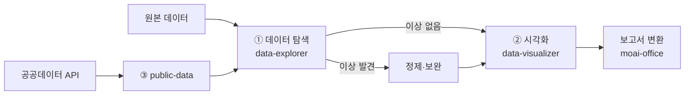

# 트랙 — 데이터 분석

> CSV·Excel을 Cowork에 던지고 나면 Pandas 콘솔이 열리는 것이 아니라 **보고서 수준의 결과물**이 나오는 흐름을 만듭니다. `moai-data` 세 스킬과 공공데이터 API를 조합하는 실전 트랙입니다.

## 트랙 지도



## Part 1 — data-explorer

### 언제 쓰나

- 처음 받은 CSV·Excel의 품질을 빠르게 진단
- 결측값·이상값·중복 레코드 탐지
- 컬럼별 분포·상관관계 요약
- 1만 ~ 수십만 행 규모의 탐색

### 기본 프롬프트

```text
D:/Input/customer-transactions-2026.csv를 분석해줘.

- 총 행수·결측률·중복 건수
- 수치형 컬럼 요약 통계 (평균·중앙값·표준편차·분위수)
- 범주형 컬럼 Top 10 빈도
- 이상값 탐지 (IQR 기준)
- 주요 상관관계 (Pearson > 0.5)
- 결과는 Markdown 리포트로, 90_Output/data-quality.md에 저장
```

### 실전 팁

**큰 파일은 샘플링부터.** 500MB 이상 Excel은 탐색만 해도 5분 이상 걸립니다. "처음 1만 행만 샘플링해서" 지시하면 속도가 크게 개선됩니다.

**결측률 5% 기준.** SKILL.md 기본값은 결측률 10% 초과 컬럼에만 경고합니다. 더 보수적으로 보고 싶다면 "결측률 3% 초과 경고"를 명시하세요.

**범주형 변수 Top N.** 기본 10개. "Top 20까지" 지시 가능합니다.

## Part 2 — data-visualizer

### 언제 쓰나

- Markdown 리포트에 바로 넣을 수 있는 차트
- 인터랙티브 대시보드 (Chart.js HTML)
- Mermaid 다이어그램 (흐름도·시퀀스)
- PPT·Word로 옮길 수 있는 고정 이미지

### 기본 프롬프트

```text
방금 생성한 data-quality.md 분석 결과를 시각화해줘.

- 월별 매출 추이: 선 그래프 (Chart.js HTML)
- 카테고리별 매출 비중: 도넛 차트
- 지역별 고객 분포: 막대 그래프
- 모든 차트는 반응형, 다크 모드 지원
- 저장: 90_Output/dashboards/YYYY-MM-DD.html
```

### 차트 종류별 추천 표

| 의도 | 차트 | 이유 |
|---|---|---|
| 시간 추이 | 선 그래프 | 연속성 전달 최적 |
| 비율 | 도넛 | 파이보다 가독성 우수 |
| 순위 Top N | 막대 | 비교가 직관적 |
| 분포 | 히스토그램·박스플롯 | 분산·이상값 시각화 |
| 상관관계 | 산점도 + 추세선 | 관계의 강도·방향 |
| 프로세스 흐름 | Mermaid flowchart | 의사결정 시각화 |
| 상태 전이 | Mermaid stateDiagram | 라이프사이클 |

### PPT로 넘길 때

시각화 결과는 HTML이므로 그대로 PPT에 넣을 수 없습니다. 흐름:

```text
1. data-visualizer로 HTML 대시보드 생성
2. Cowork에 "이 HTML 대시보드의 각 차트를 PNG로 캡처해줘" 지시
3. PNG를 moai-office:pptx-designer로 임베드
```

## Part 3 — public-data

### 언제 쓰나

- 공공데이터포털 (`data.go.kr`) API 조회
- KOSIS 통계청 데이터 조회
- 내부 데이터를 공공 지표와 비교
- KPI 대시보드에 거시 지표 추가

### 주요 API

| API | 용도 | 비고 |
|---|---|---|
| DART OpenDART | 상장사 공시·재무제표 | API 키 필요 (무료) |
| 공공데이터포털 | 정부 데이터 3만+ | API 키 필요 (무료) |
| KOSIS | 통계청 공식 통계 | API 키 필요 (무료) |
| KIPRIS Plus | 특허·상표 검색 | API 키 필요 (월 무료 한도) |
| KCI | 학술지 인용 | API 키 필요 |
| 국가법령정보센터 | 법령·판례 | API 키 필요 |

### 기본 프롬프트

```text
KOSIS에서 "소비자물가지수 최근 24개월"을 조회해서
내 회사 매출 데이터(Q1-sales.xlsx)와 함께 분석해줘.

- CPI 원계열 데이터 확보
- 우리 매출 금액을 CPI로 디플레이트 (실질 매출)
- 실질 매출 그래프 + 명목 매출 그래프 비교
- 인플레이션 효과 제거 후 진짜 성장률 계산
- Word 보고서로 정리, 90_Output/real-growth.docx
```

### API 키 관리

**절대 하드코딩 금지.** 프로젝트 폴더의 `.env` 또는 `credentials.env` 파일에 저장하고 `.gitignore`에 추가하세요.

```text
# .env 예시
KOSIS_API_KEY=XXXXXXXXXXXXXXXX
DART_API_KEY=YYYYYYYYYYYYYYYY
DATA_GO_KR_KEY=ZZZZZZZZZZZZ
```

SKILL.md 본문에는 환경변수 참조만 넣습니다.

```text
키 로드: `.env`의 `KOSIS_API_KEY` 값 사용
절대 프롬프트·로그에 키 노출 금지
```

## 통합 시나리오 — "매출 분석 완성 파이프라인"

1. **탐색 — data-explorer** — Q1 매출 CSV의 품질 진단. 결측·이상·중복 체크.
2. **정제 — 수동 프롬프트** — 이상값·결측 처리 규칙을 Cowork에 지시하여 정제 버전 생성.
3. **거시 지표 결합 — public-data** — KOSIS에서 CPI·GDP·가계소비 지출 추이 확보.
4. **시각화 — data-visualizer** — 매출 추이 + 거시 지표 비교 차트 HTML 대시보드.
5. **PPT 변환 — pptx-designer** — 임원 보고용 7장 PPT. 차트는 PNG로 임베드.
6. **Word 요약 — docx-generator** — 경영진 3페이지 요약본. 핵심 수치 + 그래프 + 제언.

## 자주 걸리는 지점

### CSV 인코딩 문제

한국어 CSV는 EUC-KR·CP949·UTF-8 세 가지가 공존합니다. Cowork가 자동 감지하지만 깨진 결과가 보이면 "인코딩은 CP949로 시도해줘"라고 명시하세요.

### 일자 컬럼이 문자열로 읽힘

원인은 공백·한글 요일·슬래시·점 혼용. 프롬프트에 "날짜 컬럼은 `date_col` 이며 `YYYY-MM-DD` 또는 `YYYY/MM/DD` 둘 다 허용, 공백 제거 후 파싱"이라고 명시.

### 차트가 너무 많음

"대시보드에 차트 최대 6개"로 상한을 두세요. 넘치면 별도 상세 페이지로 분리 지시.

### 공공 API 제한 초과

일부 API는 호출당 건수·일일 한도가 있습니다. 한 번에 수천 건 요청하면 차단됩니다. SKILL.md에 "요청은 100건 단위로 배치, 배치 간 2초 지연" 규칙 명시.

## 보안·윤리

### 민감 데이터는 격리

고객 개인정보·금융 거래는 별도 암호화 폴더에서만 작업. ai-slop-reviewer 같은 후처리에 노출되지 않도록 프롬프트에 명시.

### 익명화·가명화

고객 이름·이메일·전화는 해시·마스킹 처리 후 분석 대상에 포함. "이메일은 도메인만 유지, 로컬파트는 마스킹" 같은 구체적 규칙을 지시.

### 저작권·출처

공공데이터는 대부분 CC-BY 또는 공공누리. 보고서 발행 시 출처를 명기하세요.

## 다음 읽을거리

- [트랙 — 문서](../track-documents/)
- [트랙 — 마케팅](../track-marketing/)
- [AI 사원 실습 2](../ai-employee-lab-2/)
- [보고서 자동화](../report-automation/)

---

### Sources
- CTR-AX S3 · 공공 API / 플러그인 카탈로그 (moai-data 3 스킬)
- [공공데이터포털](https://www.data.go.kr/)
- [KOSIS OpenAPI](https://kosis.kr/openapi/index/index.jsp)
- [modu-ai/cowork-plugins — moai-data](https://github.com/modu-ai/cowork-plugins/tree/main/moai-data)
