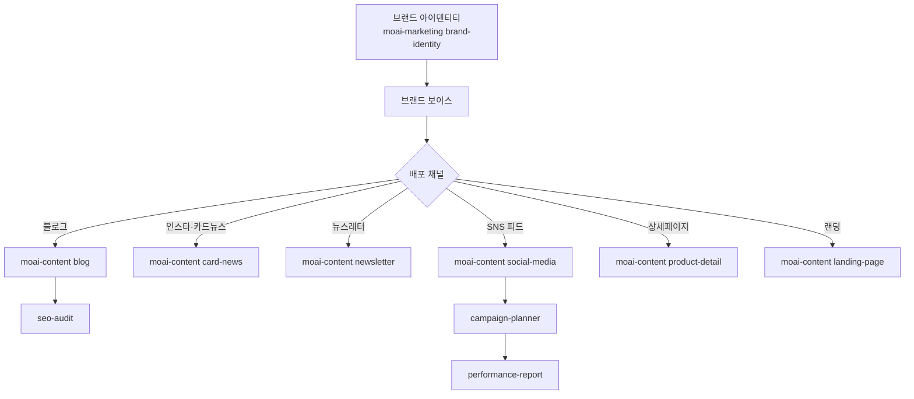

# 트랙 — 마케팅·콘텐츠

> 브랜드 전략부터 SNS 운영, 상세페이지 전환율, SEO 감사까지 — `moai-marketing`과 `moai-content` 플러그인 조합으로 마케팅 본부 하나를 덮는 트랙입니다.

## 트랙 지도



## Part 1 — 브랜드·전략

### brand-identity — 아이덴티티 설계

네이밍·슬로건·톤앤매너·비주얼 가이드라인까지 패키지로. 신규 브랜드뿐 아니라 기존 브랜드 리뉴얼에도 적합합니다.

```text
(예시)
우리 회사는 B2B SaaS 기업으로, 40대 중소기업 CEO가 주요 고객입니다.
기존 브랜드명은 "SmartFlow"인데 B2B 느낌이 부족하다는 피드백이 많아요.

브랜드 아이덴티티 리뉴얼안을 만들어줘:
- 새 네이밍 후보 5개 (신뢰감·전문성 강조)
- 각 네이밍별 슬로건
- 브랜드 컬러 팔레트 (주색·보조색·강조색)
- 톤앤매너 가이드 (격식체·경어체, 전문용어 허용 범위)
- 로고 컨셉 3가지 방향
- Word 보고서 20페이지 분량, 90_Output/brand-renewal.docx
```

### personal-branding — 개인 전문가 포지셔닝

CEO·임원·전문가 개인의 전문성을 브랜드화합니다.

```text
(예시)
저는 중소기업 컨설팅 12년차, 세무·재무·법률 복합 전문가입니다.
링크드인·브런치에서 전문가로 포지셔닝하려고 해요.

개인 브랜딩 전략 세워줘:
- 타겟 포지션 (어떤 전문가로 보여야 하는가)
- 콘텐츠 3트랙 (링크드인·브런치·유튜브)
- 1년치 콘텐츠 캘린더 (주 2회 포스팅)
- 링크드인 프로필 최적화 초안
- 브런치 첫 연재물 기획안 (10회 분량)
```

## Part 2 — 콘텐츠 제작

### blog — 포스팅 자동화

네이버·티스토리·브런치·WordPress·Ghost 6개 플랫폼 맞춤 SEO 최적화.

```text
(예시)
블로그 포스팅 1편 작성해줘.

- 플랫폼: 네이버 블로그
- 주제: "2026년 중소기업 세액공제 7가지 변화"
- 분량: 2500자
- 타겟 독자: 중소기업 재무담당자 (30~50대)
- C-Rank·D.I.A. 알고리즘 고려
- 헤드라인 SEO 키워드: "중소기업 세액공제", "2026 세법 개정", "연말정산 절세"
- 본문 구조: 도입(문제 제기) → 7가지 변화 상세 → 요약 체크리스트 → 실무 팁
- 저장: 90_Output/blog-tax-2026.md (MD 파일, 이미지 자리는 [IMG-1] 형식으로 표시)
```

### card-news — 인스타 카드뉴스

AI 이미지 생성 기반 캐러셀 10장.

```text
(예시)
방금 만든 블로그 포스트를 카드뉴스 10장으로 변환해줘.

- 플랫폼: 인스타그램 (1080x1350 비율)
- 스타일: 미니멀, 흰 배경, 포인트 컬러 네이비
- 각 장은 핵심 한 줄 + 보조 설명
- 이미지 생성은 moai-media:ideogram (한글 타이포 렌더링 우수)
- 마지막 장은 CTA — "블로그 풀버전 → 링크"
- 저장: 90_Output/card-news/card-01.png ~ card-10.png
```

### newsletter — 뉴스레터

구독자 확보·오픈율 최적화 포함.

```text
(예시)
매주 금요일 발행 뉴스레터 1회분을 만들어줘.

- 브랜드: SmartFlow (B2B SaaS)
- 타겟: 중소기업 CEO·재무담당 3,500명
- 이번 주 주제: "2026 하반기 세액공제 변화 요약"
- 분량: 1,200자 이내 (오픈율 최적화)
- 구조:
  - 제목 (A/B 테스트용 후보 3개)
  - 프리헤더 (90자 이내)
  - 인사 (1줄)
  - 본문 3섹션 (각 섹션 150자)
  - CTA 버튼 문구 2개 안
  - 푸터 (수신거부 안내 포함)
- 저장: 90_Output/newsletter/YYYY-WW.md
```

### social-media — SNS 콘텐츠

인스타·스레드·X·링크드인·유튜브쇼츠·카카오·네이버 7개 플랫폼 개별 최적화.

```text
(예시)
이번 주 블로그 포스트를 7개 플랫폼에 맞게 변환해줘.

- 인스타: 캐러셀 8장 + 피드 설명문
- 스레드: 연쇄 글타래 5개
- X: 본편 트윗 + 스레드 3개
- 링크드인: 긴 글 포스트 (1,500자, 전문가 톤)
- 유튜브 쇼츠: 60초 스크립트
- 카카오 채널: 카드형 메시지 1개
- 네이버 블로그: 별도 파일 (track-content-blog 참고)

저장: 90_Output/social/<platform>.md 각각
```

### product-detail — 상세페이지

네이버 스마트스토어·쿠팡·카카오 커머스 규격.

```text
(예시)
새 제품 "WorkBook Pro" 상세페이지를 만들어줘.

- 플랫폼: 네이버 스마트스토어
- 카테고리: 사무용품 > 수첩·노트
- 타겟 고객: 30~40대 전문직
- 가격대: 4만 원대
- 구조:
  - 히어로 섹션 (강력한 후킹)
  - 핵심 USP 3가지 (이미지 포함)
  - 사용 시나리오 3장면
  - 스펙 테이블
  - 구매 혜택 (사은품·무료배송·할인)
  - FAQ 5개
- 이미지 플레이스홀더는 [PRODUCT-HERO], [USP-1] 형식으로 표시
- 저장: 90_Output/detail/workbook-pro.html
```

### landing-page — 단독 랜딩

고전환율 원페이지 설계.

```text
(예시)
다가오는 웨비나 "2026 세무 변화 완전정복" 랜딩 페이지를 만들어줘.

- 목적: 이메일 가입 + 일정 확정
- 전환 타겟: CTR 10% 이상
- 구조:
  - 히어로 (헤드라인 + 서브헤드 + CTA 1차)
  - 문제 제기 (세 가지 페인포인트)
  - 솔루션 소개 (웨비나 커리큘럼 5단계)
  - 강사 소개 (신뢰감)
  - 수강 후기 3개
  - 가격·일정 (무료·유료 선택)
  - CTA 2차 + 긴급성 강조 (N일 남음)
  - FAQ 7개
  - CTA 3차 (마지막)
- HTML 단일 파일, CSS는 인라인
- 저장: 90_Output/landing/webinar-2026-tax.html
```

## Part 3 — 캠페인·성과

### campaign-planner — 그로스해킹

A/B 테스트 설계·인플루언서 전략·CRM 자동화.

```text
(예시)
신제품 런칭 캠페인을 8주 간으로 기획해줘.

- 목표: 사전 예약 5,000건
- 예산: 3,000만 원
- 채널: 인스타 광고·블로그·인플루언서·뉴스레터
- 주차별 마일스톤
- 크리에이티브 A/B 테스트 6세트 설계
- 인플루언서 Top 15 섭외 기준
- 전환 퍼널 설계 (방문 → 이메일 가입 → 예약)
- 저장: 90_Output/campaign/launch-plan.docx
```

### performance-report — 성과 보고서

GA4·네이버 광고·메타 광고·카카오모먼트 데이터 통합 분석.

```text
(예시)
지난 달 마케팅 성과 보고서 만들어줘.

- 소스: GA4 / 메타광고 / 네이버 광고 (CSV 파일들)
- 분석 범위:
  - 채널별 ROAS, 전환율, CAC
  - 캠페인 상위 10 / 하위 10
  - 전환 경로 분석 (첫 방문 → 구매)
- 경영진 요약 (1페이지) + 실무팀 상세 (5페이지)
- 액션 플랜 — 다음 달 채널 예산 재분배 제안
- 저장: 90_Output/report/mkt-monthly-YYYY-MM.pptx
```

### seo-audit — 네이버·구글·GEO 통합 감사

AI 검색(GEO) 최적화까지 포함.

```text
(예시)
blog.smartflow.co.kr 사이트의 SEO를 종합 감사해줘.

- 온페이지: 제목·설명·헤딩·내부링크 점검
- 기술 SEO: 사이트맵·robots.txt·Core Web Vitals
- 네이버: C-Rank·D.I.A. 기준 점검
- 구글: E-E-A-T 평가
- AI 검색 (GEO): ChatGPT·Perplexity 인용 가능성
- 경쟁사 3개와 키워드 갭 분석
- 우선순위 높은 개선 항목 Top 10
- 저장: 90_Output/seo-audit-smartflow.docx
```

### email-sequence — 이메일 드립

정보통신망법 준수 기반 자동화 시퀀스.

```text
(예시)
신규 가입자 온보딩 이메일 시퀀스 7편을 만들어줘.

- Day 0: 환영 + 시작 가이드
- Day 1: 핵심 기능 소개
- Day 3: 사용자 후기 + 성공 사례
- Day 7: 고급 기능 팁
- Day 14: 1:1 상담 CTA
- Day 21: 추천인 프로모션
- Day 30: 만족도 조사 요청
- 법적 준수: 수신거부 링크·광고 표시·발신자 정보 포함
- 저장: 90_Output/email-sequence/
```

## 자주 걸리는 지점

### AI 티 나는 문장

특히 블로그·뉴스레터는 [AI 슬롭 검수](../skill-chaining/)가 필수입니다. 본문 완성 → `anthropic-skills:ai-slop-reviewer` 호출 → 3블록 리포트 확인.

### 이미지 생성 비용

카드뉴스 10장 × 3세트 = 30장. Nano Banana는 장당 약 2~3초 + 토큰 소요. 배치 병렬 생성 지시로 속도 절감.

### 채널별 분량 규정 위반

인스타 캡션 2,200자 · X 280자 · 링크드인 3,000자 등 플랫폼 제한이 다릅니다. SKILL.md에 "인스타 캡션 2,200자 이내, 2줄 개행으로 가독성 확보" 등 명시.

### 법적 리스크

의약·금융·건강 광고는 각 산업 표시 광고법 준수 필수. 마케팅 카피 생성 후 `moai-legal:compliance-check`로 리뷰를 권장합니다.

## 다음 읽을거리

- [트랙 — 데이터](../track-data/)
- [트랙 — 문서](../track-documents/)
- [AI 사원 실습 2](../ai-employee-lab-2/)
- [블로그 파이프라인](../blog-pipeline/)

---

### Sources
- CTR-AX S3 · 플러그인 카탈로그 (moai-marketing 7 + moai-content 8 스킬)
- [Claude Docs — Cowork Marketing Use Cases](https://docs.claude.com/en/docs/claude-cowork)
- [modu-ai/cowork-plugins — moai-marketing, moai-content](https://github.com/modu-ai/cowork-plugins)
