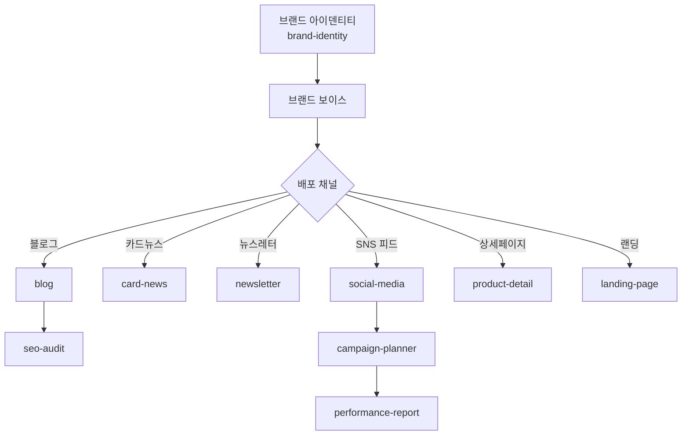

# 트랙 — 마케팅·콘텐츠

> **사용 방식**: 사용자가 짧은 한 줄 요청만 하면 시스템이 AskUserQuestion으로 맥락 수집 → 자동 체인 실행. [4가지 사용 패턴 참조](../../cowork/patterns/)

브랜드 전략부터 SNS 운영, 상세페이지 전환율, SEO 감사까지 마케팅 업무 전반을 다룹니다. `moai-marketing`과 `moai-content` 플러그인을 조합하면 마케팅 본부 한 곳을 커버하는 자동화 파이프라인을 만들 수 있습니다.

## 트랙 지도

```mermaid
flowchart TB
    Brand["브랜드 아이덴티티<br/>brand-identity"] --> Voice["브랜드 보이스"]
    Voice --> Channels{"배포 채널"}
    Channels -->|블로그| Blog["blog"]
    Channels -->|카드뉴스| Card["card-news"]
    Channels -->|뉴스레터| News["newsletter"]
    Channels -->|SNS 피드| Social["social-media"]
    Channels -->|상세페이지| Detail["product-detail"]
    Channels -->|랜딩| Landing["landing-page"]

    Blog --> SEO["seo-audit"]
    Social --> Campaign["campaign-planner"]
    Campaign --> Report["performance-report"]
```

---

## Part 1 ✦ 브랜드·전략

### brand-identity — 아이덴티티 설계

네이밍·슬로건·톤앤매너·비주얼 가이드라인을 패키지로 만들어줍니다.


> B2B SaaS 브랜드 리뉴얼안 만들어줘


시스템 인터뷰: ① 현재 브랜드명·피드백 ② 타깃 고객(B2B/B2C, 연령·직무) ③ 산출물(네이밍 후보 수·로고 컨셉·컬러 팔레트) ④ 출력 형식(DOCX/PPTX)

체인: `brand-identity → docx-generator → ai-slop-reviewer`

### personal-branding — 개인 전문가 포지셔닝

CEO·임원·전문가 개인의 전문성을 브랜드로 만들어줍니다.


> 12년차 중소기업 컨설턴트 개인 브랜딩 전략 짜줘


시스템 인터뷰: ① 전문 영역·경력 ② 타깃 포지션 ③ 채널(링크드인·브런치·유튜브) ④ 콘텐츠 빈도

체인: `personal-branding → docx-generator → ai-slop-reviewer`

---

## Part 2 ✦ 콘텐츠 제작

### blog — 포스팅 자동화

네이버·티스토리·브런치·WordPress·Ghost 등 6개 플랫폼에 맞는 SEO 최적화 글을 작성합니다.


> 2026년 중소기업 세액공제 변화 네이버 블로그 포스트 써줘


시스템 인터뷰: ① 플랫폼·SEO 키워드 ② 분량·톤 ③ 타깃 독자 ④ 발행 여부

체인: `blog → ai-slop-reviewer → korean-spell-check → humanize-korean`

### card-news — 인스타 카드뉴스

AI 이미지 생성 기반으로 캐러셀 10장을 만들어줍니다.


> 방금 만든 블로그 포스트를 카드뉴스로 변환해줘


시스템 인터뷰: ① 플랫폼 비율(인스타 1080×1350·페북 1080×1080) ② 스타일·포인트 컬러 ③ 장수 ④ CTA 문구

체인: `card-news → nano-banana → ai-slop-reviewer`

### newsletter — 뉴스레터

구독자 확보와 오픈율 최적화까지 고려해 뉴스레터를 작성합니다.


> 이번 주 금요일 뉴스레터 만들어줘


시스템 인터뷰: ① 브랜드·타깃 구독자 ② 이번 호 주제 ③ 분량·CTA ④ A/B 테스트 제목 후보 수

체인: `newsletter → ai-slop-reviewer → korean-spell-check`

### social-media — SNS 콘텐츠

인스타·스레드·X·링크드인·유튜브쇼츠·카카오·네이버 7개 플랫폼 각각의 특성에 맞게 개별 최적화된 콘텐츠를 만들어줍니다.


> 이번 주 블로그 포스트를 SNS 7개 플랫폼에 맞게 변환해줘


시스템 인터뷰: ① 대상 플랫폼 ② 톤(전문가/친근) ③ 해시태그 전략 ④ 이미지 동반 여부

체인: `social-media → nano-banana(이미지 필요 시) → ai-slop-reviewer`

### product-detail — 상세페이지

네이버 스마트스토어·쿠팡·카카오 커머스 규격에 맞는 상세페이지를 만들어줍니다.


> 신제품 워크북 프로 네이버 스마트스토어 상세페이지 만들어줘


시스템 인터뷰: ① 제품 카테고리·가격대 ② 타깃 고객 ③ 핵심 USP 3가지 ④ 구매 혜택

체인: `product-detail → nano-banana(제품 이미지) → ai-slop-reviewer`

### landing-page — 단독 랜딩

전환율을 높이는 원페이지 랜딩 페이지를 설계합니다.


> 다가오는 세무 웨비나 랜딩 페이지 만들어줘


시스템 인터뷰: ① 목적(가입·예약·구매) ② 타깃 전환율 ③ 구성 요소(강사·후기·FAQ 포함 여부) ④ HTML 단일 vs 멀티페이지

체인: `landing-page → ai-slop-reviewer`

---

## Part 3 ✦ 캠페인·성과

### campaign-planner — 그로스해킹

A/B 테스트 설계, 인플루언서 전략, CRM 자동화까지 포함한 캠페인을 기획합니다.


> 신제품 런칭 8주 캠페인 기획해줘


시스템 인터뷰: ① 목표(가입·매출·인지도) ② 예산·기간 ③ 채널 믹스 ④ A/B 테스트 세트 수

체인: `campaign-planner → docx-generator → ai-slop-reviewer`

### performance-report — 성과 보고서

GA4·네이버 광고·메타 광고·카카오모먼트 데이터를 통합 분석해 성과 보고서를 만들어줍니다.


> 지난 달 마케팅 성과 보고서 만들어줘


시스템 인터뷰: ① 데이터 소스(CSV 경로) ② 분석 차원(채널·캠페인·퍼널) ③ 수신자(경영진/실무) ④ 출력 형식(PPTX/DOCX)

체인: `performance-report → data-visualizer → pptx-designer → ai-slop-reviewer`

### seo-audit — 네이버·구글·GEO 통합 감사

AI 검색(GEO) 최적화까지 포함해 통합 SEO 감사를 수행합니다.


> blog.smartflow.co.kr SEO 종합 감사해줘


시스템 인터뷰: ① 도메인 ② 감사 범위(온페이지·기술·GEO) ③ 경쟁사 도메인 ④ 우선순위 항목 수

체인: `seo-audit → docx-generator → ai-slop-reviewer`

### email-sequence — 이메일 드립

정보통신망법을 준수하는 이메일 자동화 시퀀스를 만들어줍니다.


> 신규 가입자 온보딩 이메일 시퀀스 7편 만들어줘


시스템 인터뷰: ① 시퀀스 주기(Day 0/1/3/7/14/21/30) ② 톤·CTA 강도 ③ 발신자 정보 ④ 수신거부 처리

체인: `email-sequence → ai-slop-reviewer → korean-spell-check`

---

## 자주 걸리는 지점

### AI 티 나는 문장

블로그·뉴스레터는 특히 AI 어투가 티가 납니다. 그래서 [AI 슬롭 검수](../skill-chaining/)가 사실상 필수인데, 시스템이 본문 완성 후 `ai-slop-reviewer → humanize-korean`을 자동 호출하므로 별도 지시 없이도 처리됩니다.

### 이미지 생성 비용

카드뉴스를 10장 × 3세트, 즉 30장 생성하면 Nano Banana가 장당 약 2-3초 + 토큰을 소요합니다. 시스템이 자동으로 배치 병렬 생성을 써서 속도를 절감합니다.

### 채널별 분량 규정 위반

인스타 캡션 2,200자, X 280자, 링크드인 3,000자 등 플랫폼마다 분량 제한이 다릅니다. 시스템이 플랫폼별 제한을 자동 인식해 분량을 조정해 줍니다.

### 법적 리스크

의약·금융·건강 광고는 각 산업 표시 광고법 준수가 필수입니다. 시스템이 카피 생성 후 `compliance-check`를 체인에 자동 삽입합니다.

## 다음 읽을거리

- [트랙 — 데이터](./tracks/track-data/)
- [트랙 — 문서](./tracks/track-documents/)
- [AI 사원 실습 2](./ai-employee-lab-2/)
- [블로그 파이프라인](./blog-pipeline/)

---

### Sources
- [Claude Docs — Cowork Marketing Use Cases](https://docs.claude.com/en/docs/claude-cowork)
- [modu-ai/cowork-plugins — moai-marketing, moai-content](https://github.com/modu-ai/cowork-plugins)
