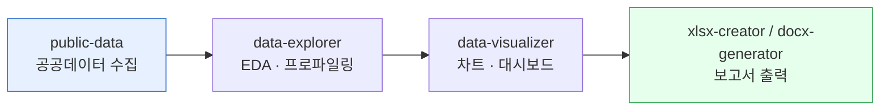

**데이터 분석 트랙**은 공공데이터 수집부터 분석, 시각화, 보고서 생성까지 완결된 데이터 워크플로우를 제공합니다. 데이터 분석가, 리서치, 기획자의 데이터 처리 작업을 AI로 자동화합니다.



## 트랙 개요

### 🎯 목적
- 데이터 처리 과정 전체 자동화
- 시각화 품질 및 정확성 보장
- 실용적인 보고서 자동 생성

### 📊 적용 대상
- 공공데이터 분석 리포트
- 시장 조사 및 트렌드 분석
- 경영 분석 및 KPI 모니터링
- 정책 영향도 분석

### 🛠️ 사용 플러그인
- **moai-data**: 공공데이터 수집 및 분석
- **moai-office**: 데이터 시각화 및 보고서 생성
- **moai-core**: AI 품질 검수

## 스킬 체인

```
public-data → data-explorer → data-visualizer → xlsx-creator
```

### Phase 1: 공공데이터 수집 (public-data)
**입력**: 분석 목표, 데이터 종류, 기간  
**출력**: 수집된 데이터  
**역할**: 공공데이터 API 호출, 데이터 정제, 기본 통계

### Phase 2: 데이터 탐색 및 분석 (data-explorer)
**입력**: 원본 데이터  
**출력**: 분석 결과 및 인사이트  
**역할**: 통계 분석, 패턴 발견, 상관관계 분석

### Phase 3: 데이터 시각화 (data-visualizer)
**입력**: 분석 결과  
**출력**: 시각화 차트 및 그래픽  
**역할**: 차트 생성, 데이터 스토리텔링, 시각적 설계

### Phase 4: 보고서 생성 (xlsx-creator)
**입력**: 시각화된 데이터  
**출력**: 최종 보고서  
**역할**: Excel 보고서 작성, 요약 생성, 배포용 문서화

## 실전 튜토리얼: 서울시 상권 분석 리포트 작성

### 시나리오
"서울시 상권 분석 데이터로 엑셀 리포트 만들어줘"

### 단계별 가이드

#### Step 1: 공공데이터 수집 및 준비

> # public-data 스킬 호출
"서울시 상권 분석 데이터 수집해줘
Target: 서울시 내 100개 주요 상권
Period: 2023년 1분기 ~ 2024년 4분기
Data Types: 매출액, 점포 수, 유동인구, 업종별 분포
API Sources: 서울시 열린데이터광장, 통계청"


**기대 결과**:
- 주요 상권별 데이터 수집 완료
- 데이터 정제 및 전처리
- 결측값 처리 및 이상치 제거
- 기본 통계 정보 생성

#### Step 2: 데이터 심층 분석

> # data-explorer 스킬 호출
"서울시 상권 데이터 분석해줘
Analysis Goals:
- 상권별 매출 성장률 추이
- 업종별 시장 점유율 분석
- 유동인구와 매출 상관관계
- 시즌별 특이점 발견
Methods:
- 통계 분석 (t-test, ANOVA)
- 시계열 분석 (추세, 변동성)
- 클러스터링 (상권 유형 분류)"


**분석 결과**:
- 상권 유형 분류 (상업지구, 주거지구, 혼합지구)
- 성장 상권/침체 상권 식별
- 주요 트렌드 발견
- 예측 모델 구축

#### Step 3: 시각화 생성

> # data-visualizer 스킬 호출
"서울시 상권 분석 시각화 생성해줘
Chart Types:
- 지도 상 매출 분포 히트맵
- 시간 추이 라인 차트
- 업종별 파이 차트
- 상관관계 산점도
Design:
- 서울시 지도 기반 시각화
- 브랜드 색상 적용
- 대시보드 스타일 레이아웃"


**생성 시각화**:
- 서울시 상권 히트맵
- 분기별 매출 추이 그래프
- 업종별 비중 차트
- 유동인구-매출 상관관계 그래프

#### Step 4: 최종 보고서 생성

> # xlsx-creator 스킬 호출
"서울시 상권 분석 보고서 생성해줘
Report Structure:
1. 실행 요약 (1페이지)
2. 데이터 개요 및 방법론 (2페이지)
3. 주요 발견사항 (5페이지)
4. 상권별 상세 분석 (10페이지)
5. 시사점 및 제언 (3페이지)
6. 부록 (데이터 원본, 분석 코드)
Format:
- Excel 통합 문서
- 자동 생성 차트
- 데이터 피벗 테이블
- 인터랙티브 필터링"


**보고서 요소**:
- 실행 요약 (Key Insights)
- 방법론 설명
- 시각화 포함 상세 분석
- 의사결정 지원 정보
- 추가 분석 아이디어

#### Step 5: AI 품질 검수

> # ai-slop-reviewer 스킬 호출
"데이터 분석 보고서 검수해줘
Focus: Data accuracy, statistical validity, business insights
Format: Excel report with charts and tables
Use Case: Executive decision making"


**검수 항목**:
- 데이터 정확성 검증
- 통계 방법 적절성
- 비즈니스 인사이트 품질
- 시각화 효과성
- 보고서 가독성

### 예시 프롬프트

> "서울시 상권 분석 데이터로 엑셀 리포트 만들어줘
분석 범위: 강남, 명동, 홍대, 여의도 4개 상권
분석 기간: 2023년 1분기 ~ 2024년 4분기
핵심 지표: 매출액, 점포 수, 유동인구, 상주인구
목표: 신규 진출 상권 선정을 위한 데이터 기반 분석"


## 확장 예시

### 시장 조사 보고서
```bash
"제조업 AI 도입 현황 시장 조사 보고서 생성
대상: 전국 500개 제조업체
데이터 소스: KOSIS, 공공데이터포털, 설문조사
분석 항목: 도입 현황, 투자 규모, 성과 측정, 장애물"
```

**추가 고려사항**:
- 업종별 세분화 분석
- 경쟁사 전략 분석
- 시장 성장 예측
- 기회점 및 위협 요인

### 경영 분석 리포트
```bash
"분기별 경영 분석 리포트 자동 생성
데이터 소스: 내부 ERP, 회계 시스템, 영업 시스템
분석 항목: 재무 성과, 영업 실적, 운영 효율성
출력: 경영진용 요약, 부서별 상세 분석"
```

**자동화 포인트**:
- 실시간 데이터 연동
- 이상 감지 알고리즘
- 자동 차트 업데이트
- 대시보드 생성

## 다음 단계

### 🚀 고급 활용
- **실시간 데이터 연동**: 자동 데이터 수집 시스템
- **예측 모델 구축**: 머신러닝 기반 미래 예측
- **대시보드 개발**: 실시간 모니터링 시스템
- **자동 리포팅**: 주간/월간 자동 보고서

### 📚 학습 자료
- [데이터 분석 가이드](../../guides/data-analysis/)
- [시각화 최적화 원칙](../../guides/data-visualization/)
- [엑셔 고급 기법](../../templates/excel/)

### ⚠️ 주의사항

공공데이터 분석 시 데이터의 출처와 한계를 반드시 명시해야 합니다. 통계적 유의성을 검증하고, 인과관계 상관관계를 구분하여 오해를 방지해야 합니다.


- 데이터 출처 및 수집 방법 명시
- 통계적 유의성 검증
- 데이터의 시간적 한계 고려
- 개인정보보호 규정 준수

### Sources
- [moai-data: public-data 스킬 문서](../../../plugins/moai-data/)
- [moai-office: xlsx-creator 스킬 문서](../../../plugins/moai-office/)
- [공공데이터 포털 가이드](https://www.data.go.kr/)