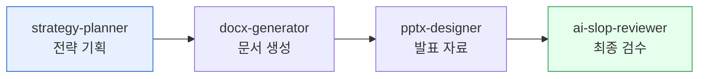

**문서 작성 트랙**은 전략 기획부터 프레젠테이션 디자인, 최종 검수까지 완결된 문서 작업 워크플로우를 제공합니다. 기획자, 컨설턴트, 기획팀의 반복적인 문서 작업을 AI로 자동화하여 시간을 절약하고 품질을 향상시킵니다.



## 트랙 개요

### 🎯 목적
- 전략 문서 작업의 전 과정을 자동화
- 일관된 품질의 프레젠테이션 생성
- 검수 프로세스 표준화

### 📊 적용 대상
- 사업계획서 (Series A, Series B, 각자주주총회)
- IR 덱 (투자자 프리젠테이션)
- 주간/월간 보고서
- 경영진 회의 자료

### 🛠️ 사용 플러그인
- **moai-business**: 전략 기획, 시장 분석
- **moai-office**: 문서/프레젠테이션 생성
- **moai-core**: AI 품질 검수

## 스킬 체인

```
strategy-planner → pptx-designer → ai-slop-reviewer
```

### Phase 1: 전략 기획 (strategy-planner)
**입력**: 비즈니스 아이디어, 시장 정보  
**출력**: 구조화된 전략 문서  
**역할**: 사업 모델 정의, 타겟 고객 분석, 경쟁사 분석

### Phase 2: 프레젠테이션 디자인 (pptx-designer)  
**입력**: 전략 문서 디자인 가이드  
**출력**: PPTX 프레젠테이션  
**역할**: 슬라이드 구조 설계, 디자인 적용, 시각화

### Phase 3: AI 품질 검수 (ai-slop-reviewer)
**입력**: 완성된 프레젠테이션  
**출력**: 검수된 문서  
**역할**: 문서 품질 검증, AI 패턴 수정, 최종 검수

## 실전 튜토리얼: Series A IR 덱 작성

### 시나리오
"AI 기반 SaaS 솔루션을 위한 Series A 투자 유치 IR 덱 작성"

### 단계별 가이드

#### Step 1: 시장 분석 및 전략 수립
```bash
# strategy-planner 스킬 호출
"/project init
Business: AI SaaS 플랫폼
Industry: Enterprise Software
Target: 한국 중소제조업체
Funding: Series A (50억 목표)
Investors: 한국벤처캐피탈, 일본모토야마캐피탈"
```

**기대 결과**:
- 사업 모델 캔버스 완성
- TAM/SAM/SOM 분석
- 경쟁 우위 요소 도출
- 재무 예측 모델 초안

#### Step 2: IR 덱 구조 설계
```bash
# pptx-designer 스킬 호출
"Series A IR 덱 생성
Target Investors: 벤처캐피탈, 일본 모토야마캐피탈
Key Topics: Market Opportunity, Product Demo, Business Model, Financials, Team
Design: Modern Tech Startup (Blue/White theme)"
```

**기대 결과**:
- 15-20장 슬라이드 구조
- 각 슬라이드별 콘텐츠 가이드라인
- 시각화 자동 생성
- 일관된 디자인 적용

#### Step 3: 전략 내용 채우기
strategy-planner에서 생성된 전략 내용을 기반으로 각 슬라이드에 상세 내용 작성:
- 문제 정의: 제대로 정의되지 않은 문제
- 해결책: AI 기반 제안서 자동 생성
- 시장 규모: 1조 시장 예측
- 경쟁사 분석: 주요 경쟁 3사
- 재무 모델: ARR 기준 성장 전망

#### Step 4: 디자인 적용 및 시각화
pptx-designer가 자동으로:
- 브랜드 컬러 적용
- 아이콘 및 차트 생성  
- 이미지 자동 삽입
- 레이아웃 최적화

#### Step 5: 최종 검수
```bash
# ai-slop-reviewer 스킬 호출
"AI-generated IR 덱 검수
Focus: Logical consistency, data accuracy, presentation flow
Format: PowerPoint slides with charts and data
Use Case: Investor presentation"
```

**검수 항목**:
- 데이터 정확성 검증
- 논리적 흐름 검토
- 전문 용어 적절성
- 프레젠테이션 효과성

### 예시 프롬프트

> "SaaS Series A IR 덱 만들어줘. 타깃 고객은 한국 중소제조업체
핵심 가치: AI 기반 자동 견적 생성 시스템
경쟁 우위: 70% 비용 절감, 3배 빠른 처리 속도
목표 투자금: 50억 (20% 지분)
적용 시장: 제조업 IT 전용 솔루션"


## 확장 예시

### 사업계획서 작성
```bash
# 전체 체인 실행
"중견 기업용 ERP 사업계획서 작성
규모: 300명 규모 중견 기업
목표: 내부 경영진 회의용
범위: 3년 성장 로드맵 + 재무 계획"
```

**추가 고려사항**:
- 내부 보고용 vs 외부 투자자용 차이
- 기밀 정보 처리 가이드라인
- 다양한 버전 자동 생성

### 주간 보고서 자동화
```bash
# 반복적 작업 자동화
"주간 업무 보고서 자동 생성
부서: 기획팀
형식: KPI 대시보드 + 주요 성과 + 다주계획
데이터 소스: Salesforce, Google Analytics"
```

**자동화 포인트**:
- 데이터 자동 수집
- KPI 시각화
- 템플릿 기반 자동 생성
- 주간별 트렌드 분석

## 다음 단계

### 🚀 고급 활용
- **다국어 IR 덱**: 영문/일문 병행 생성
- **인터랙티브 프레젠테이션**: 웹 기반 동적 프레젠테이션
- **실시간 데이터 연동**: Google Analytics, Salesforce 연동
- **AI 기반 발표 연습**: 발표 스크립트 생성 및 피드백

### 📚 학습 자료
- [투자 유치 가이드](../../guides/funding/)
- [프레젠테이션 디자인 원칙](../../design/presentation/)
- [재무 모델링 템플릿](../../templates/financial/)

### ⚠️ 주의사항

IR 덱은 투자 유치의 핵심 도구입니다. AI 생성 내용은 반드시 실제 데이터와 검증되어야 하며, 투자자와의 전문적인 상담을 대체할 수 없습니다.


- 민감한 재정 정보는 신중하게 처리
- 경쟁사 정보는 정확한 출처 확인 필수
- 시장 예측은 근거 있는 데이터 기반으로 작성

### Sources
- [moai-business: strategy-planner 스킬 문서](../../../plugins/moai-business/)
- [moai-office: pptx-designer 스킬 문서](../../../plugins/moai-office/)
- [AI IR 덱 최적화 가이드](https://startup-investor.kr/ir-deck-best-practices/)