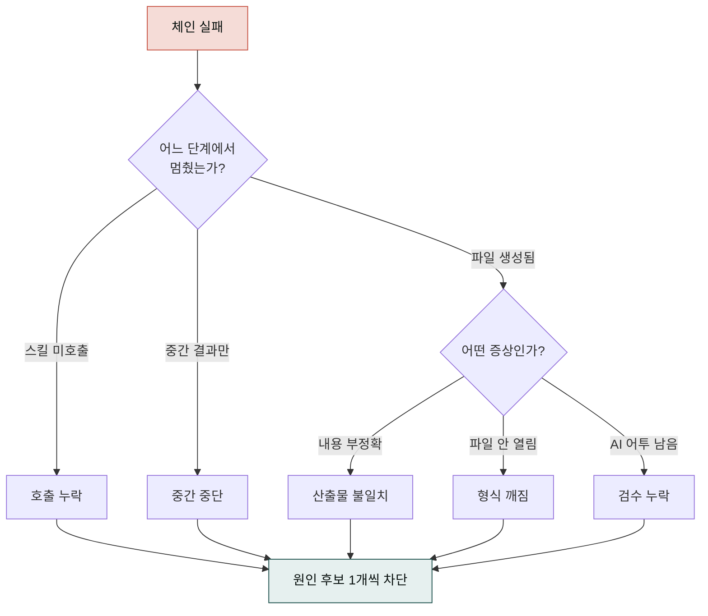

> 스킬 체인이 기대대로 흘러가지 않을 때 읽는 페이지입니다. 증상 → 원인 후보 → 다음 액션 순서로 정리했습니다.


시스템 레이어(앱·로그인·플러그인 설치·MCP)의 트러블슈팅은 [Cowork 트러블슈팅](../../cowork/troubleshooting/)을, 시스템 한도는 [제약과 한도](../../cowork/constraints/)를 함께 보세요. 본 페이지는 **체인 단계의 실패 진단**에 집중합니다.


## 학습 목표

이 페이지를 읽고 나면 체인 실패를 스킬 단위·체인 단위·산출물 단위로 분리해 진단할 수 있고, 재시도 시 프롬프트를 어떻게 보강해야 할지 판단할 수 있으며, 롤백 시점을 결정해 되돌아갈 체크포인트를 지정할 수 있게 됩니다.

## 선수 지식

- [스킬 체이닝 가이드](../skill-chaining/)
- [FAQ — 스킬·플러그인 호출](../../cowork/faq/)

## 진단 3단계

1. **어느 단계에서 멈췄는가** — 체인이 완결되지 않았다면 마지막으로 응답을 남긴 스킬이 무엇인지 먼저 특정합니다. 도메인 스킬이었는지, 포맷 스킬이었는지, `ai-slop-reviewer` 직전이었는지에 따라 대응이 다릅니다.
2. **어떤 증상인가**
   - **호출 누락** — 스킬이 아예 트리거되지 않음
   - **중간 중단** — 중간 단계에서 멈추고 결과 반환
   - **산출물 불일치** — 파일은 생성됐으나 내용이 부정확
   - **형식 깨짐** — DOCX/PPTX가 열리지 않거나 레이아웃이 어긋남
   - **AI 어투 잔존** — 검수 단계 누락
3. **원인을 가정하고 1개씩 차단** — 가능한 원인이 여러 개라면 **가장 흔한 것부터** 하나씩 차단합니다. 한 번에 두 곳을 바꾸면 무엇이 고쳤는지 알 수 없습니다.

## 증상별 패턴 10선

### 1. 스킬 트리거 실패

트리거 키워드 부재, 플러그인 미설치, 다른 스킬과 충돌이 주요 원인입니다. 요청문에 스킬 이름을 직접 명시하세요. 예: "사업계획서 써줘 — `strategy-planner` 사용".

### 2. 포맷 스킬로 인계 안 됨

도메인 스킬의 응답이 너무 짧아 체인 연결 트리거가 약해지는 경우가 많습니다. "방금 결과를 DOCX로 만들어줘"라고 후속 요청을 추가하세요.

### 3. `ai-slop-reviewer` 누락

체인 마지막이 파일 생성으로 종료되어 검수가 빠지는 경우입니다. "이 문서 AI 슬롭 검수해줘"라고 이어서 요청하면 됩니다.

### 4. Windows MAX_PATH

세션 경로가 260자를 초과하면 파일이 열리지 않습니다. 짧은 경로(`C:\docs\`)로 파일을 복사한 뒤 열어보세요.

### 5. DOCX 표 레이아웃 깨짐

도메인 스킬 출력의 마크다운 표가 너무 넓을 때 발생합니다. 표를 분할 요청하거나 PPTX로 전환하세요.

### 6. PPTX 글꼴 누락

시스템에 `Pretendard`·한글 명조가 설치되어 있지 않으면 글꼴이 Calibri로 폴백됩니다. 폰트를 설치하거나 기본 폰트로 재생성을 요청하세요.

### 7. 이미지 생성 API 키 없음

`GEMINI_API_KEY`가 설정되지 않은 경우입니다. `moai-media/CONNECTORS.md`를 참고해 `.moai/credentials.env`에 등록하세요.

### 8. 긴 작업 중단

세션 컨텍스트 상한에 도달하면 작업이 멈춥니다. 프로젝트·메모리로 이전하고 단계를 분할해 재시도하세요.

### 9. 체인이 무한 루프

포맷 스킬을 두 번 호출(예: DOCX → DOCX 재생성)하면 루프가 발생합니다. 체인을 재설계하고 원본을 기준으로 한 번만 포맷 변환하세요.

### 10. 검수 후 내용이 오히려 어색

`ai-slop-reviewer`가 도메인 전문 용어를 일반어로 치환하는 경우입니다. 검수 전에 "의학·법률·금융 용어는 보존"이라고 명시하면 예방할 수 있습니다.

## 롤백 가이드


**되돌리기 원칙**: 체인 중간에 원본 프롬프트와 직전 산출물을 **세션 내 북마크**로 저장해두면 문제 시 해당 지점으로 복귀해 재시도할 수 있습니다.


## 자가 점검


- Q. 방금 체인이 중단된 지점을 스킬 이름으로 말할 수 있나요? (쉬움·이해)
- Q. 증상 10선 중 본인이 겪은 것과 가장 가까운 것은? 원인 후보를 하나씩 차단했나요? (중간·적용)
- Q. 체인을 처음부터 재실행하지 않고 마지막 실패 단계부터 이어가려면 어떻게 프롬프트를 써야 할까요? (어려움·창조)


## 다음 단계

- [스킬 체이닝 가이드](../skill-chaining/) — 체인 설계 3원칙 복습

---

### Sources

- [modu-ai/cowork-plugins — Issues](https://github.com/modu-ai/cowork-plugins/issues)
- [Anthropic 지원센터](https://support.claude.com)
