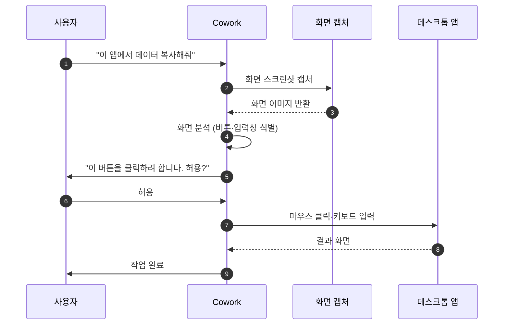

> Cowork의 컴퓨터 사용(computer use) 기능은 Claude가 마우스·키보드·화면 캡처로 데스크톱 앱이나 브라우저를 직접 조작할 수 있게 합니다.

## 작동 방식

## 언제 쓰나

공식 API가 없는 데스크톱 앱(예: Figma 데스크톱, 엑셀 고급 기능)을 직접 조작해야 할 때, 회사 내부망 웹사이트의 폼을 입력할 때, 또는 이메일 → 스프레드시트 → PPT처럼 여러 앱을 오가는 복합 워크플로우가 필요할 때 컴퓨터 사용 기능이 유용합니다.

## 권한 모델


컴퓨터 사용은 사용자의 실제 화면과 입력을 조작합니다. 반드시 필요한 앱에만, 일시적으로 권한을 허용하세요.


권한은 앱별로 **read**(화면 읽기), **click**, **full** 3단계로 구분되며, 브라우저는 기본값이 **read**로 제한됩니다. 승인은 앱 단위로 명시적으로 이루어지고, 세션이 끝나면 권한은 자동으로 해제됩니다.

## 안전 수칙

이메일·메시지 안의 낯선 링크를 컴퓨터 사용으로 클릭하지 마세요. 브라우저 MCP로 안전하게 열도록 요청하는 편이 좋습니다. 금융·결제 액션(매매 주문, 송금)은 사용자가 직접 수행해야 하며 Cowork에 맡기지 마세요. 작업 중 예상치 못한 화면이 뜰 수 있으니, 처음에는 짧은 단위로 시켜보면서 즉시 중단할 수 있는 상태를 유지하세요.

## 제한 사항

지문·얼굴 인증 같은 생체 인증은 자동화할 수 없습니다. 일부 앱은 정책상 화면 캡처가 차단되며, VM 외부 실행이 필요한 경우에는 엔터프라이즈 정책에 따라 제한될 수 있습니다.

## 다음 단계

- [안전하게 사용하기](../safety/)
- [커넥터와 MCP](../connectors-mcp/) — API 기반이 더 안전한 경우

---

### Sources

- [Let Claude use your computer in Cowork](https://support.claude.com/en/articles/14128542)
- [Use Claude Cowork safely](https://support.claude.com/en/articles/13364135)
