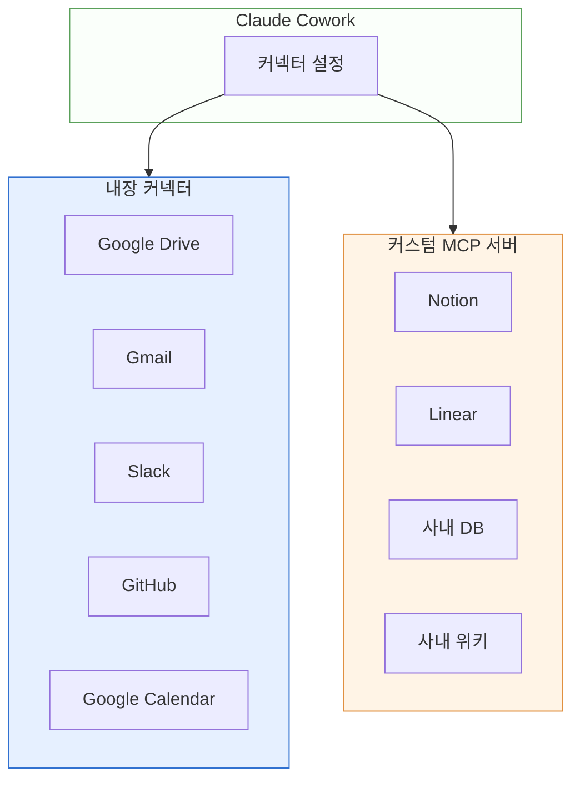

> Cowork는 내장된 커넥터(connectors)와 사용자 지정 MCP 서버를 통해 외부 서비스와 데이터에 접근합니다.

## 연결 아키텍처

## 내장 커넥터

Cowork 설정에서 "커넥터" 항목을 열면 Google Drive, Gmail, Google Calendar, Slack, GitHub 등 자주 쓰이는 서비스를 한 번에 연결할 수 있습니다. 2026-02에는 영업·분석·법무·마케팅 영역의 **12종 커넥터가 추가 공개**되었습니다: DocuSign · Apollo · Clay · Outreach · Similarweb · MSCI · LegalZoom · FactSet · WordPress · Harvey · Google Calendar(확장) · Google Drive(확장). 연결 후에는 다음과 같은 요청이 자연스럽게 가능합니다.

- "Drive에서 이번 주 회의록 찾아서 요약해줘"
- "Gmail 받은편지함의 고객 요청 3건을 카드로 정리해줘"
- "Slack #release 채널의 최근 공지를 주간 보고에 포함해줘"

커넥터는 각자 승인된 범위(scope) 내에서만 작동합니다.

1. **Chrome 데이터 사용 토글** — 커넥터가 Chrome 데이터에 접근할 수 있는지 제어합니다
2. **보안 경고** — 커넥터 연결 시 데이터 접근 범위에 대한 보안 안내가 표시됩니다
3. **커넥터 목록** — Gmail, Google Calendar, Notion 등 사용 가능한 커넥터 목록을 확인합니다

## MCP가 필요한 이유

내장 커넥터가 없는 서비스 — 사내 위키, 사내 API, Notion, Linear, 공공데이터 포털 등 — 는 MCP(Model Context Protocol) 서버를 통해 연결합니다.

MCP 서버는 "Claude가 이해할 수 있는 표준 인터페이스"로 도구를 노출합니다. 원격 URL을 등록하기만 하면 됩니다.

## 원격 MCP 등록

1. Cowork 설정 > **커넥터** > **커스텀 커넥터 추가**
2. MCP 서버의 URL과 인증 방식 입력
3. 승인 창에서 필요한 권한 범위를 확인하고 연결
4. 새로운 도구가 Cowork의 도구 목록에 자동 등록됨

[공식 가이드](https://support.claude.com/en/articles/11175166)에 단계별 스크린샷이 있습니다.

## 보안 체크

- 처음 보는 MCP URL은 사용자가 책임지고 검증해야 합니다.
- 조직 플랜에서는 관리자 승인 목록만 사용 가능하게 정책을 걸 수 있습니다.
- 민감 데이터 접근 범위는 최소 권한으로 맞춥니다.

## 다음 단계

- [예약 작업](../schedule/) — MCP 데이터를 주기적으로 수집·보고
- [안전하게 사용하기](../safety/)

---

### Sources

- [Get started with custom connectors using remote MCP](https://support.claude.com/en/articles/11175166)
- [Use connectors to extend Claude's capabilities](https://support.claude.com/en/articles/11176164)
- [Anthropic 2026-02 신규 12종 커넥터 발표 (CNBC)](https://www.cnbc.com/2026/02/24/anthropic-claude-cowork-office-worker.html)
