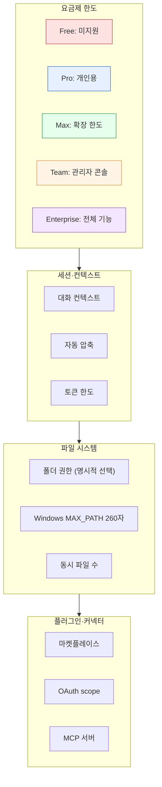

> Claude Cowork는 Claude Desktop 앱에서 작동하는 사무·연구 협업 모드입니다. 본 페이지는 **앱 사용자 관점**의 한도(요금제·세션·파일·플러그인·커넥터)만 다룹니다. 개발자용 Claude Code(터미널 CLI)와는 별개의 제품군이므로 혼동하지 마세요.

## 제약 구조 한눈에 보기

## 한눈에 보기

| 분류 | 핵심 한도 | 회피·확장 |
|---|---|---|
| 요금제 가용성 | Pro·Max·Team·Enterprise (Free 미지원, 지역별 순차 출시) | 상위 플랜 전환 또는 정식 출시 대기 |
| 세션 길이 | 플랜별 차이, 길어지면 자동 압축 발생 | 핵심 결과물을 파일로 저장 후 새 대화 시작 |
| 작업 폴더 권한 | 사용자가 명시적으로 선택한 폴더만 R/W | 폴더 추가 선택 또는 OS 권한 재허용 |
| Windows 경로 | MAX_PATH 260자 한계 | 짧은 경로 사용 (`C:\w\`) |
| 플러그인 카탈로그 | 공식·커뮤니티 마켓플레이스만 | 조직 내부 플러그인은 관리자 승인 필요 |
| 커넥터 권한 범위 | 각 서비스가 승인한 OAuth scope | 서비스 측 추가 권한 부여 |
| MCP 커넥터 | 사용자가 직접 검증해야 함 | 조직 플랜에서는 관리자 승인 목록만 사용 |
| Team·Enterprise 정책 | 관리자가 플러그인·커넥터·감사 로그 제어 | Admin Settings → Capabilities |

## 1. 요금제 가용성

[Use Cowork on Team and Enterprise plans (Anthropic Support)](https://support.claude.com/en/articles/13455879)에 따라 Cowork는 **유료 플랜 전용** 기능입니다.

| 플랜 | Cowork 사용 | 주요 차이 |
|---|---|---|
| Free | 미지원(원칙적) | 정책 변경 시 Anthropic 지원센터 공지 확인 |
| Pro | 개인 Cowork 기능 | 개인용 작업 폴더·메모리·플러그인 |
| Max | 개인 Cowork + 더 큰 사용 한도 | 장시간·대용량 작업 |
| Team | 관리자 콘솔 일부 | 팀 단위 플러그인 정책·감사 로그 |
| Enterprise | 전체 관리자 기능 | OpenTelemetry 모니터링, SSO, 강제 정책 |

- 2026-01-30 리서치 프리뷰로 공개된 뒤 **2026-02 macOS/Windows에서 정식 출시(GA)** ([공지](https://claude.com/blog/cowork-research-preview))
- Linux 및 일부 지역은 순차 출시 ([Get started with Claude Cowork](https://support.claude.com/en/articles/13345190))

## 2. 작업 폴더와 파일 시스템

### 2-1. 폴더 권한

- Cowork는 사용자가 **명시적으로 선택한 폴더만** 읽고 씁니다 — 전체 디스크 접근 권한을 받지 않습니다
- macOS는 첫 실행 시 시스템 권한 다이얼로그에서 "허용"을 선택해야 함
- 폴더 권한 회수는 시스템 환경설정 → 개인정보 보호 → 파일 및 폴더 (macOS), 파일 시스템 권한 (Windows)에서 가능
- 권한이 거부된 폴더는 Cowork 우측 사이드바에 표시되지 않거나 비어 보입니다

### 2-2. Windows MAX_PATH

Windows의 기본 경로 길이 한계는 260자입니다. 한국어 폴더명은 UTF-16 기준 2바이트 이상이라 더 빨리 초과합니다.

- 작업 폴더를 짧은 경로(`C:\w\` 또는 `C:\cowork\`)로 옮기는 것이 가장 안전
- 그룹 정책 또는 레지스트리에서 `LongPathsEnabled = 1` 설정 가능 (관리자 권한 필요, 일부 앱은 미지원)
- 한국어 파일명은 단어 1~2개로 유지

### 2-3. 동시 열기 파일 수

명시된 상한값은 공개되지 않았지만, 실무상 한 세션에서 동시에 다루는 파일이 많아질수록 응답 속도가 느려집니다. 핵심 파일만 작업 폴더로 분리하는 것을 권장합니다.

## 3. 세션과 컨텍스트

Cowork는 사용자가 토큰·컨텍스트를 직접 관리하지 않도록 설계되어 있습니다. 다만 다음 동작이 알려져 있습니다.

- 긴 대화는 일정 시점에 **자동 압축**(auto-compact)이 일어나며, 압축 중 일부 디테일이 요약되어 손실될 수 있습니다
- 압축이 잦으면 결과 품질이 저하 — **핵심 결과물을 파일로 저장한 뒤 새 대화로 이전**하는 편이 안정적
- 1M 토큰 컨텍스트 모델(Opus·Sonnet 상위)은 Max·Team·Enterprise 플랜에서 제공되며, Pro 플랜은 추가 사용 토글이 필요할 수 있음 ([1M Context GA 공지](https://claude.com/blog/1m-context-ga))
- Plan 모드 또는 일부 작업은 모델별 세부 한도가 다를 수 있으니 [공식 문서](https://support.claude.com)의 최신 안내를 따르세요

## 4. 플러그인 시스템

### 4-1. 플러그인을 어디서 받나

세 종류의 출처가 있습니다.

- **Claude 공식 카탈로그** ([claude.com/plugins](https://claude.com/plugins)) — 영업·재무·법무·마케팅·HR 등 기본 제공
- **공식 오픈소스** ([anthropics/knowledge-work-plugins](https://github.com/anthropics/knowledge-work-plugins))
- **커뮤니티 마켓플레이스** — 예: [`modu-ai/cowork-plugins`](https://github.com/modu-ai/cowork-plugins) 같은 GitHub 저장소

### 4-2. 설치 흐름

1. Cowork 좌측 사이드바 > **사용자 지정(Customize)** > **개인 플러그인**
2. **플러그인 추가** > **마켓플레이스 추가**
3. 마켓플레이스 URL 입력 (예: `modu-ai/cowork-plugins`) → **동기화**
4. 목록에서 원하는 플러그인 옆 **+** 클릭

### 4-3. 활성·비활성 정책

- 플러그인은 설치 후에도 프로젝트별로 **켜고 끌 수 있습니다**
- Team·Enterprise 조직 플랜에서는 관리자가 승인 목록을 강제할 수 있어, 구성원이 임의의 마켓플레이스를 추가할 수 없을 수 있습니다 ([Manage plugins for your organization](https://support.claude.com/en/articles/13837433))
- 신규 버전 적용은 **마켓플레이스 갱신 → 플러그인 상세 재진입**으로 반영됩니다 (커뮤니티 마켓플레이스의 경우)

### 4-4. 플러그인 자동 업데이트

- Anthropic 공식 카탈로그: 자동 업데이트 ON
- 서드파티(GitHub) 마켓플레이스: 사용자가 수동 갱신 (예: cowork-plugins는 신버전 후 사용자 측에서 마켓플레이스 갱신 필요)
- 조직 정책에 의해 자동 업데이트가 제한될 수 있음

## 5. 커넥터와 MCP

### 5-1. 내장 커넥터

Cowork 설정 > 커넥터에서 Google Drive·Gmail·Google Calendar·Slack·GitHub 등 자주 쓰이는 서비스를 OAuth로 한 번에 연결할 수 있습니다. 2026-02에는 영업·분석·법무·마케팅 영역의 12종 커넥터가 추가 공개되었습니다 (DocuSign·Apollo·Clay·Outreach·Similarweb·MSCI·LegalZoom·FactSet·WordPress·Harvey·Google Calendar/Drive 확장).

- 각 커넥터는 **사용자가 승인한 scope** 내에서만 작동
- 권한 범위는 항상 최소 권한 원칙으로 부여
- 회수는 Cowork 설정 또는 해당 서비스의 OAuth 관리 페이지에서 가능

### 5-2. 사용자 지정 MCP 서버

내장 커넥터가 없는 서비스(사내 위키·내부 API·공공데이터 포털 등)는 **MCP(Model Context Protocol) 서버**를 통해 연결합니다 ([Get started with custom connectors using remote MCP](https://support.claude.com/en/articles/11175166)).

- Cowork 설정 > 커넥터 > **커스텀 커넥터 추가**에서 MCP 서버 URL과 인증 방식을 입력
- 처음 보는 MCP URL은 **사용자가 책임지고 검증**해야 합니다 (악성 도구 노출 가능)
- 조직 플랜에서는 관리자가 승인 목록만 사용하도록 정책 강제 가능

### 5-3. 커넥터 한도

- 동시 연결 가능한 커넥터 수의 명시적 상한은 공개되지 않았으나, 너무 많이 연결하면 도구 선택의 모호성이 커져 결과 품질이 떨어집니다 — **작업별로 필요한 커넥터만 활성화** 권장
- 일부 커넥터(예: WordPress)는 자동 발행 권한을 요구 — 데모 사이트에서 충분히 검증 후 운영 사이트에 적용

## 6. 예약 작업·자동화

[예약 작업](../schedule/) 기능을 사용해 정기 보고를 자동화할 수 있습니다. 다음 사항을 유의하세요.

- 예약 실행 시점에 작업 폴더 권한이 유효해야 함 (사용자가 로그아웃·재로그인하면 권한이 풀릴 수 있음)
- 데이터 소스 커넥터의 OAuth 토큰이 만료되면 작업이 실패 — 주기적 재인증 필요
- 매우 잦은 예약(매분 단위)은 플랜 정책에 의해 제한될 수 있음

## 7. 컴퓨터 사용(Computer Use)

[컴퓨터 사용](../computer-use/)은 베타 기능으로, Claude가 마우스·키보드를 직접 제어합니다.

- 시작 전 [안전하게 사용하기](../safety/)를 반드시 숙지 — 의도치 않은 클릭으로 데이터 손상 가능
- 백그라운드에서 실행되는 다른 작업과 충돌할 수 있으니 단일 작업 환경에서 사용 권장
- 민감한 사이트(은행·결제·관리자 콘솔)에서는 사용을 피하거나 로그아웃 상태에서 시작

## 8. Team·Enterprise 거버넌스

Team·Enterprise 관리자는 다음을 제어할 수 있습니다 ([Manage plugins for your organization](https://support.claude.com/en/articles/13837433)).

- 사용자가 추가할 수 있는 마켓플레이스 목록 제한
- 승인된 플러그인만 활성화 허용
- 커넥터 화이트리스트
- 사용 이력·감사 로그 조회
- OpenTelemetry 기반 모니터링 (Enterprise)

자세한 도입 가이드는 [Team·Enterprise 관리](../enterprise/)를 참고하세요.

## 9. 회사 환경 (프록시·방화벽)

회사 네트워크에서 Cowork를 사용할 때 IT 팀에 다음 사항을 사전 협의하세요.

- TLS 검사 프록시(Zscaler·CrowdStrike 등) 환경에서는 회사 루트 인증서를 OS 신뢰 저장소에 등록해야 안정 동작
- Cowork와 마켓플레이스가 사용하는 도메인을 화이트리스트:
  - `claude.ai`
  - `api.anthropic.com`
  - `support.claude.com`
  - 사용 중인 마켓플레이스 호스팅 도메인 (커뮤니티는 보통 `github.com`)
- VPN 강제 환경에서는 OAuth 리다이렉트가 차단되지 않도록 OAuth 도메인 허용 설정

## 10. 알려진 회피·확장책

| 문제 | 회피 |
|---|---|
| Free 플랜에서 Cowork 안 보임 | Pro 이상으로 업그레이드 |
| Team에서 cowork-plugins 마켓플레이스 추가 안 됨 | 관리자에게 마켓플레이스 승인 요청 |
| 작업 폴더 권한 다이얼로그 거부 | OS 설정에서 수동 재허용 |
| Windows 한국어 파일 저장 실패 | 짧은 경로(`C:\w\`)로 작업 폴더 이전 |
| 긴 대화 품질 저하 | 핵심 결과물 파일 저장 후 새 대화 시작 |
| 커넥터가 너무 많아 모호함 | 작업별로 필요한 커넥터만 활성화 |
| 처음 보는 MCP URL 의심 | 신뢰 출처 확인 후 추가, 조직은 관리자 승인 |
| 예약 작업 실패 누적 | 토큰 만료·폴더 권한 점검 후 재등록 |

## 다음 단계

- [트러블슈팅](../troubleshooting/) — 증상별 해결 절차
- [커넥터와 MCP](../connectors-mcp/) — 외부 서비스 연동
- [Team·Enterprise 관리](../enterprise/) — 조직 도입 정책
- [안전하게 사용하기](../safety/) — 위험 영역 사전 숙지

---

### Sources

- [Get started with Claude Cowork](https://support.claude.com/en/articles/13345190)
- [Use Cowork on Team and Enterprise plans](https://support.claude.com/en/articles/13455879)
- [Use plugins in Claude Cowork](https://support.claude.com/en/articles/13837440)
- [Manage plugins for your organization](https://support.claude.com/en/articles/13837433)
- [Get started with custom connectors using remote MCP](https://support.claude.com/en/articles/11175166)
- [Use connectors to extend Claude's capabilities](https://support.claude.com/en/articles/11176164)
- [Customize Cowork with plugins (blog)](https://claude.com/blog/cowork-plugins)
- [Cowork research preview 공지](https://claude.com/blog/cowork-research-preview)
- [1M Context GA 공지](https://claude.com/blog/1m-context-ga)
- [Anthropic 2026-02 신규 12종 커넥터 발표 (CNBC)](https://www.cnbc.com/2026/02/24/anthropic-claude-cowork-office-worker.html)
