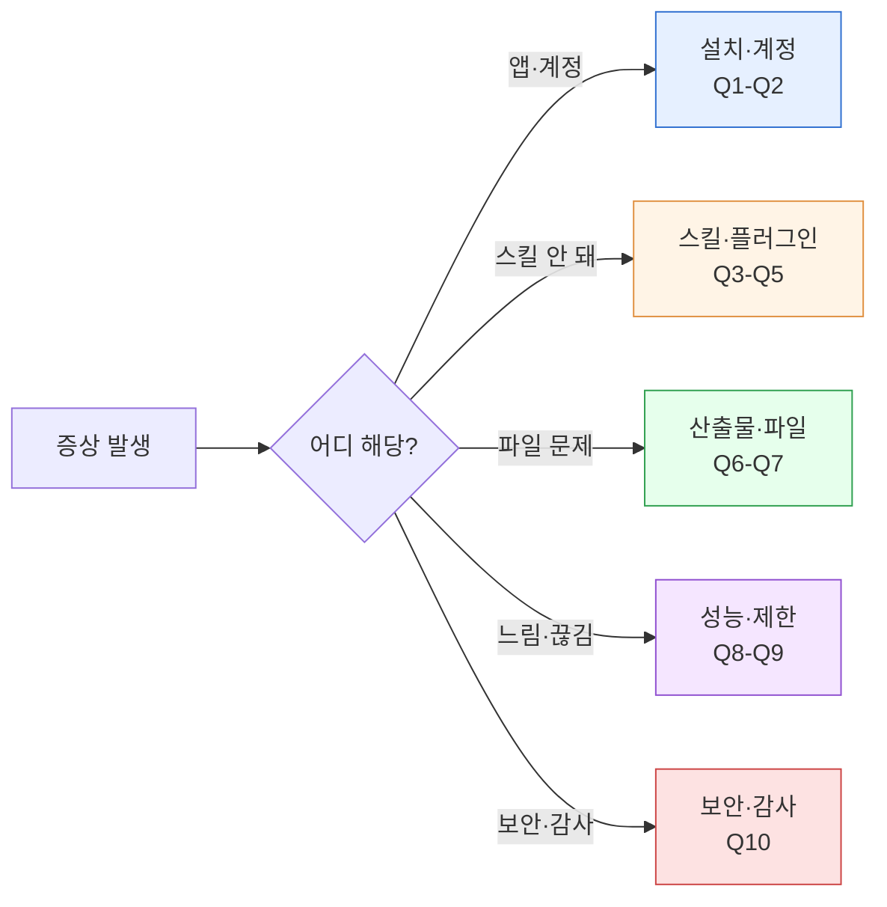

> Cowork를 2주 써본 뒤 가장 자주 올라오는 질문 10가지를 모았습니다.

## 학습 목표

- 내 증상이 어떤 카테고리(설치·호출·산출물·성능)에 속하는지 분류할 수 있습니다.
- 해결 링크를 따라 5분 내 자체 해결을 시도할 수 있습니다.

## 선수 지식

- [설치와 요금제 요건](../install/)
- [첫 작업 실행하기](../first-task/)

## FAQ 카테고리

## 설치·계정

### Q1. Claude Desktop에 Cowork 메뉴가 안 보입니다

Cowork는 2026-01-30 리서치 프리뷰로 공개된 뒤 **2026-02에 macOS/Windows에서 정식 출시(GA)** 되었습니다. Pro·Max·Team·Enterprise 플랜에서 제공되며, Free 플랜과 지역별 순차 제공 여부는 [설치와 요금제 요건](../install/)에서 확인하세요.

### Q2. 회사 계정에서 Cowork를 쓰고 싶습니다

Team·Enterprise의 경우 관리자가 Admin settings → Capabilities에서 Cowork 사용을 허용해야 합니다. [Team·Enterprise 관리](../enterprise/)를 참고하세요.

## 스킬·플러그인 호출

### Q3. 요청했는데 스킬이 자동 호출되지 않습니다

세 가지 원인을 순서대로 점검합니다.

1. 플러그인이 설치되었는가 (`/plugin` 슬래시 명령으로 확인)
2. 요청문에 스킬 트리거 키워드가 있는가 ([스킬 사용법](../skills/) 참고)
3. 상위 도메인 스킬에서 포맷 스킬로 명시적 인계가 일어났는가

### Q4. 플러그인 설치 후 업데이트는 어떻게 하나요

`/plugin marketplace update cowork-plugins`를 실행하면 최신 버전이 반영됩니다.

### Q5. 스킬 체인을 직접 설계하고 싶습니다

[스킬 체이닝 가이드](../../cookbook/skill-chaining/)의 3원칙(도메인 → 포맷 → 품질)을 먼저 읽고 쿡북 예제 중 자기 업무와 가까운 것을 복사·붙여넣기 후 변형하세요.

## 산출물·파일

### Q6. 생성된 DOCX/PPTX가 열리지 않습니다 (Windows)

대부분 MAX_PATH(260자) 제약 때문입니다. 파일을 짧은 경로(예: `C:\docs\`)로 복사해 열어보세요. [트러블슈팅](../../cookbook/troubleshooting/)을 참고하세요.

### Q7. 산출물에 AI 특유의 어투가 남아 있습니다

체인 마지막에 `ai-slop-reviewer`가 실행됐는지 확인하세요. 누락됐다면 "이 문서 AI 슬롭 검수해줘"라고 이어서 요청하면 됩니다.

## 성능·제한

### Q8. 긴 작업 중간에 컨텍스트가 끊깁니다

[프로젝트와 메모리](../projects-memory/) 사용을 권장합니다. 프로젝트 단위로 지침과 파일을 고정해두면 세션이 바뀌어도 일관성을 유지합니다.

### Q9. 한 세션에서 얼마나 많은 파일을 다룰 수 있나요

플랜에 따라 한 대화에서 다룰 수 있는 분량이 달라집니다. Max·Team·Enterprise 플랜은 상위 모델(Opus·Sonnet 등)에서 **1M 토큰** 컨텍스트가 가용해 한국어 기준 대략 60~80만 자 분량의 입력·출력을 한 대화에 담을 수 있습니다 ([1M Context GA 공지](https://claude.com/blog/1m-context-ga)). Pro 플랜은 더 짧은 컨텍스트로 동작하며, 자세한 플랜별 한도는 [제약과 한도](../constraints/)를 참고하세요.

긴 작업은 **자동 압축이 발생하기 전에** 핵심 결과물을 작업 폴더에 저장한 뒤 새 대화를 시작하는 편이 결과 품질을 안정적으로 유지하는 데 유리합니다. 자주 쓰는 지침은 [프로젝트와 메모리](../projects-memory/)에 고정해 새 대화에서도 맥락을 이어가세요.

## 보안·감사

### Q10. 팀에서 쓸 때 로그·감사는 어떻게 확인하나요

Team·Enterprise 관리자 콘솔에서 사용 이력을 조회할 수 있습니다. 세부 항목은 [Team·Enterprise 관리](../enterprise/)와 [안전하게 사용하기](../safety/)를 함께 보세요.

## 자가 점검


- Q. 위 10문항 중 본인이 방금 겪은 증상과 가장 유사한 것은? 해당 해결 링크를 끝까지 따라갔습니까? (쉬움·이해)
- Q. 내 요청이 자동 호출되지 않을 때 맨 먼저 점검해야 할 것은? (중간·적용)


## 다음 단계

- [트러블슈팅](../../cookbook/troubleshooting/) — 체인 실패 진단 패턴
- [안전하게 사용하기](../safety/) — 하지 말아야 할 5가지

---

### Sources

- [Claude 지원센터](https://support.claude.com)
- [Cowork research preview 공지](https://claude.com/blog/cowork-research-preview)
