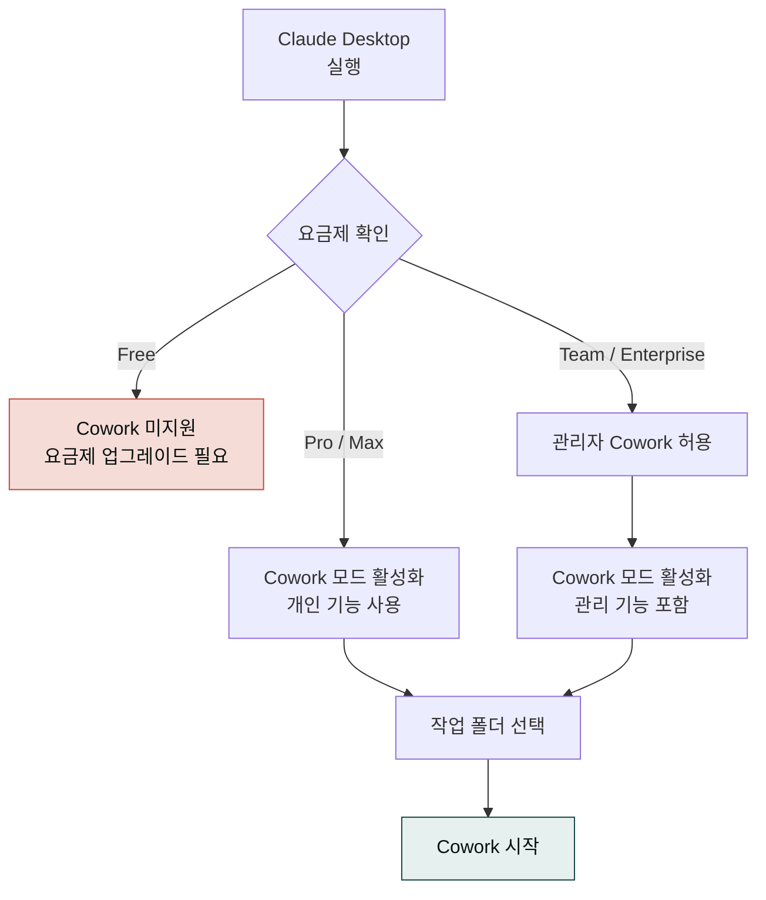

> Cowork는 Claude Desktop 앱의 일부로 제공됩니다. 별도 설치 파일이 없으니 Desktop 앱을 최신 버전으로 유지하면 됩니다.

## 요금제별 가용 흐름

## 요금제 요건


Cowork는 2026-01-30 리서치 프리뷰로 공개된 뒤 **2026-02 macOS/Windows에서 정식 출시(GA)** 되었습니다. 유료 플랜(Pro·Max·Team·Enterprise)에서 제공되며, Free 플랜 가용 여부는 공식 문서에서 최신본을 확인하세요.


Cowork는 유료 플랜 전용 기능입니다. 개인 Pro·Max 플랜이라면 바로 사용할 수 있고, Team·Enterprise 플랜에서는 플러그인 정책 관리, 감사 로그, OpenTelemetry 모니터링 같은 관리자 기능까지 포함됩니다. Free 플랜은 Cowork를 지원하지 않을 수 있으니, 가입 중인 요금제 안내를 먼저 확인하세요.

## 설치 절차

1. **Claude Desktop 앱 내려받기** — [Claude Desktop 다운로드 안내](https://support.claude.com/en/articles/10065433)에서 macOS 또는 Windows용 설치 파일을 받습니다.
2. **로그인** — Desktop 앱을 실행하고 사용 중인 계정으로 로그인합니다. Team·Enterprise 사용자는 조직이 Cowork를 활성화했는지 관리자에게 확인합니다.
3. **Cowork 모드 시작** — 좌측 상단 메뉴 또는 명령 팔레트에서 Cowork를 선택합니다. 진입 시 "작업 폴더" 선택 창이 뜨면 프로젝트용 폴더를 지정합니다.
4. **폴더 선택과 권한** — Cowork는 선택한 폴더에만 읽기·쓰기 권한을 갖습니다. 전체 드라이브를 내어주지 않아도 됩니다. macOS의 경우 첫 실행 시 "Claude가 파일을 접근하도록 허용" 시스템 대화상자가 뜹니다.

## Windows 사용자를 위한 주의


Windows의 `MAX_PATH`(260자) 제한으로 Cowork 세션 경로가 길면 일부 파일을 열 수 없을 수 있습니다. 작업 폴더는 짧은 경로(예: `C:\work\cowork`)에 두고, 생성 파일명도 간결하게 유지합니다. 한국어 파일명은 특히 짧게 쓰기를 권장합니다.


## 첫 화면 구성

처음 Cowork를 열면 세 영역으로 나뉜 화면이 보입니다. 좌측 사이드바에는 대화 스레드가, 중앙에는 현재 진행 중인 대화가, 우측에는 작업 폴더·플러그인·커넥터·메모리 정보가 표시됩니다. 작업 폴더 옆 링크를 클릭하면 파일 탐색기가 해당 위치를 바로 열어줍니다.

## 다음 단계

설치를 마쳤다면 [첫 작업 실행하기](../first-task/)에서 5분 안에 첫 결과물을 만들어 볼 수 있습니다. 반복 작업을 체계적으로 관리하고 싶다면 [프로젝트와 메모리](../projects-memory/)를, 한국어 실무용 스킬을 바로 쓰고 싶다면 [플러그인 사용](../plugins/)에서 `cowork-plugins` 설치 방법을 확인하세요.

---

### Sources

- [Get started with Claude Cowork (Support)](https://support.claude.com/en/articles/13345190)
- [Install Claude Desktop (Support)](https://support.claude.com/en/articles/10065433)
- [Use Cowork on Team and Enterprise plans](https://support.claude.com/en/articles/13455879)
