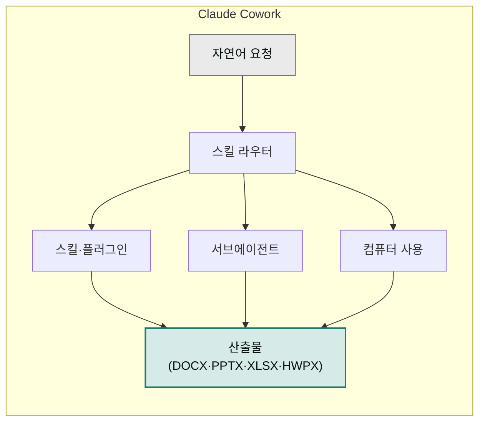

> Claude Cowork는 Claude Desktop 앱 안에서 동작하는 비개발자용 작업 자동화 환경입니다.

Claude Code가 개발자에게 "터미널에서 일 시키기"를 가능하게 했다면, Cowork는 같은 능력을 지식 근로자의 문서·스프레드시트·발표자료 작업에 가져온 제품입니다.

## 대상 독자

이 페이지는 Cowork를 처음 듣는 한국어 사용자를 위해 작성되었습니다. Claude Desktop 앱이 아직 없다면 [설치와 요금제 요건](../install/)에서 앱 다운로드부터 시작하세요. 이미 설치를 마쳤다면 [첫 작업 실행하기](../first-task/)로 건너뛰어도 됩니다.

## Cowork가 하는 일

- **로컬 파일 접근**: 사용자가 선택한 폴더를 읽고, 수정하고, 새 파일을 저장합니다. DOCX·PPTX·XLSX·HWPX까지 산출물로 만들 수 있습니다.
- **서브에이전트(subagent)**: 긴 작업을 나눠 여러 작은 에이전트가 동시에 검색·리서치·초안 작성을 진행합니다.
- **컴퓨터 사용(computer use)**: 데스크톱 앱이나 브라우저를 직접 조작해야 하는 작업도 처리합니다.
- **스킬(skill)·플러그인(plugin)**: 반복되는 업무 패턴을 스킬로 묶어두면, 자연어 요청만으로 해당 절차가 자동 호출됩니다.

## Claude Code와 무엇이 다른가

| 축 | Claude Code | Claude Cowork |
|---|---|---|
| 대상 | 개발자 | 지식 근로자(기획·법무·재무·마케팅 등) |
| 인터페이스 | 터미널 CLI | Claude Desktop 앱 |
| 기본 작업 | 코드베이스 수정 | 문서·발표자료·스프레드시트·리서치 |
| 공통점 | 스킬·플러그인·MCP 커넥터·서브에이전트 아키텍처 공유 | |

두 제품은 같은 엔진을 공유합니다. 그래서 플러그인 생태계도 서로 호환됩니다. 예를 들어 `cowork-plugins`는 Claude Code에서도 대부분 동작합니다.

## 언제 써야 할까

Cowork가 효과를 보이는 전형적 상황은 다음과 같습니다.

- 매주·매월 반복되는 보고서·대시보드 작성
- 자료 조사 후 PPT·Word·Excel로 정리
- 여러 문서 초안을 동시에 쓰고 다듬기
- 고객 문의·티켓에 정형화된 응답 초안 쓰기
- 법무·재무 양식 기반 서류를 빠르게 채우기


규제·법률·의료처럼 사람의 최종 판단이 반드시 필요한 영역에서는 초안 작성 도구로만 사용하고 검토는 사람이 수행해야 합니다. 자세한 내용은 [안전하게 사용하기](../safety/)를 참고하세요.


## 다음 단계

- [설치와 요금제 요건](../install/) — Mac·Windows 설치, 개인·팀·엔터프라이즈 요금제 차이
- [첫 작업 실행하기](../first-task/) — 5분 안에 첫 결과물 만들기
- [플러그인 카탈로그](../../plugins/) — `cowork-plugins`로 한국어 업무 자동화 시작하기

---

### Sources

- [Claude Cowork 제품 페이지](https://claude.com/product/cowork)
- [Cowork research preview (blog)](https://claude.com/blog/cowork-research-preview)
- [Claude Cowork (Anthropic 제품 홈)](https://www.anthropic.com/product/claude-cowork)
- [Get started with Claude Cowork (Support)](https://support.claude.com/en/articles/13345190)
