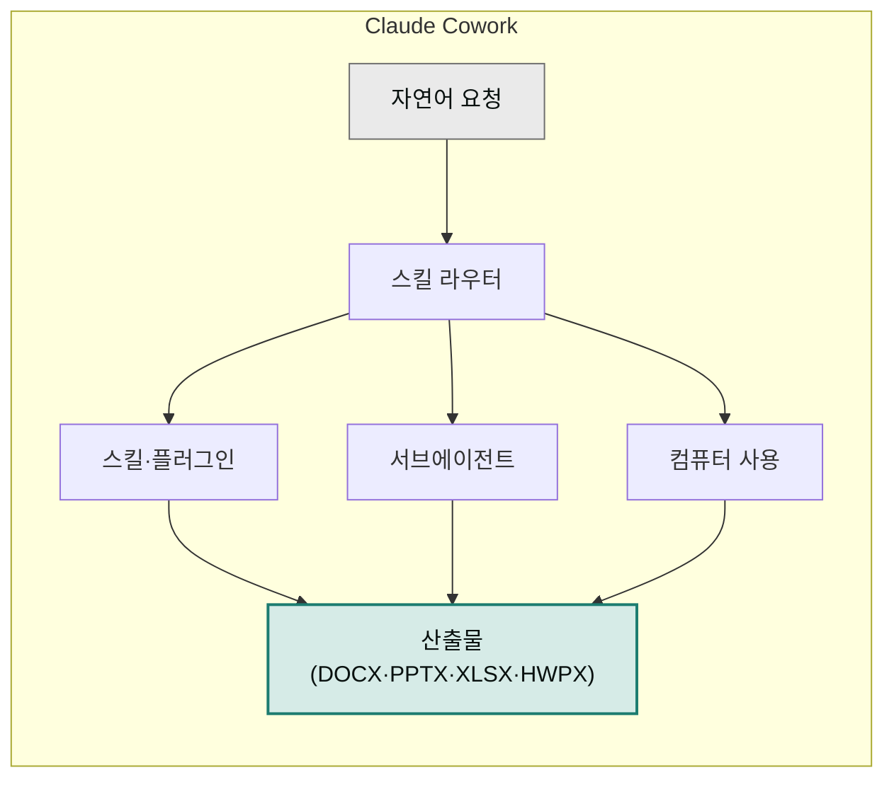

> Claude Cowork는 Claude Desktop 앱 안에서 동작하는 비개발자용 작업 자동화 환경입니다.

Claude Code가 개발자에게 "터미널에서 일 시키기"를 가능하게 했다면, Cowork는 같은 능력을 지식 근로자의 문서·스프레드시트·발표자료 작업에 가져온 제품입니다.

## 대상 독자

이 페이지는 Cowork를 처음 듣는 한국어 사용자를 위해 작성되었습니다. Claude Desktop 앱이 아직 없다면 [설치와 요금제 요건](../install/)에서 앱 다운로드부터 시작하세요. 이미 설치를 마쳤다면 [첫 작업 실행하기](../first-task/)로 건너뛰어도 됩니다.

## Cowork가 하는 일

```mermaid
flowchart TB
    subgraph Cowork["Claude Cowork"]
        direction TB
        INPUT["자연어 요청"]
        ROUTER["스킬 라우터"]
        SKILL["스킬·플러그인"]
        AGENT["서브에이전트"]
        CU["컴퓨터 사용"]
        OUTPUT["산출물<br/>(DOCX·PPTX·XLSX·HWPX)"]
    end

    INPUT --> ROUTER
    ROUTER --> SKILL
    ROUTER --> AGENT
    ROUTER --> CU
    SKILL --> OUTPUT
    AGENT --> OUTPUT
    CU --> OUTPUT

    style INPUT fill:#eaeaea,stroke:#6e6e6e,color:#09110f
    style OUTPUT fill:#d6ebe7,stroke:#1c7c70,stroke-width:2px,color:#09110f
```

Cowork는 사용자가 선택한 폴더만 읽고 씁니다. 덕분에 전체 드라이브를 내어주지 않아도 DOCX·PPTX·XLSX·HWPX 형식의 산출물을 바로 만들어 저장할 수 있습니다. 작업이 길어지면 여러 서브에이전트가 검색·리서치·초안 작성을 나눠 동시에 처리하고, API가 없는 데스크톱 앱이나 브라우저를 직접 조작해야 하는 상황에는 컴퓨터 사용(computer use) 기능이 개입합니다. 반복되는 업무 패턴은 스킬(skill)로 묶어두면 자연어 한 줄만으로 해당 절차가 자동 호출됩니다.

## Claude Code와 무엇이 다른가

| 축 | Claude Code | Claude Cowork |
|---|---|---|
| 대상 | 개발자 | 지식 근로자(기획·법무·재무·마케팅 등) |
| 인터페이스 | 터미널 CLI | Claude Desktop 앱 |
| 기본 작업 | 코드베이스 수정 | 문서·발표자료·스프레드시트·리서치 |
| 공통점 | 스킬·플러그인·MCP 커넥터·서브에이전트 아키텍처 공유 | |

두 제품은 같은 엔진을 공유합니다. 그래서 플러그인 생태계도 서로 호환됩니다. 예를 들어 `cowork-plugins`는 Claude Code에서도 대부분 동작합니다.

## 언제 써야 할까

Cowork는 반복성과 분량이 있는 지식 업무에서 효과가 두드러집니다. 매주·매월 똑같이 만들어야 하는 보고서나 대시보드, 자료를 조사·정리해 PPT·Word·Excel로 완성해야 하는 작업, 여러 문서 초안을 동시에 작성하고 다듬어야 하는 상황이 전형적인 예입니다. 고객 문의나 티켓에 정형화된 응답 초안을 빠르게 생성하거나, 법무·재무 양식에 내용을 채워 넣는 작업도 Cowork가 잘 처리하는 영역입니다.


규제·법률·의료처럼 사람의 최종 판단이 반드시 필요한 영역에서는 초안 작성 도구로만 사용하고 검토는 사람이 수행해야 합니다. 자세한 내용은 [안전하게 사용하기](../safety/)를 참고하세요.


## 다음 단계

Cowork를 처음 시작한다면 [설치와 요금제 요건](../install/)에서 Mac·Windows 설치와 플랜 차이를 확인한 뒤, [첫 작업 실행하기](../first-task/)로 5분 안에 첫 결과물을 만들어 보세요. 한국어 실무 환경에 바로 쓸 수 있는 스킬이 필요하다면 [플러그인 카탈로그](../../plugins/)에서 `cowork-plugins`를 설치하는 것으로 시작하면 됩니다.

---

### Sources

- [Claude Cowork 제품 페이지](https://claude.com/product/cowork)
- [Cowork research preview (blog)](https://claude.com/blog/cowork-research-preview)
- [Claude Cowork (Anthropic 제품 홈)](https://www.anthropic.com/product/claude-cowork)
- [Get started with Claude Cowork (Support)](https://support.claude.com/en/articles/13345190)
