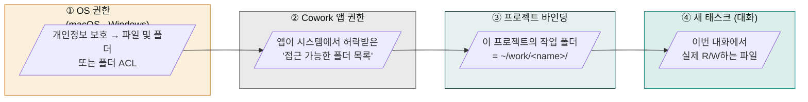
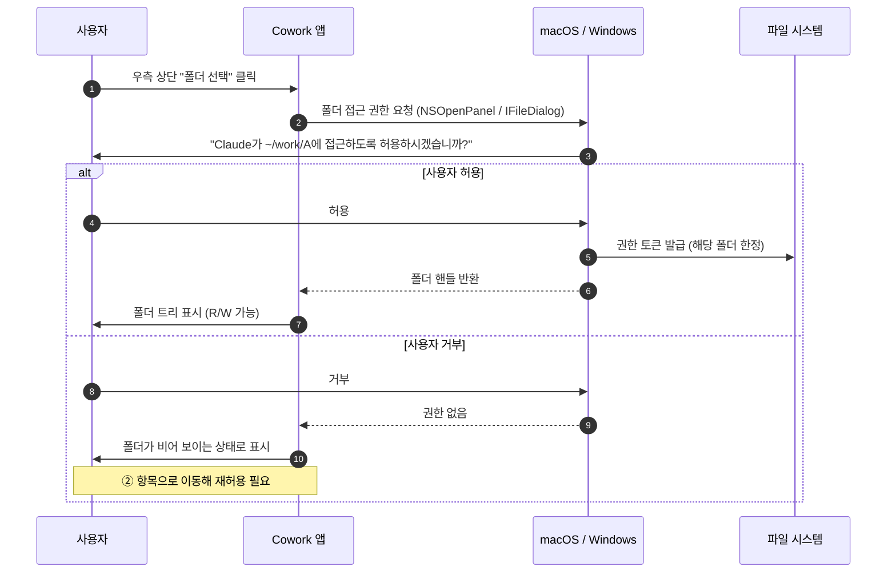
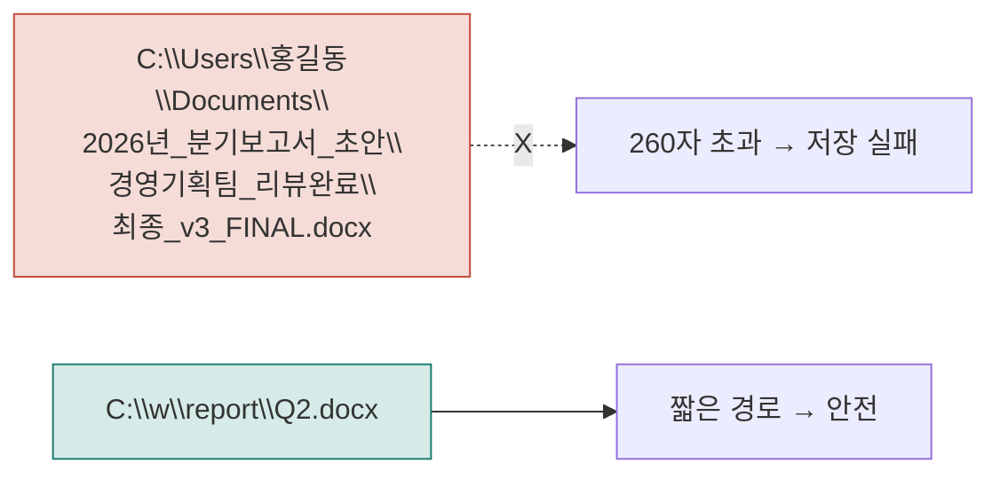
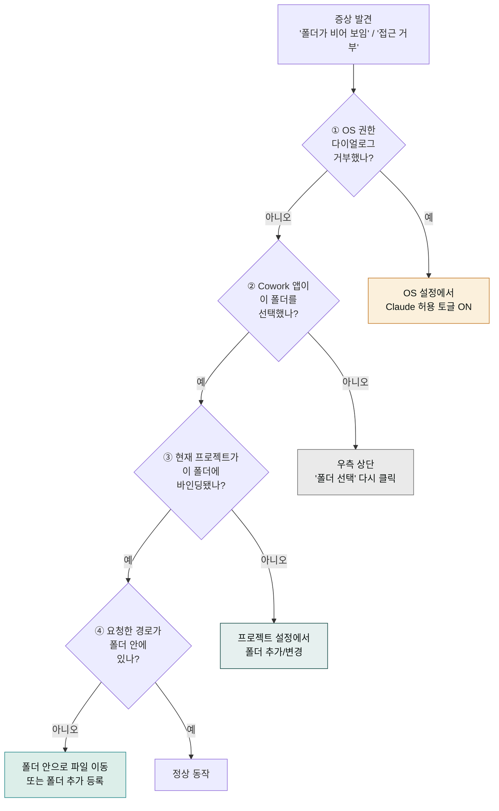

> Cowork가 가장 자주 막히는 곳은 "내 PC에서 어디까지 손을 댈 수 있는가"입니다. 권한이 어디서 어떻게 정해지는지 그림으로 보고, 막혔을 때 푸는 절차를 정리합니다.

## 학습 목표

- Cowork의 권한이 OS·앱·프로젝트·대화 4개 층으로 흐른다는 것을 설명할 수 있습니다.
- macOS와 Windows에서 폴더 권한을 다시 허용하는 절차를 따라 할 수 있습니다.
- "권한 거부됨" 류 증상의 진짜 원인이 어느 층에 있는지 빠르게 짚어냅니다.

## 한 문장 요약

Cowork는 **사용자가 명시적으로 선택한 폴더만** 읽고 씁니다. 그 폴더 밖은 보이지도 않고, 권한도 없습니다.

## 4개 층 권한 모델

| 층 | 누가 결정 | 사용자가 하는 일 | 막혔을 때 증상 |
|---|---|---|---|
| ① OS | macOS 시스템 환경설정 / Windows 보안 설정 | 첫 실행 시 "허용" 다이얼로그에 동의 | 폴더가 비어 보이거나 "접근 거부" |
| ② Cowork 앱 | 사용자가 폴더 선택 | "폴더 선택" 버튼으로 폴더 추가 | 폴더가 사이드바에 안 나타남 |
| ③ 프로젝트 | 사용자가 프로젝트에 폴더 바인딩 | 프로젝트 생성·수정 시 폴더 지정 | 다른 프로젝트로 이동하면 다른 폴더가 보임 |
| ④ 새 태스크 | Cowork가 대화 단위로 사용 | 자연어로 파일 요청 | 폴더 밖 경로 요청 시 "보이지 않음" 응답 |

핵심 원칙: **위 층이 막히면 아래 층은 자동으로 무력화**됩니다. OS가 차단하면 앱이 폴더를 못 보고, 앱이 폴더를 못 보면 프로젝트도 새 태스크도 R/W가 안 됩니다.

## 첫 폴더 허용 — 단계별 흐름

이 흐름은 **폴더 단위로** 일어납니다. 새 폴더를 추가할 때마다 OS 다이얼로그가 한 번 더 뜨는 것이 정상입니다.

## macOS — 권한 다시 켜기

폴더 다이얼로그를 거부했거나, 외장 디스크를 새로 꽂았거나, 시스템 업데이트 후 권한이 풀렸다면:

1. **시스템 환경설정 → 개인정보 보호 및 보안 → 파일 및 폴더** 진입
2. 목록에서 **Claude** 항목을 찾습니다
3. 막히는 폴더(예: 다운로드, 문서, 데스크톱, 외장 디스크)의 토글을 **켭니다**
4. Cowork 앱을 완전 종료 후 재실행 (메뉴 막대 → Quit)
5. 우측 상단 **폴더 선택**을 눌러 다시 선택

전체 디스크 접근이 필요한 특수 작업은 **전체 디스크 접근(Full Disk Access)** 항목에 Claude를 추가합니다(권장하지 않음 — 필요한 폴더만 허용하는 것이 안전).

### 외장 디스크의 함정

외장 디스크는 마운트가 풀리면 권한이 자동으로 해제됩니다. 디스크를 다시 연결한 뒤 폴더를 **재선택**해야 Cowork가 다시 인식합니다.

## Windows — 권한 다시 켜기

1. 파일 탐색기에서 **작업 폴더 우클릭 → 속성 → 보안 탭**
2. 그룹 또는 사용자 이름에서 본인 계정의 권한이 **읽기 + 쓰기**로 되어 있는지 확인
3. Claude Desktop 앱을 완전 종료 후 재실행 (시스템 트레이 → 종료)
4. Cowork에서 **폴더 선택**을 다시 누름

### MAX_PATH 함정

Windows의 기본 경로 길이 한계는 260자입니다. 한국어 폴더명은 한 글자가 2바이트이므로 더 빨리 초과합니다.

해결:
- 작업 폴더를 짧은 경로(`C:\w\<name>\`)로 옮깁니다
- 파일명을 한국어 1~2 단어로 줄입니다
- 그래도 막히면 그룹 정책에서 `LongPathsEnabled = 1` (관리자 권한, 일부 앱 미지원)

## 프로젝트별 폴더 — 한 프로젝트에서 여러 위치를 다루고 싶을 때

기본 원칙은 **한 프로젝트 = 한 작업 폴더**입니다. 디자인 자산(`~/Design/`)과 문서 출력(`~/Reports/`)을 동시에 다뤄야 한다면, 프로젝트당 폴더 수의 공식 사양은 [Anthropic 지원 문서](https://support.claude.com/en/articles/14116274)에서 최신본을 확인하세요. 실무에서는 다음 우회책이 안전합니다.

- **단일 작업 폴더에 모으기** — 새 작업 폴더(`~/work/<project>/`)를 하나 만들고, 필요한 자산을 그 안에 복사하거나 OS 수준 심볼릭 링크/바로가기로 끌어옵니다. 권한 다이얼로그가 한 번만 뜨고 관리가 단순합니다.
- **프로젝트를 분리** — 자산 정리 프로젝트와 산출물 작성 프로젝트를 별도로 운영하고, 결과물만 수동으로 이관합니다.

심볼릭 링크는 macOS·Windows에서 모두 가능하지만, 일부 보안 정책이나 외장 디스크 환경에서는 끊길 수 있어 IT 친숙 사용자에게만 권장합니다.

## 컴퓨터 사용(Computer Use) — 또 다른 권한 층

[컴퓨터 사용](../computer-use/)은 폴더가 아니라 **앱·화면**에 대한 권한입니다. 폴더 권한과 별개로 작동하며, 앱별로 read/click/full 3단계로 승인됩니다. 자세한 내용은 해당 페이지에서 다룹니다.

## 권한이 막혔을 때 — 5단계 진단

## 베스트 프랙티스 — 권한을 단순하게 유지하는 6가지

1. **짧은 경로**: macOS는 `~/w/<name>/`, Windows는 `C:\w\<name>\`. 한국어 폴더명은 짧게.
2. **프로젝트 1개 = 폴더 1개**가 기본. 여러 폴더가 필요한 경우만 예외.
3. **민감 데이터 폴더 분리**: 계약·계좌·인사 데이터는 별도 폴더로 격리해 다른 프로젝트와 섞이지 않게.
4. **외장 디스크는 마운트 후 재선택**. 끊겼다 다시 연결되면 권한도 다시.
5. **전체 디스크 접근은 마지막 수단**. 필요한 폴더만 허용하는 게 사고 시 피해 범위를 줄입니다.
6. **권한 다이얼로그는 한 번에 잘 읽기**. macOS는 거부하면 시스템 환경설정으로 가야 다시 켤 수 있어 번거롭습니다.

## 자주 겪는 실수

- **다이얼로그를 무심코 "허용 안 함"** — 시스템 환경설정에서 직접 켜야 합니다.
- **폴더를 옮긴 뒤 그대로 작업 시도** — 폴더 경로가 바뀌면 권한이 끊깁니다. 다시 선택하세요.
- **다른 프로젝트에서 같은 파일을 또 보려 함** — 두 프로젝트가 모두 그 폴더에 바인딩되어 있어야 합니다.
- **VPN·SSO·MDM 통제 PC에서 폴더가 안 보임** — 회사 IT가 사용자의 폴더 권한을 별도로 제한하는 경우가 있습니다. IT 팀에 Claude 앱의 폴더 접근 허용을 문의하세요.

## 다음 단계

- [프로젝트와 메모리](../projects-memory/) — 프로젝트와 새 태스크의 차이
- [트러블슈팅](../troubleshooting/) — 권한 외 다른 증상별 진단
- [컴퓨터 사용](../computer-use/) — 화면·앱 단위 권한
- [안전하게 사용하기](../safety/) — 권한 위임의 한계

---

### Sources

- [Get started with Claude Cowork](https://support.claude.com/en/articles/13345190)
- [Install Claude Desktop](https://support.claude.com/en/articles/10065433)
- [Use Claude Cowork safely](https://support.claude.com/en/articles/13364135)
