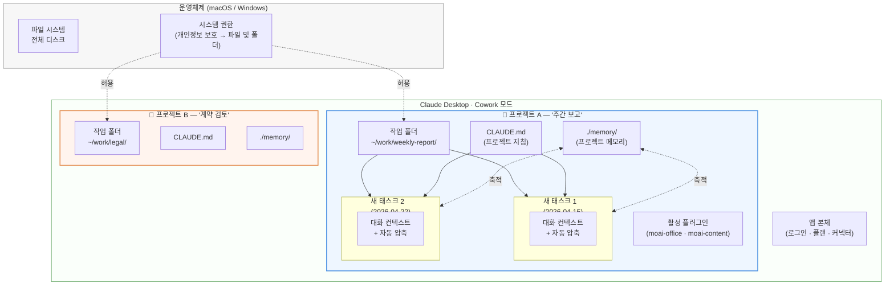
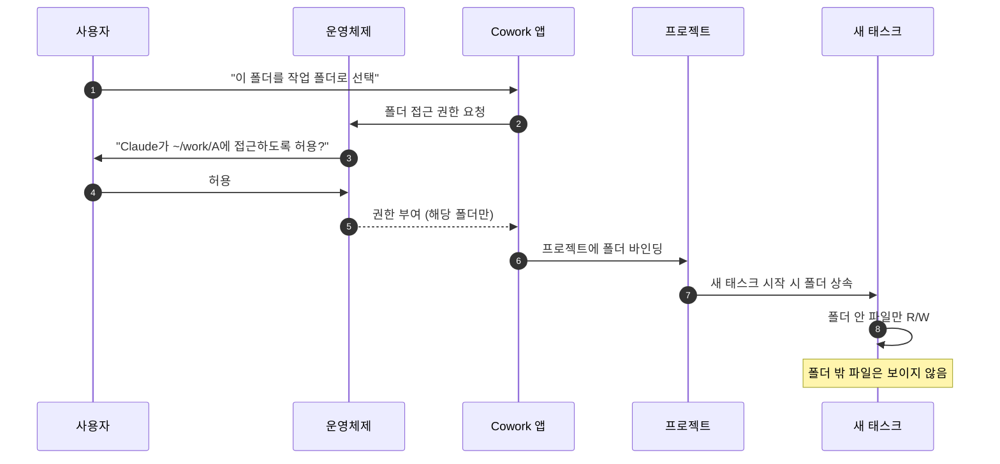

> Cowork에서 가장 자주 헷갈리는 두 가지 — "**프로젝트**(project)와 새 **태스크**(new task)는 뭐가 다른가요?"와 "선택한 **작업 폴더**의 권한은 어디까지 가나요?" — 를 한 페이지에 정리합니다.

## 학습 목표

- "프로젝트"와 "새 태스크(새 대화)"의 차이를 한 문장으로 설명할 수 있습니다.
- 작업 폴더 권한이 OS, Cowork, 프로젝트, 대화 4개 층에서 어떻게 흐르는지 그릴 수 있습니다.
- 메모리의 4가지 종류와 저장하지 말아야 할 것을 분류할 수 있습니다.

## 프로젝트란 무엇인가 — 한 문장 정의

프로젝트는 **"같은 맥락(작업 폴더 + 지침 + 메모리 + 플러그인 구성)을 공유하는 대화 묶음"** 입니다. 새 태스크는 **그 묶음 안에서 시작하는 한 번의 대화**입니다.

비유하면: **프로젝트 = 책상**, **새 태스크 = 그 책상 위에서 시작하는 한 번의 일감**. 책상을 옮기면(다른 프로젝트로 가면) 도구·자료·노트가 통째로 바뀝니다.

## 그림 한 장으로 보기



핵심:

- **OS가 가장 바깥** — 파일 시스템 전체를 갖고 있고, Cowork에는 "허용한 폴더만" 내어줍니다.
- **Cowork 앱 안에 프로젝트가 여러 개** — 각 프로젝트는 자기 폴더·지침·메모리·플러그인 구성을 따로 가집니다.
- **새 태스크(새 대화)는 프로젝트 안에서 시작** — 같은 프로젝트의 다른 태스크끼리는 메모리를 공유합니다.
- **프로젝트가 다르면 폴더도 메모리도 다릅니다** — A에서 본 파일을 B는 보지 못합니다.

## 프로젝트와 새 태스크, 무엇이 어떻게 다른가

| 구분 | 프로젝트 | 새 태스크(새 대화) |
|---|---|---|
| 정의 | 맥락의 묶음 (책상 자체) | 그 안의 한 번의 대화 (책상 위 일감 한 건) |
| 작업 폴더 | 프로젝트 단위로 1개 고정 | 프로젝트 폴더를 그대로 상속 |
| 지침 (`CLAUDE.md`) | 프로젝트에 1개, 모든 태스크에 적용 | 자동 적용 |
| 메모리 | 프로젝트별로 누적 | 같은 프로젝트의 다른 태스크와 공유 |
| 플러그인 활성화 | 프로젝트별로 켜고 끔 | 프로젝트 설정을 그대로 사용 |
| 대화 컨텍스트 | — | 태스크별로 새로 시작, 길어지면 자동 압축 |
| 만들 때 | 사이드바 → "새 프로젝트" | 기존 프로젝트 진입 후 "새 대화" |

### 자주 묻는 질문 — 헷갈리는 지점

**Q. 새 태스크를 시작하면 메모리가 초기화되나요?**
A. 아닙니다. 같은 프로젝트 안에서는 이전 태스크들이 쌓아둔 메모리(`./memory/` 안의 파일)를 새 태스크가 그대로 읽어옵니다. 초기화되는 건 **대화 컨텍스트**(이번 대화 기록)뿐입니다.

**Q. 그러면 모든 작업을 한 프로젝트에서 해도 되나요?**
A. 가능하지만 권장하지 않습니다. 메모리가 섞여서 라우터가 헷갈립니다. **하나의 큰 일 = 하나의 프로젝트** 원칙이 안전합니다 (예: "주간 보고서", "Q2 사업계획", "고객사 NDA 검토").

**Q. 프로젝트를 만들지 않고 그냥 대화만 시작하면요?**
A. Cowork는 "기본(default) 폴더"를 임시로 잡습니다. 그 대화의 결과물은 메모리에 영구 저장되지 않을 수 있고, 다음 대화에서 맥락이 사라질 수 있습니다. **반복 작업이라면 반드시 프로젝트로 묶으세요.**

## 작업 폴더 — 권한이 어디까지 미치나

선택한 폴더의 권한은 **4개 층**을 거쳐 흐릅니다. 한 층이라도 막히면 Cowork는 파일을 못 읽거나 못 씁니다.



층별 의미:

| 층 | 무엇이 결정되나 | 막혔을 때 증상 |
|---|---|---|
| ① OS (macOS·Windows) | 디스크 전체에 대한 보안 권한 | 폴더 권한 다이얼로그 거부 → 폴더가 비어 보임 |
| ② Cowork 앱 | 어느 폴더를 "작업 폴더"로 선택했는가 | 폴더 미선택 → 파일 작업이 막힘 |
| ③ 프로젝트 | 프로젝트가 어느 폴더에 바인딩되어 있는가 | 다른 프로젝트로 이동 → 다른 폴더가 보임 |
| ④ 새 태스크 | 이 대화에서 그 폴더 안의 어떤 파일을 다루는가 | 정상 동작 시 자유롭게 R/W |

OS 층의 권한 설정·재허용·문제 진단은 [폴더와 권한 가이드](../permissions/)에서 자세히 다룹니다.

## 메모리 — 무엇이 자동으로 남는가

메모리는 `./memory/` 경로 아래 작은 마크다운 파일로 저장됩니다. 대화가 끝나도 남고, 같은 프로젝트의 다음 태스크가 자동으로 불러옵니다.

### 4가지 메모리 종류

| 종류 | 무엇을 저장 | 예시 |
|---|---|---|
| **user** | 사용자의 역할·선호·전문성 | "한국 스타트업 CFO, K-IFRS 익숙, 영문 보고서 선호" |
| **feedback** | "이렇게 해달라/하지 말아달라" 지침 | "PPT 폰트는 항상 Pretendard. 이유: 브랜드 가이드 §3" |
| **project** | 진행 중인 일·이해관계자·마감일 | "Q2 IR 자료, 4/30 발표, 검토자: CFO·CTO" |
| **reference** | 외부 시스템 위치 | "디자인 자산은 Figma 'Brand v3' 페이지" |

### 저장하지 않아야 할 것

- 코드·문서·커밋 로그로 이미 복원 가능한 사실
- 일회성 대화 맥락 ("방금 이거 했지")
- 민감 정보 (주민번호·계좌번호·비밀번호·API 키 평문)

## 프로젝트 설계 — 어떤 단위로 묶을까

같은 폴더·같은 지침·같은 플러그인을 쓰는 일이라면 한 프로젝트로 묶고, 그렇지 않으면 분리합니다. 결정 트리:

```mermaid
flowchart TD
    Q1{같은 폴더의<br/>파일을 다루는가?}
    Q2{같은 지침<br/>(CLAUDE.md)이<br/>적용되는가?}
    Q3{같은 플러그인<br/>구성이 필요한가?}
    SAME[같은 프로젝트로 묶기]
    SPLIT[새 프로젝트로 분리]

    Q1 -- 예 --> Q2
    Q1 -- 아니오 --> SPLIT
    Q2 -- 예 --> Q3
    Q2 -- 아니오 --> SPLIT
    Q3 -- 예 --> SAME
    Q3 -- 아니오 --> SPLIT

    style SAME fill:#dff5dd,stroke:#3a8a3a
    style SPLIT fill:#fde2e2,stroke:#c44
```

## 베스트 프랙티스 — 5가지 권장 습관

1. **하나의 큰 일 = 하나의 프로젝트.** 작업 폴더는 짧은 경로(macOS: `~/w/<name>/`, Windows: `C:\w\<name>\`)에 두세요. 한국어 폴더명은 길지 않게 유지합니다.
2. **`/project init` 한 번 실행.** `moai-core` 플러그인이 있다면 첫 진입 시 자연어로 "이 프로젝트 초기화해줘"라고 입력하세요. 산출물별 스킬 체인이 `CLAUDE.md`에 기록됩니다.
3. **민감 데이터는 격리 폴더에 따로.** 주민번호·계좌·계약 단가 같은 정보는 별도 프로젝트(별도 폴더)로 분리해 메모리 오염을 막습니다.
4. **메모리는 정리하기.** 분기에 한 번 정도 `./memory/` 파일을 훑어 오래된 항목을 지웁니다. 메모리가 누적되면 라우터가 옛 결정을 따라가는 부작용이 있습니다.
5. **새 대화로 자주 끊어가기.** 한 태스크가 너무 길어지면 자동 압축이 디테일을 요약해 품질이 흔들립니다. 핵심 산출물을 폴더에 저장한 뒤 새 태스크로 넘어가세요.

## 가져오기·내보내기

대화에 포함된 메모리는 **설정 → 데이터 → 메모리 내보내기**로 백업하고, 다른 프로젝트에 가져오기로 옮길 수 있습니다. 회사 PC를 교체할 때, 또는 같은 지침을 여러 프로젝트에서 재사용할 때 유용합니다.

## 자주 겪는 실수

- **"새 대화"를 누른 뒤 폴더가 사라진 것 같다** — 사이드바를 보면 프로젝트 안에서 새 태스크가 시작된 것이고 폴더는 그대로입니다. 만약 진짜로 사라졌다면 프로젝트 밖에서 대화를 시작한 경우입니다.
- **다른 프로젝트의 파일을 참조하라고 했는데 안 됨** — 현재 프로젝트의 작업 폴더 밖이라 권한이 없습니다. 필요한 파일을 현재 작업 폴더로 복사하거나, 그 파일이 있는 프로젝트에서 작업하세요. 한 프로젝트에서 여러 위치를 다루는 우회책은 [폴더와 권한 가이드](../permissions/#프로젝트별-폴더--한-프로젝트에서-여러-위치를-다루고-싶을-때)를 참고하세요.
- **메모리가 너무 보수적이다** — 같은 결정이 3번 이상 반복되면 메모리에 명시적으로 기록하라고 요청하세요: `> "이 결정 메모리에 feedback으로 저장해줘"`

## 다음 단계

- [폴더와 권한 가이드](../permissions/) — OS·앱·프로젝트·대화 4개 층 권한 흐름
- [스킬 사용법](../skills/) — 자연어 요청과 자동 트리거 조건
- [예약 작업과 디스패치](../schedule/) — 프로젝트를 자동 실행하는 두 가지 방식
- [플러그인 사용](../plugins/)

---

### Sources

- [Organize your tasks with projects in Claude Cowork](https://support.claude.com/en/articles/14116274)
- [Import and export your memory from Claude](https://support.claude.com/en/articles/12123587)
- [Get started with Claude Cowork](https://support.claude.com/en/articles/13345190)
