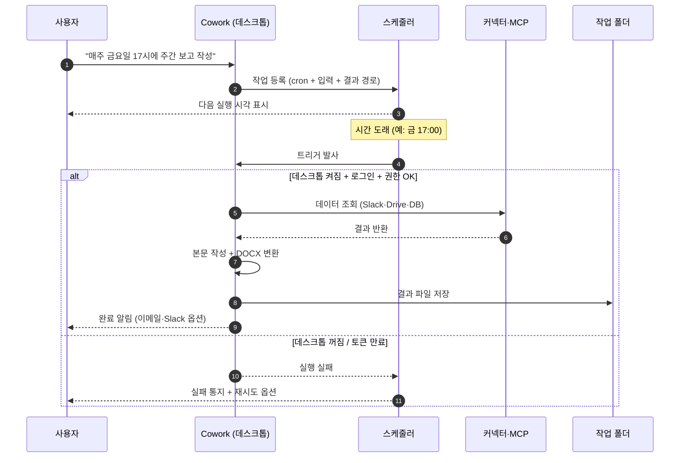
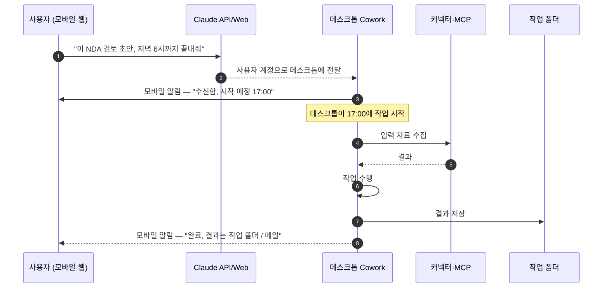
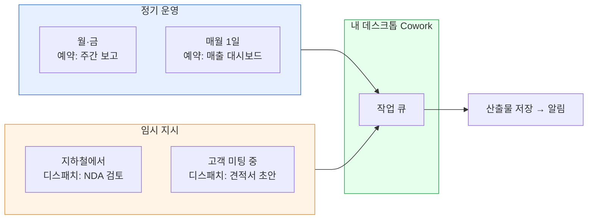

> "매주 금요일 오후 5시에 주간 보고 자동 작성"과 "지하철에서 휴대폰으로 '이 작업 저녁 6시까지 끝내줘' 지시" — 둘은 비슷해 보이지만 작동 방식이 다릅니다. 이 페이지에서 두 기능의 차이와 베스트 프랙티스를 정리합니다.

## 학습 목표

- 예약 작업(Scheduled Tasks)과 디스패치(Dispatch)의 차이를 한 문장으로 설명할 수 있습니다.
- 두 기능 각각의 라이프사이클(트리거 → 실행 → 결과 전달)을 그릴 수 있습니다.
- 자주 깨지는 지점(권한·토큰·세션) 5개를 미리 점검합니다.

## 한눈에 보기

| 축 | 예약 작업 (Schedule) | 디스패치 (Dispatch) |
|---|---|---|
| 트리거 | **시간** (cron · 매일·매주·매월) | **사람의 자연어 지시** (모바일·웹) |
| 실행 위치 | 본인 데스크톱의 Cowork | 본인 데스크톱의 Cowork |
| 시작 조건 | 데스크톱이 켜져 있고 로그인 상태 | 데스크톱이 켜져 있고 로그인 상태 |
| 대표 사용 사례 | 매주 금요일 보고서 자동 생성 | 외부에서 "오늘 저녁까지 이거 끝내줘" |
| 결과 도착 위치 | 작업 폴더 + (선택) 이메일·Slack | 작업 폴더 + 모바일 알림 |
| 빈도 | 정기적 | 단발성 |
| 비유 | 예약 녹화 | 외부에서 PC에 메모 남기기 |

핵심: **예약은 시간 트리거, 디스패치는 사람 트리거.** 둘 다 결국 본인의 데스크톱 Cowork가 실제 작업을 수행한다는 점은 같습니다.

## 예약 작업 — 라이프사이클

### 등록 절차

1. 작업을 한 번 **수동으로 실행**해 결과물이 원하는 형태로 나오는지 확인합니다.
2. 같은 대화에서 자연어로 예약을 요청하거나, 대화 상단의 **예약** 메뉴에서 반복 주기를 선택합니다 (매일 · 매주 · 매월 · 커스텀 cron).
3. 결과를 받을 경로를 지정 — 작업 폴더(필수), 이메일·Slack(선택).
4. 저장하면 **다음 실행 시간**이 화면에 표시됩니다.

### 실패 모드 (자주 깨지는 지점)

| 실패 원인 | 증상 | 해결 |
|---|---|---|
| 데스크톱이 꺼져 있음 | 트리거 시점에 실행 안 됨, 다음 켜질 때 누적되지 않음 | 정기 작업이 도는 시간대는 PC를 절전 상태로 (수면 모드 OK, 종료는 NO) |
| OAuth 토큰 만료 | 커넥터(Slack·Drive·Gmail)가 401 반환 | 분기에 한 번 재인증, 만료 알림을 메일로 받기 |
| 작업 폴더 권한 해제 | 외장 디스크 마운트 풀림, 시스템 업데이트 후 권한 리셋 | [폴더와 권한 가이드](../permissions/)의 재허용 절차 |
| 입력 데이터 형식 변경 | 매월 보고서가 갑자기 빈 칸 | 데이터 소스 변경 시 한 번 수동 실행으로 재학습 |
| 결과 품질 흔들림 | 같은 cron인데 결과가 들쭉날쭉 | 모델은 비결정적 — 출력 형식을 명시하고 메모리에 표준화 |

## 디스패치 — 라이프사이클

### 등록 절차

1. 모바일 또는 웹 (claude.ai/cowork)에서 작업을 자연어로 지시합니다.
2. 어느 프로젝트(따라서 어느 작업 폴더)에서 처리할지 선택합니다.
3. 마감 시각 또는 즉시 실행을 선택합니다.
4. 결과를 어디로 받을지 지정합니다 — 작업 폴더(필수), 모바일 알림·이메일(선택).

### 실패 모드

| 원인 | 해결 |
|---|---|
| 데스크톱이 꺼져 있음 | 외출 중에는 데스크톱을 수면 모드(절전)로 두고 외부 트리거 가능하게 설정 |
| 디스패치 비활성화 | 모바일·웹에서 디스패치가 보이지 않으면 [공식 가이드](https://support.claude.com/en/articles/13947068)의 활성화 절차 확인 |
| 프로젝트 미선택 | 디스패치 등록 시 프로젝트를 명시 — "default" 프로젝트는 메모리·폴더가 빈약 |
| 모바일 알림 안 옴 | 알림 권한 확인, Wi-Fi/데이터 연결 확인 |

## 둘을 함께 쓰는 운영 패턴

권장 분리:
- **정기·정량 작업** (주·월간 보고, 대시보드 갱신) → 예약
- **임시·품질 검토 필요 작업** (NDA 검토, 견적서 초안) → 디스패치 + 본인이 데스크톱에서 결과 확인

## 베스트 프랙티스 — 7가지 운영 원칙

1. **첫 실행은 손으로.** 예약·디스패치 등록 전에 같은 대화를 한 번 수동 실행해 결과 품질을 검증합니다.
2. **결과 경로를 작업 폴더로 고정.** 메일·Slack은 부수 알림용으로만. 원본은 항상 폴더에 남겨야 추적이 됩니다.
3. **OAuth 토큰 만료 알림을 메일로.** 커넥터 설정에서 토큰 만료 알림을 켜고, 분기 1회 재인증을 캘린더에 등록.
4. **PC는 종료 대신 수면.** 예약과 디스패치 모두 데스크톱이 깨어 있어야 작동합니다. 절전 상태에서도 트리거가 깨우는 환경을 권장.
5. **민감 데이터 작업은 디스패치 사용 금지.** 모바일 환경에서 자연어로 인사·재무 데이터에 영향을 주는 지시를 하지 마세요. 사람이 책상 앞에서 직접 검토합니다.
6. **결과 폴더에 날짜 prefix.** 자동 생성물은 `2026-04-26_주간보고.docx`처럼 날짜 prefix로 누적되게 — 덮어쓰기보다 추적이 쉽습니다.
7. **실패 알림 채널 분리.** 정상 완료 알림과 실패 알림을 같은 채널로 받으면 묻혀버립니다. 실패는 별도 메일/Slack으로.

## 자주 겪는 실수

- **외출하면서 PC 종료** — 예약·디스패치가 모두 멈춥니다. 수면 모드로 두세요.
- **결과를 메일로만 받음** — 메일이 누락되거나 스팸으로 분류되면 결과 자체를 못 봅니다. 반드시 폴더에도 저장.
- **매분 단위 cron** — 플랜 정책에 의해 차단될 수 있습니다. 최소 5분 간격, 가능하면 시간 단위.
- **디스패치로 결제·송금 지시** — 절대 금지. 사람이 책상 앞에서 직접 수행합니다 ([안전하게 사용하기](../safety/)).
- **여러 예약이 같은 폴더에 동시 쓰기** — 파일 충돌. 시간을 5~10분씩 어긋나게 분산.

## 보안 체크 — 외부에서 내 PC를 깨우는 일에 대한 의문

디스패치는 **사용자의 계정**을 통해서만 작동합니다. 즉:
- 내 Claude 계정에 로그인된 디바이스에서만 지시 가능
- 외부에서 임의로 내 데스크톱을 깨우는 것이 아니라 **내 계정에 묶인 데스크톱이 작업을 받아 처리**합니다 (전달 메커니즘의 정확한 구현은 Anthropic 정식 문서 미공개)
- 회사 PC에서 디스패치를 쓰려면 IT 정책 확인 필요 — 일부 환경은 외부 트리거 자체를 차단

## 다음 단계

- [폴더와 권한 가이드](../permissions/) — 권한 끊김이 가장 흔한 실패 원인
- [커넥터와 MCP](../connectors-mcp/) — 토큰 만료 관리
- [컴퓨터 사용](../computer-use/) — 디스패치로 자동 GUI 조작 시 추가 권한
- [쿡북 — 주간 보고서 자동화](../../cookbook/automation-recipes/)

---

### Sources

- [Schedule recurring tasks in Claude Cowork](https://support.claude.com/en/articles/13854387)
- [Assign tasks from anywhere in Claude Cowork](https://support.claude.com/en/articles/13947068)
- [Get started with Claude Cowork](https://support.claude.com/en/articles/13345190)
- [Use Claude Cowork safely](https://support.claude.com/en/articles/13364135)
