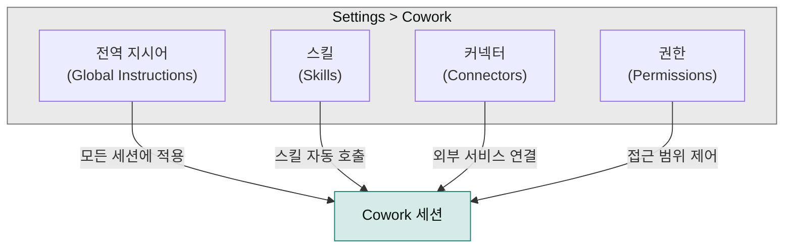

처음 Cowork를 쓰기 시작하면 설정이 필요한 네 가지 항목을 곧바로 만나게 됩니다. "한국어로 답해줘"나 "파일 삭제 전 확인해줘" 같은 말을 매번 입력하는 대신, Claude Desktop의 **Settings > Cowork**에서 전역 지시어·스킬·커넥터·권한을 한 번 설정해두면 이후 모든 세션에 일관되게 적용됩니다.

## 설정 구조 한눈에 보기



## 설정 메뉴 접근

macOS에서는 `⌘ Command` + `,`, Windows에서는 메뉴 바의 `Claude Desktop > Settings`를 선택하면 설정이 열립니다. 좌측 패널에서 `Cowork` 탭을 클릭하면 Global instructions(전역 지시어), Skills(스킬), Connectors(커넥터), Permissions(권한) 네 카테고리가 나타납니다.

## 전역 지시어 (Global Instructions)

전역 지시어는 **모든 Cowork 세션의 시작점**에서 Claude가 읽는 영구 규칙입니다. 매번 "한국어로 답해줘" 또는 "파일 삭제 전 확인해줘"를 입력할 필요 없이, 한 번 저장해두면 이후 모든 세션에 자동으로 적용됩니다.

### 설정 방법

1. Settings > Cowork에서 **Global instructions** 섹션 찾기
2. **Edit** 버튼 클릭
3. 지시어 입력 (아래 예제 참조)
4. 저장

### 전역 지시어 예제

```markdown
# 작업 스타일

- 모든 코드 변경 사항을 명확하게 설명하세요
- 복잡한 작업은 단계별로 나누어 진행하세요
- 결정을 내리기 전에 항상 대안을 고려하세요

# 출력 형식

- 코드는 마크다운 코드 블록으로 제출하세요
- 파일 변경 사항은 요약해서 보고하세요
- 완료 후 다음 단계를 제안하세요

# 언어

- 한국어로 응답하세요
- 기술 용어는 원문을 유지하세요
```

### 전역 지시어 활용 팁

| 목적 | 예제 |
|---|---|
| **작업 스타일** | "항상 단계별로 접근하고, 각 단계를 완료한 후 확인받으세요" |
| **형식 규칙** | "모든 코드 변경 사항을 테이블로 요약하세요 (파일 \| 변경 \| 이유)" |
| **안전 가드** | "파일을 삭제하기 전에 항상 백업 여부를 확인하세요" |
| **팀 컨벤션** | "커밋 메시지는 Conventional Commits 형식을 따르세요" |

## 스킬 (Skills)

스킬은 **재사용 가능한 프롬프트 템플릿**입니다. "블로그 글 써줘"처럼 자연어로 요청하면 Cowork가 적합한 스킬을 자동 선택하고, 명시적으로 부르고 싶을 때는 `/`로 시작하는 슬래시 명령을 사용합니다.

### 스킬 마켓플레이스

Settings > Cowork > Skills의 **Marketplace** 탭에서 스킬을 찾아 **Install** 을 클릭하면 설치됩니다. 설치된 스킬은 내 스킬 탭에서 확인할 수 있습니다.

### 스킬 사용


> /blog
> /summarize
> /refactor


`/blog`는 블로그 글 작성, `/summarize`는 문서 요약, `/refactor`는 코드 리팩토링 스킬입니다.

### 인기 스킬 카테고리

| 카테고리 | 예시 |
|---|---|
| **문서 생성** | `/blog`, `/docx`, `/pptx` |
| **코드 작업** | `/refactor`, `/test`, `/review` |
| **데이터 처리** | `/analyze`, `/chart`, `/report` |
| **워크플로우** | `/project`, `/deploy`, `/release` |

## 커넥터 (Connectors)

커넥터는 **MCP(Model Context Protocol) 서버**와 외부 서비스를 Claude Cowork에 연결합니다.

### MCP 서버 연결

1. Settings > Cowork > Connectors
2. **+** 버튼으로 새 커넥터 추가
3. 커넥터 유형 선택:
   - **Local**: 로컬 MCP 서버 (stdio 또는 HTTP)
   - **Cloud**: 클라우드 호스팅 MCP 서버

### 로컬 MCP 서버 설정 예시

```yaml
# stdio 기반 서버
name: "Filesystem MCP"
command: "npx"
args: ["-y", "@modelcontextprotocol/server-filesystem", "/path/to/allowed/files"]

# HTTP 기반 서버
name: "Custom MCP Server"
url: "http://localhost:3000/mcp"
headers:
  Authorization: "Bearer YOUR_API_KEY"
```

### 인기 커넥터

| 커넥터 | 용도 |
|---|---|
| **Filesystem MCP** | 로컬 파일 시스템 접근 |
| **GitHub MCP** | GitHub 리포지토리 연동 |
| **Google Drive MCP** | Google Drive 파일 접근 |
| **Slack MCP** | Slack 메시지 송수신 |
| **Database MCP** | 데이터베이스 쿼리 실행 |

## 권한 관리 (Permissions)

Cowork가 파일/폴더에 접근하기 **이전에** 사용자 승인이 필요합니다. 권한 모드는 세 가지입니다. **Ask**는 매번 확인하므로 가장 안전하고, **Allow**는 묻지 않고 허용하며, **Deny**는 묻지 않고 거부합니다.

### 권한 카테고리

Settings > Cowork에서 관리:

| 권한 | 설명 | 기본값 |
|---|---|---|
| **Bash** | 터미널 명령 실행 | Ask |
| **File Access** | 파일 읽기/쓰기 | Ask |
| **Network** | 외부 API 호출 | Ask |
| **Agent** | 서브에이전트 호출 | Allow |

### 프로젝트별 권한

`.claude/settings.json`에서 프로젝트별 권한 설정:

```json
{
  "permissions": {
    "allow": {
      "bash": ["npm test", "go build"],
      "fileAccess": ["src/", "tests/"],
      "network": ["api.github.com"]
    }
  }
}
```

## 고급 설정

### 토큰 예산 관리

1. Settings > General > **Tokens**
2. 최대 토큰 수 설정 (기본값: 200,000)
3. **Compact 세션**: 컨텍스트 압축 빈도 설정

### 모델 선택

작업 유형에 따라 모델을 다르게 쓰면 속도와 품질을 균형 있게 맞출 수 있습니다. Settings > Models에서 Cowork 기본 모델을 선택하는데, 코딩 작업에는 Claude Sonnet 4.6, 문서 작성에는 Claude Opus 4.7, 빠른 분석에는 Claude Haiku 4.5가 권장됩니다.

### 로그 및 디버깅

Settings > Advanced에서 **Debug mode**로 개발자 로그를 켜거나, **Log level**(Error / Warn / Info / Debug)을 조정하고, **Export logs**로 로그 파일을 내보낼 수 있습니다.

## 설정 확인하기

설정이 제대로 적용되었는지 확인하는 방법:

1. 새 Cowork 세션 시작 — `⌘ Command + Shift + N`
2. 아래 테스트 프롬프트 입력


> 내 전역 지시어를 읽고, 현재 설정된 스킬과 커넥터를 요약하세요.


## 문제 해결

| 문제 | 해결책 |
|---|---|
| **전역 지시어가 적용되지 않음** | Claude Desktop 재시작, 지시어 문법 확인 |
| **스킬이 보이지 않음** | Marketplace에서 스킬 재설치, 동기화 확인 |
| **MCP 서버 연결 실패** | 서버 로그 확인, 포트 충돌 점검 |
| **권한 팝업이 계속 뜸** | Permissions 설정에서 Allow로 변경 |

## Sources

- [Get started with Claude Cowork | Claude Help Center](https://support.claude.com/en/articles/13345190-get-started-with-claude-cowork)
- [Install and configure Claude Cowork with third-party platforms | Claude Help Center](https://support.claude.com/en/articles/14680741-install-and-configure-claude-cowork-with-third-party-platforms)
- [Claude Cowork Guide - Complete Tutorial & Features](https://claudecowork.im/)
- [The Actual Guide to Setting Up Claude Cowork | Reddit](https://www.reddit.com/r/ClaudeCode/comments/1roa5bu/the_actual_guide_to_setting_up_claude_cowork/?tl=ko)
