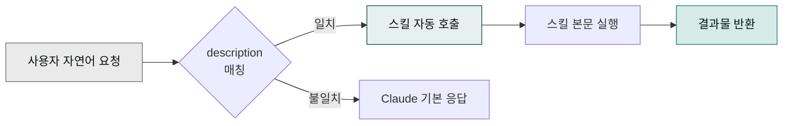

> 스킬(skill)은 "이런 요청이 오면 이렇게 처리해라"라는 절차적 지침 묶음입니다. 프롬프트 엔지니어링을 파일 하나로 저장해둔 것이라고 생각하면 쉽습니다.

## 스킬 트리거 흐름



## 언제 트리거되나

각 스킬의 `description` 필드에 트리거 조건이 쓰여 있습니다. Cowork가 사용자의 요청을 읽고, 일치하는 스킬이 있으면 자동으로 호출합니다.

예시:

- "블로그 글 써줘" → `moai-content:blog`
- "계약서 검토해줘" → `moai-legal:contract-review`
- "사업계획서 만들어줘" → `moai-business:strategy-planner`

## 스킬의 구조

```text
skill-name/
  SKILL.md               # 본체 (YAML frontmatter + 본문)
  references/            # 상세 참고 문서
  scripts/               # (선택) 실행 스크립트
  assets/                # (선택) 이미지·템플릿
```

`SKILL.md`는 다음 구조를 따릅니다.

```yaml
---
name: skill-name
description: >
  [무엇을 하는지] + [언제 쓰는지] + [트리거 키워드]
user-invocable: true
---

(본문: 절차, 규칙, 예시)
```

## 스킬 호출 방식

### 1. 자연어 요청 (권장)

사용자는 그냥 자연어로 요청합니다. Cowork가 맥락을 읽고 적합한 스킬을 자동 호출합니다.


**문서 표기 규약**: 본 문서 전반에서 **사용자가 Cowork에 입력하는 모든 것**(자연어 지시·슬래시 명령·마켓플레이스 URL 등)은 macOS 터미널 스타일 박스 안에 `> ` prefix와 함께 표기합니다.

| 종류 | 문서 표기 | 실제 입력 |
|---|---|---|
| 슬래시 명령 | `> /project init` | `/project init` |
| 자연어 지시 | `> "블로그 글 써줘"` | `블로그 글 써줘` |
| 마켓플레이스 URL | `> modu-ai/cowork-plugins` | `modu-ai/cowork-plugins` |

`>`는 문서에서 "이건 사용자 입력"이라는 시각적 표식이며, **실제 대화창에 입력할 때는 `>`를 빼고 본문만** 입력하면 됩니다.


### 2. 슬래시 호출

특정 스킬을 명시적으로 부르고 싶으면 대화창에 `/`를 입력해 나타나는 목록에서 스킬을 선택합니다. 스킬의 frontmatter에 `user-invocable: true`가 설정된 스킬만 Tab 자동완성과 `/skill-name` 호출을 지원합니다.


> /blog
/contract-review



자연어 요청이 가장 안정적입니다. 슬래시 호출은 스킬별로 지원 여부가 다르고, 호출 가능 목록은 Cowork의 `/` 자동완성에서 직접 확인하는 게 가장 정확합니다.


### 3. 체이닝

여러 스킬을 연결해 파이프라인을 구성합니다. 자세한 설계 방법은 [쿡북 — 스킬 체인 설계](../../cookbook/skill-chaining/)에서 다룹니다.

## 커스텀 스킬

사용자 본인도 스킬을 만들 수 있습니다. 핵심만 요약하면 다음과 같습니다.

- 파일 위치: `~/.claude/skills/<skill-name>/SKILL.md` (개인용) 또는 플러그인 내부 `<plugin>/skills/<skill-name>/SKILL.md` (배포용)
- 최소 YAML: `name`, `description` 두 필드만 있으면 동작합니다
- Tab 자동완성을 원한다면 `user-invocable: true`를 추가합니다
- `description`에 **트리거 키워드**를 풍부하게 쓰면 자동 호출 정확도가 올라갑니다 — "다음과 같은 요청 시 이 스킬을 사용하세요:" 블록으로 명시하는 패턴을 권장합니다
- 본문은 사람이 읽는 절차서처럼 작성합니다. 조건·금지 사항·예시를 분리하면 Claude가 안정적으로 따라갑니다

처음 만들 때는 `cowork-plugins` 저장소의 기존 스킬(`moai-content/skills/blog/SKILL.md` 등)을 템플릿으로 복사해 수정하는 방법이 가장 빠릅니다. 전체 공식 절차는 [플러그인 개발 튜토리얼](https://claude.com/resources/tutorials/how-to-build-a-plugin-from-scratch-in-cowork)을 참고하세요.

## 다음 단계

- [플러그인 사용](../plugins/)
- [쿡북 — 스킬 체인 설계](../../cookbook/skill-chaining/)

---

### Sources

- [Use Skills in Claude](https://support.claude.com/en/articles/12512180)
- [How to build a plugin from scratch in Cowork](https://claude.com/resources/tutorials/how-to-build-a-plugin-from-scratch-in-cowork)
