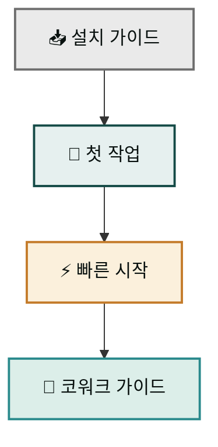

처음 MoAI Cowork Plugins을 접하면 어디서부터 시작해야 할지 막막할 수 있습니다. 이 섹션은 그 길을 세 단계로 압축했습니다. Claude Desktop에 플러그인을 설치하고, 첫 산출물을 손에 쥐기까지 — 전체 흐름을 처음 써 보는 분 기준으로 안내합니다. 환경만 갖춰지면 자연어 한 줄로 스킬 체인이 자동 실행됩니다.

## 학습 경로

### 1. 설치 가이드

Claude Desktop이 이미 설치되어 있다면 약 5-7분이면 충분합니다. 마켓플레이스 등록과 moai-core 활성화까지 전체 과정을 단계별로 설명합니다.

### 2. 첫 작업

설치 직후 바로 따라 할 수 있는 실습 예제입니다. Series A IR 덱 생성 워크플로우를 직접 경험하면서, 스킬 체인이 어떻게 자동으로 맞물려 돌아가는지 확인할 수 있습니다.

### 3. 빠른 시작

마켓플레이스 등록부터 첫 자연어 요청까지의 전체 흐름을 약 10분으로 압축한 가이드입니다. 설치 후 바로 실무에 적용하고 싶을 때 가장 먼저 읽으세요.

## 이 가이드를 마치면

세 단계를 모두 거치면 환경 구축에 더 이상 시간을 쓰지 않아도 됩니다. 이후에는 필요한 도메인 플러그인을 추가하는 것만으로 워크플로우를 자유롭게 확장할 수 있습니다.

## 다음 단계

- [설치 가이드](install/) — Claude Desktop에 플러그인 설치하기
- [첫 작업](first-task/) — IR 덱 생성 체험하기
- [빠른 시작](quick-start/) — 주요 스킬 빠르게 숙지하기

### Sources
- GitHub 저장소: [https://github.com/modu-ai/cowork-plugins](https://github.com/modu-ai/cowork-plugins)
- 온라인 문서: [https://cowork.mo.ai.kr](https://cowork.mo.ai.kr)
