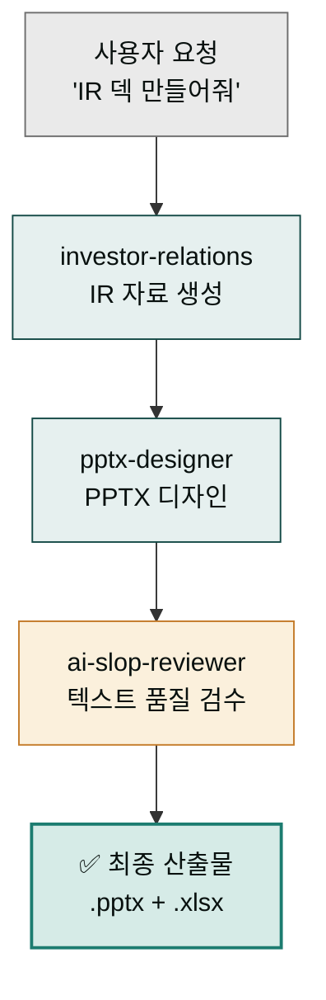

설치와 플러그인 활성화를 마쳤다면 이제 실제로 무언가를 만들어 볼 차례입니다. 이 가이드는 Series A IR 덱을 생성하는 워크플로우를 5-7분 안에 체험할 수 있도록 설계됐습니다. 스킬 체인이 어떻게 자동으로 맞물려 돌아가는지 직접 확인해 보세요. **전제 조건**: [설치](../install/)와 플러그인 활성화 완료.

## 목표

설치·플러그인 활성화가 이미 완료된 상태에서 **약 5-7분** 안에 다음을 달성합니다.

- SaaS Series A IR 덱 초안 생성
- 전문가 스킬 체인 자동 실행
- 결과물 파일로 확인

## 실행 절차

### 1단계: 프로젝트 생성 및 폴더 연결


**준비물**: 시스템에 Claude Desktop이 설치되어 있고, 작업할 빈 폴더가 필요합니다.


작업할 빈 폴더를 하나 만들고 Claude Desktop에 연결합니다. Cowork 모드에서 해당 폴더를 선택하면 새 프로젝트가 생성됩니다.

### 2단계: 프로젝트 초기화

`/project init` 뒤에 한 줄 자연어로 프로젝트 목적을 함께 알려주면 인터뷰가 더 정확해집니다:


> /project init "SaaS IR Deck Project 초기화 진행!!"


`/project init`은 **7 Phase 워크플로우**로 동작하며 총 2-3분, AskUserQuestion 최대 6회가 소요됩니다. 사용자가 직접 답하는 인터뷰는 **Phase 1의 3질문**뿐이고, 나머지 Phase는 자동으로 진행됩니다.

| Phase | 동작 | 사용자 입력 |
|---|---|---|
| 1. 워크플로우 인터뷰 | 업무 유형·산출물·톤 3질문 | **3회 (필수)** |
| 2. 플러그인 자동 감지 | 설치된 moai-* 스캔 + Phase 1 답변 매칭 | 자동 |
| 3. 스킬 체인 설계 | 산출물별 실행 파이프라인 설계 | 자동 |
| 4. 설계 확인 | 체인 설계 승인/수정/취소 | 1회 |
| 5. CLAUDE.md 생성 | 템플릿(≤200라인) + 스킬 체인 주입 | 자동 |
| 6. API 키 등록 (조건부) | 선택된 플러그인에 필요한 키만 | 조건부 1-2회 |
| 7. 첫 실행 안내 | 설계된 체인 기반 예시 3개 제시 | 자동 |

**Phase 1 인터뷰 — 실제 질문과 선택지** (IR 덱 시나리오 기준 권장 답변):

**Q1. 이 프로젝트에서 어떤 일을 하시나요?** (복수 선택)

- ☑ **사업 기획·전략** — 사업계획서, 시장조사, IR, 투자제안서 ← 선택
- ☐ 콘텐츠 제작 — 블로그, 카드뉴스, 뉴스레터, SNS
- ☐ 문서·행정 — PPT, 한글, Word, Excel, 공문
- ☐ 제품·연구 — PM 문서, UX 리서치, 논문, 특허
- *(+ Other 자유 입력 가능)*

**Q2. 주로 만드는 산출물은 무엇인가요?** (자유 입력)

> 예시 답변: `"Series A 피칭 IR 덱(PPT), 시장 분석 리포트, 투자자 Q&A 자료"`

**Q3. 특별히 지키고 싶은 톤·형식이 있나요?**

- ☑ **산업별 전문 용어 사용** (법률·의료·금융·기술) ← 선택
- ☐ 공식·격식체 유지 (관공서·기업 보고)
- ☐ 캐주얼·대화체 (SNS·블로그·콘텐츠)
- ☐ 제약 없음 — 그때그때 지정

**Phase 4 — 설계 확인** (예시):

```
이 프로젝트의 실행 체인 설계

[주 산출물 1] IR 피칭덱
  체인: investor-relations → pptx-designer → ai-slop-reviewer
  트리거 예시: "IR 자료 써줘"

[보조 산출물 2] 시장조사 리포트
  체인: market-analyst → docx-generator → ai-slop-reviewer

위 스킬 체인 설계로 CLAUDE.md를 생성하시겠습니까?
  ○ 승인 (권장)
  ○ 수정
  ○ 취소
```


**자동 매칭**: Phase 1에서 "사업 기획·전략"을 선택하면 `moai-business`(strategy-planner·investor-relations)와 `moai-office`(pptx-designer)가 자동 매칭되고, 텍스트 산출물 체인 끝에 `ai-slop-reviewer`가 자동 부착됩니다. 스킬을 직접 선택할 필요는 없습니다.



**이름·회사·역할은 묻지 않습니다**(v1.3.0+). 글로벌 프로필 시스템이 제거되어 인터뷰는 "이번 프로젝트에서 뭘 어떻게 할지"에만 집중합니다. 필요하면 생성된 CLAUDE.md를 직접 편집하세요.


### 3단계: 첫 작업 요청

자연어로 Series A IR 덱 생성을 요청합니다. **본 문서의 모든 사용자 입력은 `> ` prefix와 함께 표기**하지만, 실제 대화창에는 `>` 없이 본문만 입력하면 됩니다([표기 규약 자세히](../../cowork/skills/#스킬-호출-방식)).


> "SaaS Series A IR 덱 초안 만들어줘"


이 한 줄 요청에는 비즈니스 모델(SaaS 플랫폼), 투자 단계(Series A), 대상 투자사(벤처 캐피털), 포함 내용(시장 분석·재무 모델·성장 전략)이 모두 담겨 있습니다. 더 자세한 맥락을 추가할수록 결과물이 정확해집니다.

### 4단계: 스킬 체인 자동 실행

요청을 받으면 MoAI가 자동으로 세 개의 전문 스킬을 순서대로 실행합니다.



먼저 **investor-relations 스킬**이 실행되어 투자자 대상 IR 자료를 생성하고, 시장 분석과 경쟁사 대비 분석, 재무 모델 및 성장 지표를 설정합니다. 이어서 **pptx-designer 스킬**이 생성된 내용을 바탕으로 전문적인 IR 덱 레이아웃과 데이터 시각화를 입힌 PPTX 파일을 만듭니다. 마지막으로 **ai-slop-reviewer 스킬**이 전체 텍스트의 AI 생성 패턴을 검증하고 최종 결과물을 다듬습니다.

### 5단계: 결과물 확인

작업이 완료되면 작업 폴더에 다음 파일들이 생성됩니다. `SaaS_Series_A_IR_Deck.pptx`는 Series A 투자 표준에 맞는 구조와 데이터 시각화가 적용된 최종 IR 덱이고, `analysis_report.md`는 분석 보고서, `financial_model.xlsx`는 재무 모델입니다. 결과물은 투자사의 관심사를 반영한 내용 구성과 일관된 디자인 톤으로 작성됩니다.

## 실제 화면 예시


**스크린샷**: 실제 실행 시 화면은 Claude Desktop의 Cowork 모드에서 확인할 수 있습니다. 각 스킬 실행 시 진행 상황이 실시간으로 표시됩니다.


실행 전 프로젝트 폴더는 비어 있고 활성 스킬도 없는 상태입니다. 실행 중에는 `investor-relations → pptx-designer → ai-slop-reviewer` 순서로 체인 진행 상황이 실시간 로그로 표시됩니다. 완료되면 폴더에 `SaaS_Series_A_IR_Deck.pptx`(약 15-20MB)가 생성되고 완료 메시지가 나타납니다.

## 왜 이 방식이 효과적인가

각 스킬이 특정 도메인의 전문성을 담당하고, 수동 단계 없이 자동으로 이어지며, ai-slop-reviewer가 결과물 품질을 보증합니다. 표준화된 템플릿과 프로세스가 일관된 산출물을 만들어 냅니다. 전통적인 방식과 비교하면 차이가 명확합니다.

### 비교 표

| 방식 | 시간 | 품질 | 전문성 | 자동화 |
|------|------|------|--------|--------|
| 수동 제작 | 2-3일 | 중간 | 제한적 | 낮음 |
| 일반 AI 도구 | 30분 | 중간 | 일반적 | 중간 |
| **MoAI 체인** | **5분** | **높음** | **전문적** | **완전 자동** |

## 확장 활용

같은 패턴으로 다양한 작업을 자동화할 수 있습니다. IR 덱만 해도 Pre-seed 덱(초기 투자 대상)·Series B 덱(성장 단계)·IPO 준비 덱(상장 준비) 등으로 응용됩니다. 다른 스킬 체인으로는 블로그 생성(`blog` → `ai-slop-reviewer` → `nano-banana`), 사업 계획서(`strategy-planner` → `pptx-designer` → `ai-slop-reviewer`), 랜딩 페이지(`copywriting` → `landing-page` → `ai-slop-reviewer`) 등이 있습니다.

## 다음 단계

첫 작업을 완료했다면 이제 더 깊은 기능을 탐색할 준비가 된 것입니다.

- [빠른 시작 가이드](../quick-start/) - 모든 주요 스킬 숙지하기
- [릴리스 정보](../../releases/) - 최신 기능 업데이트 확인하기
- [GitHub 저장소](https://github.com/modu-ai/cowork-plugins) - 직접 기여하기

### Sources
- GitHub 저장소: [https://github.com/modu-ai/cowork-plugins](https://github.com/modu-ai/cowork-plugins)
- investor-relations 스킬: [../../plugins/moai-business/](../../plugins/moai-business/)
- pptx-designer 스킬: [../../plugins/moai-office/](../../plugins/moai-office/)
- ai-slop-reviewer 스킬: [../../plugins/moai-core/](../../plugins/moai-core/)
